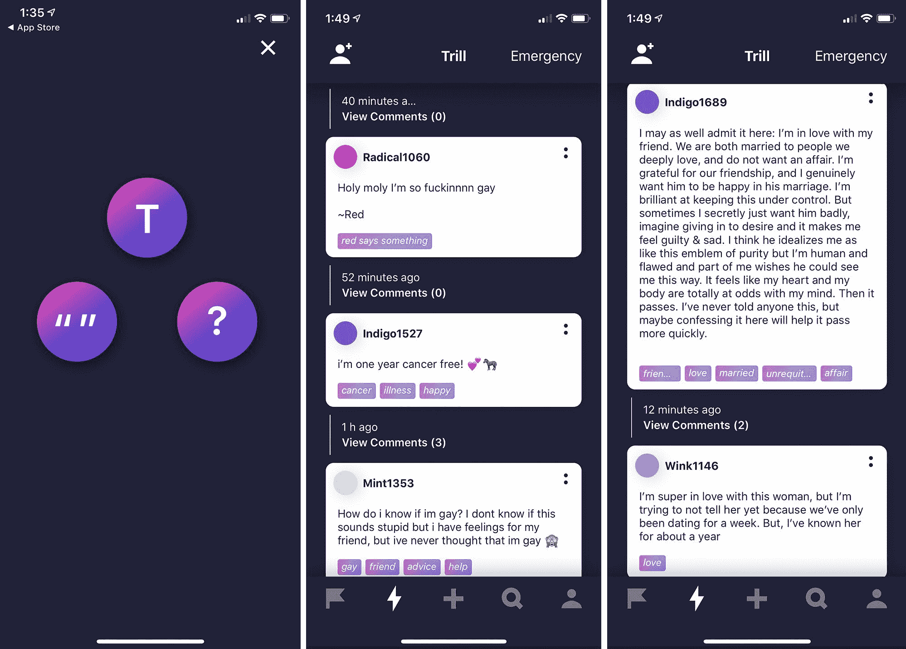

# Trill 项目旨在成为人们表达真实自我的安全社区

> 原文：<https://web.archive.org/web/https://techcrunch.com/2018/07/22/trill-project-aims-to-be-a-safe-community-for-people-to-express-their-true-selves/>

Trill 项目由三名高中女生创建，最近在私人测试版中推出，旨在帮助人们安全地在网上表达自己。对于那些不熟悉“颤音”这个词的人来说，它是“真实”和“真实”的结合一位投资者向我描述它是一个积极的 Yik Yak。

Trill 项目最初是一个面向青少年的社区，尤其是那些感觉没有安全空间做自己的跨性别青少年。从那时起，它已经扩展成一个平台，让每个人都可以表达自己的任何事情，从与成瘾、精神疾病的斗争到工作场所的问题。

“我们正在重塑社交网络的叙事，我们通过隐私和匿名提升了社交媒体，”Trill 项目的联合创始人乔治亚·梅辛格(Georgia Messinger)在电话中告诉 TechCrunch。

在 Trill 项目上，一切都是匿名的(没有用户名)，由 50 名版主全天候监控。Trill 项目也有机器学习算法，从报告的帖子中学习，以便能够在未来识别有问题的帖子。如果有人感到不安全或者认为有人已经发现了他们的颤音身份，他们总是可以改变它。

除了希望防止欺凌和骚扰，Trill Project 还希望对那些暗示自己想要伤害自己或报告被他人伤害的人有所帮助。这就是为什么 Trill 项目与专门支持经历心理健康危机的人的非营利组织合作。

Trill 项目将永远对用户免费，但其想法是可能许可其机器学习算法，出售广告空间和社区赞助，Trill 项目联合创始人阿里·索科洛夫告诉 TechCrunch。

当然，匿名社交网络并不新鲜。像 Whisper、Secret 和 Yik Yak 这样的初创公司都尝试过[，也可以说失败了](https://web.archive.org/web/20230323141144/https://techcrunch.com/2017/07/28/whisper-layoffs/)。

“人们以前也尝试过，但特别是作为青少年，我们真的更接近我们的用户，”Messinger 说。“它让我们获得了这些公司一直缺乏的渠道和洞察力。”

Trill 项目目前正在参与[创始人训练营](https://web.archive.org/web/20230323141144/https://www.foundersbootcamp.org/)，这是一个针对高中生的加速器。通过加速器，Trill 项目获得了 5 万美元的资金。下个月，Trill Project 打算开始筹集种子资金。