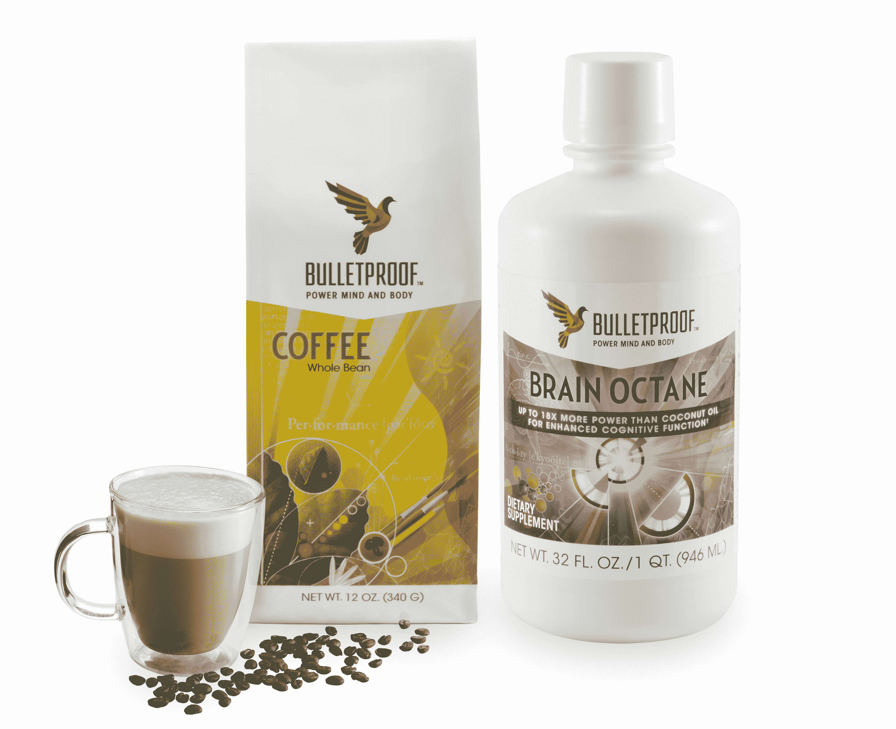
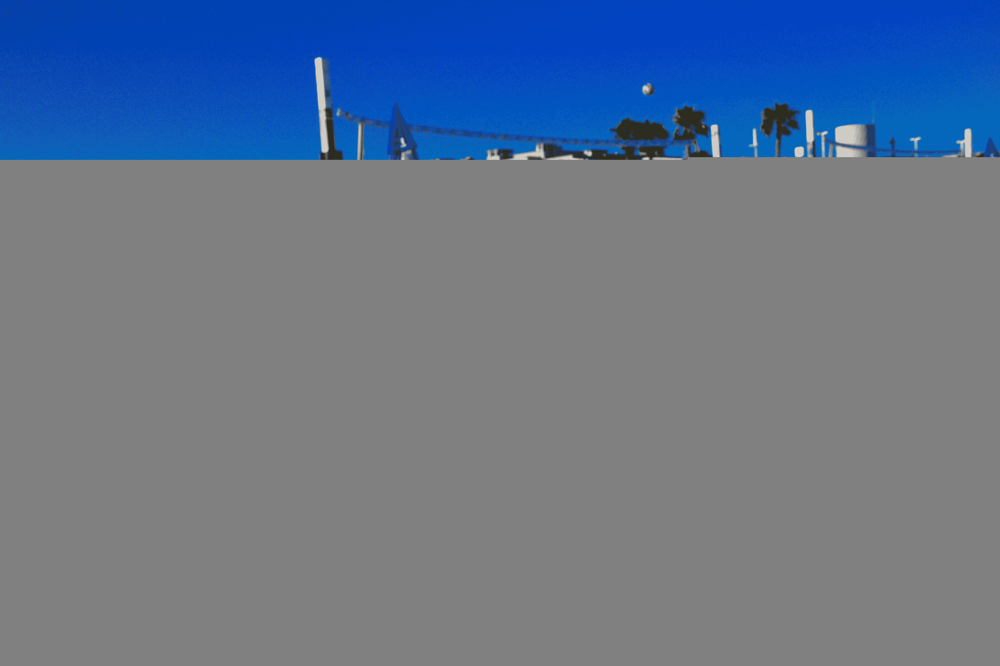

# 三一投资 900 万美元购买黄油咖啡，支持戴夫·阿斯普雷的防弹产品

> 原文：<https://web.archive.org/web/https://techcrunch.com/2015/07/23/trinity-bulletproof/>

# 三一投资 900 万美元支持戴夫·阿斯普雷的防弹公司购买黄油咖啡和益智药

自称自学成才的生物黑客戴夫·阿斯普雷(Dave Asprey)在网上积累了大量追随者，他刚刚从三一学院筹集了 900 万美元，将他的黄油咖啡和 FATwater 带给更广泛的公众受众。

Trinity 的 Gus Tai 和其他人打赌，Asprey 的防弹系列[T3 可以成为星巴克等主流咖啡系列的新兴替代品(顺便说一下，该公司几年前就支持星巴克)。Tai 和 Dan Scholnick 将加入防弹公司的董事会，他们将与前三一常驻企业家 Asprey 一起工作。](https://web.archive.org/web/20230404161832/http://www.bulletproofexec.com/how-to-make-your-coffee-bulletproof-and-your-morning-too/)

阿斯普雷写了一本名为《防弹饮食》的书，他通过控制饮食减掉了 100 磅。

“我彻底改变了我的生物学，”他说。我 40 多岁的时候比 20 多岁的时候强壮多了。这些都是不可能的，”他说。“所以我想，也许其他一些为了在硅谷获得成功而感到肥胖和过度劳累的人真的会从我学到的东西中受益。我开始围绕黑客人体建立一个社区。”

【YouTube https://www.youtube.com/watch?v=5-atwAIo_Lo&w=640&h=360]

在此基础上，他创造了一种咖啡配方，包括该公司所谓的“升级咖啡豆”，以及草饲无盐黄油和一种特殊的“大脑辛烷油”，由椰子或棕榈仁的甘油三酯制成。然后他推出了健康播客，一个广播节目和这本书。他的网站现在每月有超过 200 万的访问者。

“对我来说，当你全神贯注的时候，没有什么比写代码更好的了。它最初是由软件企业家发起的，”阿斯普雷说。“他们了解到，他们不仅可以设计外部系统，还可以控制内部系统。”

现在，他正利用这笔资金，根据他的产品线开设咖啡店和咖啡馆，第一家在圣莫尼卡。

“自从我们成立以来，我们一直在投资食品，”泰说。“我们设计了 PF Chang，防弹服真正吸引我们的是，我们觉得它有潜力成为一个领导品牌。”

今天，该公司还推出了另一个 FATwater 产品线，其中包含防弹 XCT 油或椰子油中发现的中链甘油三酯脂肪的纳米颗粒。这意味着提供能量和水合作用，而不会对血糖水平产生太大影响。

“你从脂肪和水中获取能量，所以你会有这种兴奋的水合作用的感觉，”阿斯普雷说。

它有 16 盎司瓶装或 10 毫升浓缩包装，每包含有大约 2 克脂肪和 20 卡路里。它可以是原味的，也可以配有浆果、橙子或柠檬香精。它不含素食和麸质。