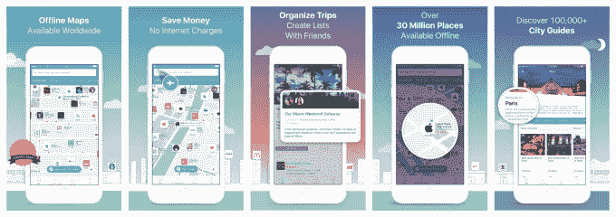

# 猫途鹰收购社交地图服务城市地图

> 原文：<https://web.archive.org/web/https://techcrunch.com/2016/08/25/tripadvisor-scoops-up-social-mapping-service-citymaps/>

两家公司宣布，总部位于纽约的社交地图应用城市地图(Citymaps)已被猫途鹰收购，该应用获得了 1200 万美元的风险投资。这项服务既是地图和导航工具，也是旅游指南，在交易完成后，将作为猫途鹰的一项独立业务继续运营。

交易条款没有披露。

这家初创公司由埃利奥特·科恩(Elliot Cohen)和亚伦·鲁登斯廷(Aaron Rudenstine)在 2010 年共同创立，最初是作为一款聚合来自第三方来源(包括社交网络)的商业信息的应用程序[，后来发展成为如今功能更全的旅行者工具。](https://web.archive.org/web/20230326023351/https://techcrunch.com/2012/06/11/social-maps-app-citymaps-arrives-boston-rolls-out-local-recommendations/)

尽管如今大多数消费者满足于使用苹果和谷歌等标准地图应用，但 Citymaps 仍然能够通过提供大公司没有的功能集为自己开辟出一片天地。

虽然大多数地图可以将您从 A 点带到 B 点，但 Citymaps 最显著的区别在于它专注于感兴趣的点。当然，你可以在传统的地图应用程序中找到博物馆、商店和餐馆之类的东西，但城市地图*真正地*突出了这些东西——它将它们的标志放在地图界面上，所以你可以通过寻找你认识的地方来导航，而不仅仅是街道名称。

当你点击一个兴趣点时，你可以查看更多信息，查看照片，阅读评论等——这类似于应用程序中类似 Yelp 的体验。但城市地图的用处在于，你还可以将这些地方保存到你自己的个性化收藏中。这些自定义地图——例如，以您最喜爱的当地餐馆为特色的地图——可以随时访问，甚至可以与朋友或更广泛的城市地图社区共享。

今年早些时候，该公司推出了基于自己专利技术的离线地图，并推出了城市指南。

这些精选的指南包括一些有趣的地方，可以作为地图下载，并在无法上网时使用。指南的内容来自 WikiTravel，并配有 Citymaps 的 200 多家出版合作伙伴制作的定制地图。这个群体包括 BuzzFeed、 [Travel + Leisure](https://web.archive.org/web/20230326023351/http://www.travelandleisure.com/) 或 *New York Times 的* [36 Hours](https://web.archive.org/web/20230326023351/http://www.nytimes.com/column/36-hours) 专栏等合作伙伴。

此外，Citymaps 应用程序还集成了各种提供预订功能和交易的服务，如 OpenTable、Groupon、Travelzoo、Viator(活动门票)、Ticketmaster、Songkick 等。

截至 3 月 1 日，城市地图报告称拥有大约 100 万用户。这是一个不错的数字——尤其是考虑到地图和旅游领域的竞争——但可能不足以维持业务。它通过合作伙伴关系、广告、许可和预订交易创造收入。

与此同时，猫途鹰是旅游领域最大的品牌之一，如今在全球 48 个国家开展业务。它的网站平均每月有 3.5 亿访客，对 660 万家酒店、度假租赁、餐馆和景点有 3.85 亿条评论和意见。该公司有自己的地图功能，专注于帮助旅行者在他们的目的地找到并预订东西，这是它计划利用 Citymaps 收购的地方。

猫途鹰公司全球产品部的 SVP 亚当·梅德罗斯在一份声明中说:“城市地图团队通过地图了解人们如何体验他们的一天。”。“我们很高兴地欢迎该团队加入猫途鹰品牌家族，帮助猫途鹰确保其地图功能能够最好地满足越来越多通过移动设备访问网站的用户的需求。”

“城市地图”可以在 iOS、Android 以及移动和桌面网络上使用。