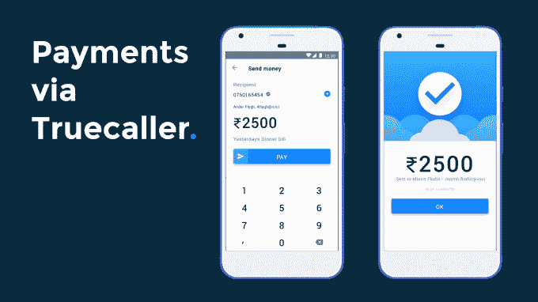

# Truecaller 增加了支付和 Google Duo 视频通话功能，与印度的 WhatsApp 竞争 

> 原文：<https://web.archive.org/web/https://techcrunch.com/2017/03/28/truecaller-platform-india/>

总部位于瑞典的初创公司 Truecaller 是一款漂亮的移动应用，可以帮助人们过滤掉不想要的电话和信息，但现在它正在成为一个平台。

印度是 Truecaller 最大的市场，拥有 1.5 亿用户。在印度举行的新闻发布会上，该公司宣布了一系列合作伙伴关系，包括与谷歌的合作，这将使美国公司新推出的视频通话功能集成到 Truecaller 应用程序中。

致力于对抗烦人电话的 Truecaller 应用程序，即将变得远不止于此。除了两人的合作，Truecaller 还通过整合其已推出两年的服务 true messenger T1 来提升该应用程序，该服务旨在使消息传递更加智能并管理垃圾邮件。

现在，在印度，Truecaller for Android 将从一个拨号应用程序变成一个可以处理呼叫、管理短信和进行视频通话的服务。

但这还不是全部，Truecaller 还推出了支付功能。

该公司与 ICICI 银行合作，实现 Truecaller 用户之间的点对点支付。Truecaller 证实，ICICI 银行正在提供这项服务背后的技术。除了持有这项服务的必要许可证，该银行还利用印度的 UPI 支付系统来支持这项服务。双方表示，Truecaller Pay 将向印度任何一家银行的用户开放。

“印度在我们带给用户的创新中发挥了重要作用。Truecaller 首席执行官兼联合创始人艾伦·马梅迪在 TechCrunch 的一份声明中表示:“随着我们产品的成熟，印度市场也变得比以往任何时候都更加有机，可以在 Truecaller 的基础上建立更有意义的服务。”

因此，视频通话、短信和支付——这听起来像是一个移动平台的基础，可以与中国的微信、日本的 line 和韩国的 Kakao 相媲美。

Truecaller 的一名代表向 TechCrunch 解释说，该公司目前没有向第三方开放其服务，但它愿意在看到匹配的情况下整合其他服务。同样，该公司最初是在印度推出这些功能，但并不排除在世界其他地区推出类似产品的可能性。

“如果我们能够在(印度)这类服务上取得成功，那么我们可以在其他市场复制类似的模式，”Truecaller 的通信总监 Kim Fai Kok 告诉 TechCrunch。“在肯尼亚和尼日利亚这样的市场存在巨大的机会，(但)我们需要集中精力，确保我们的首次推出是正确的。”

Truecaller 远不是唯一一家抓住印度移动平台机遇的公司，印度是科技行业的一个关键增长市场。根据印度互联网和移动协会最近共同撰写的一份报告，到 2017 年 6 月，该国的在线人口预计将达到 4.5 亿至 4.65 亿人，扩大了潜在电子商务客户的受众。分析公司 Forrester 声称，中国和美国目前在电子商务支出方面占据主导地位，但预计到 2020 年，印度的在线销售额将达到 480 亿美元。

中国是 WhatsApp 全球最大的单一市场，拥有 2 亿活跃用户。这种受欢迎程度使其成为该服务备受期待的盈利计划的核心，该计划可能首先在印度进行测试。在最近的一次印度之行中， [WhatsApp 联合创始人 Brian Acton 表示](https://web.archive.org/web/20221209221935/http://timesofindia.indiatimes.com/business/india-business/the-initial-reaction-to-whatsapp-status-has-not-been-entirely-positive-brian-acton/articleshow/57336061.cms)脸书所有的公司将在时机成熟时寻找围绕“商业信息”和数字支付的机会。

除了 WhatsApp，还有 Hike，这家本土公司[最近在由微信制造商腾讯牵头的一轮融资](https://web.archive.org/web/20221209221935/https://beta.techcrunch.com/2016/08/16/indias-whatsapp-rival-hike-raises-175m-led-by-tencent-at-a-1-4b-valuation/)中筹集了 1.75 亿美元，估值为 10 亿美元。Hike 正在效仿 WhatsApp，专注于消息服务。虽然 Hike 一直在更积极地向游戏、新闻和贴纸等互联服务领域扩张，但它并没有透露自己在印度的活跃用户群。这引发了人们对这些数字并不特别令人印象深刻的猜测。

这就引出了 Truecaller 成为一个平台的有趣之处。该公司没有与 WhatsApp 正面竞争。在印度，这是一项不值得羡慕的任务。相反，它提供了一个不同的第一主张——过滤讨厌的垃圾电话和信息——这可能会让它在寻求这些新功能的参与方面有所帮助。尽管如此，随着市场上已经有了丰富的支付选择，看看新的 Truecaller 服务如何对抗现有服务将是一件有趣的事情。

更广泛地说，与 Truecaller 的结盟是谷歌默认了它正在努力为其最新的即时通讯应用 [Duo 和 Allo 寻找受众。](https://web.archive.org/web/20221209221935/https://beta.techcrunch.com/2016/09/20/allo-brings-googles-smarts-to-messaging/)尽管产品质量很好，谷歌在消息和通话应用领域还是迟到了几年，WhatsApp 在印度和许多其他新兴市场占据主导地位。搭载 Truecaller 对两家公司来说都是合乎逻辑的举措，但这种结合是否能打破 WhatsApp 的网络效应仍有待观察，WhatsApp 在 2015 年增加了[语音通话，去年增加了](https://web.archive.org/web/20221209221935/https://beta.techcrunch.com/2015/04/21/whatsapp-begins-rolling-out-its-voice-calling-feature-to-ios-users/)[视频通话](https://web.archive.org/web/20221209221935/https://beta.techcrunch.com/2016/11/14/whatsapp-video-calling/)，这是世界上最成功的消息服务，拥有超过 10 亿活跃用户。