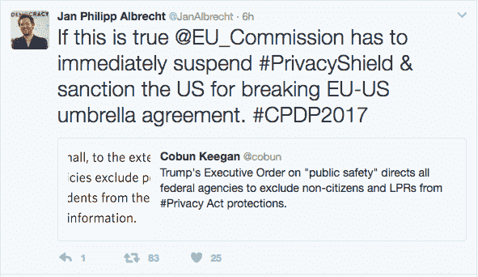

# 特朗普命令剥夺非美国公民的隐私权，可能会阻止 EU-美国数据流 

> 原文：<https://web.archive.org/web/https://techcrunch.com/2017/01/26/trump-order-strips-privacy-rights-from-non-u-s-citizens-could-nix-eu-us-data-flows/>

美国总统唐纳德·特朗普(Donald Trump)在上任头几天签署的一项行政命令可能会危及一项为期六个月的数据传输框架，该框架使欧盟公民的个人数据能够流向美国进行处理，并承诺一旦到达美国，将获得“基本等同”的隐私保护。

到目前为止，已有近 1500 家公司签署了该框架，经过多年的谈判过程，该框架仅于 8 月[开始运行。](https://web.archive.org/web/20230108095127/https://techcrunch.com/2016/08/01/eu-us-privacy-shield-open-for-sign-ups-from-today/)

欧洲议会数据保护监管报告员欧洲议会议员扬·菲利普·阿尔布雷特(MEP Jan Philipp Albrecht)今天早些时候在推特上暗示，特朗普昨天签署的总统令可能会使隐私保护无效。

特朗普签署的行政命令第 14 条-表面上旨在加强美国移民法的国内执法-内容如下:

> 隐私法。在符合适用法律的范围内，各机构应确保其隐私政策将非美国公民或合法永久居民排除在《隐私法》关于个人身份信息的保护之外。

本月早些时候，欧盟专员 Vera Jourova [表示](https://web.archive.org/web/20230108095127/http://www.natlawreview.com/article/eu-commissioner-plans-to-assess-us-privacy-shield-commitments)她将于今年春天前往美国，与 Trump 政府会面，评估其对 EU-美国隐私保护的承诺。

数据传输框架也将于今年夏天进行首次年度评估。

2015 年 10 月，在之前的安全港安排被欧洲最高法院[推翻](https://web.archive.org/web/20230108095127/https://techcrunch.com/2015/10/06/europes-top-court-strikes-down-safe-harbor-data-transfer-agreement-with-u-s/)后，就隐私保护达成一致的谈判紧急升级，此前美国政府大规模监控项目受到法律挑战。这种自我认证制度已经运作了 15 年。

现在的问题是，替代 EU-的美国数据流机制是否会以快得多的速度崩溃——特朗普政府的隐私相关政策选择对此起到了推波助澜的作用。

根据 Albrecht 的分析，EU-与美国的另一项总括协议也可能产生影响，该协议涉及两个地区执法机构之间的数据共享——欧洲议会建议制裁政府制定这项行政命令。

在撰写本文时，记者未能联系到欧洲议会发表评论。

目前还不清楚政策变化对隐私盾的持续运作到底会有多大的损害——这取决于在欧盟隐私盾谈判期间美国隐私法对非美国公民的可扩展性有多重要，以及美国另一项相关立法([司法补救法](https://web.archive.org/web/20230108095127/https://www.congress.gov/114/plaws/publ126/PLAW-114publ126.pdf))是否也受到川普行政命令的影响。

但是，鉴于该命令明确寻求剥夺非美国公民的隐私保护，关于“[加强美国内陆公共安全](https://web.archive.org/web/20230108095127/https://www.whitehouse.gov/the-press-office/2017/01/25/presidential-executive-order-enhancing-public-safety-interior-united)”的命令看起来肯定会加深对 EU-美国数据传输机制法律稳健性的担忧。也就是与欧盟委员会在谈判中意图达成的目标相反。

该委员会的一名女发言人告诉 TechCrunch，目前没有关于特朗普行政命令影响的声明，但证实:“我们目前正在研究。”**更新:**女发言人现在给我们发来了一份声明，声明称隐私盾“不依赖于美国隐私法的保护”。

关于总括协议，这位发言人表示，这依赖于司法补救法，她说“将美国隐私法的好处扩展到欧洲人，并让他们能够诉诸美国法院”。

“我们将继续监督这两项文书的实施，并密切关注美国可能对欧洲数据保护权产生影响的任何变化，”她补充说。

本周在布鲁塞尔举行的隐私会议上，欧盟委员会似乎已经向美国政府发出了警告，重申如果美国法律无法保证充分保护欧盟公民的个人数据，那么该框架确实必须暂停。

对目前在美国通过这一授权框架处理欧盟数据的 1500 多家企业来说，隐私保护的任何暂停都意味着法律不确定性的回归，其中包括脸书、Twitter、谷歌和微软等公司。(你可以在这里找到完整的注册名单。)

在漫长的 EU-美国隐私保护谈判中，一个关键的症结是需要做出安排，以确保欧洲公民在美国的数据隐私保护的基本等效性——因此，毫无疑问，寻求剥夺欧洲人隐私保护的总统令(无论声明的意图如何)将被欧盟官员非常模糊地看待。

将川普的命令与奥巴马总统在 2014 年初签署的[政策指令](https://web.archive.org/web/20230108095127/https://obamawhitehouse.archives.gov/the-press-office/2014/01/17/presidential-policy-directive-signals-intelligence-activities)进行比较和对比，该指令对美国机构使用大量收集的信号情报进行了限制，其目的是保护“所有人**的隐私和公民自由，无论他们的国籍如何，也无论他们可能居住在哪里***强调我的*。

在隐私保护盾谈判期间，欧盟官员称赞奥巴马将隐私保护扩展到非美国公民是非常积极的一步。因此，很难不对美国新政府相对于隐私和外国人的轨迹做出结论，这对于两个地区之间的数据流动来说不是一个好兆头。

本月早些时候，随着特朗普总统就职典礼的临近，该委员会已经[发出了公众对美国对雅虎电子邮件扫描](https://web.archive.org/web/20230108095127/https://techcrunch.com/2017/01/12/report-eu-unhappy-with-us-response-to-yahoo-email-scanning-scandal/)[丑闻](https://web.archive.org/web/20230108095127/https://techcrunch.com/2016/10/04/yahoo-scans-email-for-nsa/)后发出的问题的回应的关切——去年秋天新闻曝光后，该公司应美国情报机构的要求开发了一种定制扫描工具，可以对所有雅虎用户的电子邮件进行实时关键词扫描。

在这个问题上，茹罗娃抱怨说，美国的反应迟缓，缺乏细节。“这不是我们所理解的良好、快速和充分的信息交换，”她在本月早些时候的一次采访中告诉[路透社](https://web.archive.org/web/20230108095127/http://www.reuters.com/article/us-eu-usa-yahoo-idUSKBN14V2MN)。

[Privacy Shield 的批评者—](https://web.archive.org/web/20230108095127/https://techcrunch.com/2016/07/12/eu-us-privacy-shield-now-officially-adopted-but-criticisms-linger/)—包括最初挑战安全港的律师——一直认为，鉴于美国政府机构正在进行访问欧洲公民数据的监控项目，这一安排与其无效的前身存在相同的根本缺陷。

甚至在特朗普总统登录之前，隐私保护就已经招致了第一次法律挑战。(这很可能为其在特朗普行政命令中的斗争找到新的燃料。)

但欧盟委员会此前拒绝了对该框架的这些结构性批评——声称自己对奥巴马政府获得的“保证”感到满意，即出于执法或国家安全目的对个人数据的任何访问都将“限于必要和相称的范围”，并辩称该机制通过新的组成部分加强了隐私保护，如处理投诉的监察员，以及对 Privacy Shield 如何运作的年度审查。

然而，特朗普的到来可能真的会给委员会带来麻烦。

它的 Privacy Shield 的首要目标是通过提供一种简化的机制来授权 EU-美国个人数据传输，同时达到与欧洲隐私法的充分合规性，从而推动数字商务的发展。但是，美国新政府在移民和商业方面的优先事项表明，特朗普的美国打算朝着一个非常不同的方向发展。

虽然也有其他数据传输机制支持在美国处理欧盟个人数据，但对于企业来说，一般来说更为复杂。他们的合法性也被[质疑](https://web.archive.org/web/20230108095127/https://techcrunch.com/2016/02/03/eu-us-data-transfers-wont-be-blocked-while-privacy-shield-details-are-hammered-out-says-wp29/)。