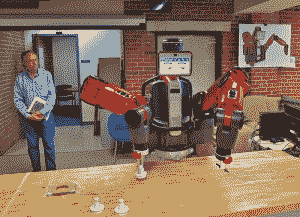
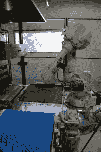

# 特朗普承诺带回制造业工作，但机器人不会让他

> 原文：<https://web.archive.org/web/https://techcrunch.com/2016/11/09/trump-promises-to-bring-back-manufacturing-jobs-but-robots-wont-let-him/>

对于在工资停滞、就业不足或失业中挣扎的美国人来说，唐纳德·特朗普最有吸引力的竞选承诺之一是将制造业就业岗位带回美国。

对于当选总统来说，驾驭政策、关税和地缘政治的复杂性已经够难的了。但是技术将使这个承诺几乎不可能实现。

为什么？因为制造业工作越来越多地由机器人完成，而不是人。

根据来自[联合国贸易发展会议的最新政策报告，机器人技术已经帮助汽车、电气和电子行业的制造商减少了对海外劳动力的依赖。](https://web.archive.org/web/20230403122248/http://unctad.org/en/PublicationsLibrary/presspb2016d6_en.pdf)

自动化确实让制造商可以在美国做生意，而以前他们可能会选择在东南亚或其他地方做生意。

*反思机器人公司的 Baxter。*

但是当制造业回到美国时，工作并没有随之大量增加。报告指出，自动化让发展中国家的工人失业，美国也面临同样的前景。

创建有趣的机器人技术的初创公司正在吸引种子和风险投资，这些机器人技术有可能从国内外的人们那里“偷走”工作。

这个空间的玩家包括烙汉堡和做披萨的机器人，分别来自 [Momentum Machines](https://web.archive.org/web/20230403122248/https://www.crunchbase.com/organization/momentum-machines#/entity) 和 [Zume](https://web.archive.org/web/20230403122248/https://techcrunch.com/2016/09/01/robots-and-on-board-ovens-deliver-on-zumes-promise-of-better-pizza/) ，绘画机器人来自 [Rational Robotics](https://web.archive.org/web/20230403122248/https://www.crunchbase.com/organization/rational-robotics) 。此外，还有像 [Modbot](https://web.archive.org/web/20230403122248/https://techcrunch.com/2014/01/08/modbot/) 和 [Baxter、](https://web.archive.org/web/20230403122248/https://techcrunch.com/2015/03/19/rethink-robotics-home-of-baxter-brings-a-new-robot-arm-to-the-party/)这样的机器人，可配置用于制造业和其他领域的广泛用途。

然而，不仅仅是初创公司。像耐克和 T2【阿迪达斯这样的大品牌已经放弃了承包商，转而采用机器人技术和 3d 打印技术来制造他们的鞋子。[大型农场早就在田间雇佣机器人](https://web.archive.org/web/20230403122248/https://www.therobotreport.com/news/ag-in-transition-from-precision-ag-to-full-autonomy)，像[亚马逊](https://web.archive.org/web/20230403122248/https://techcrunch.com/2014/12/01/these-cool-robots-are-processing-your-amazon-orders/)和 [UPS](https://web.archive.org/web/20230403122248/https://techcrunch.com/2013/12/03/ups-also-said-to-be-testing-drone-delivery-constant-robot-background-hum-increasingly-inevitable/) 这样的大公司在物流和仓储方面严重依赖机器人。

*Zume 的披萨制作机器人。*

联合国贸发会议的报告解释说，“发达国家机器人使用的增加侵蚀了发展中国家的传统劳动力成本优势”，并已经产生了全球影响。

不仅仅是机器人提高了生产力。他们可以帮助公司简化与在海外开店相关的各种棘手问题。

向供应商外包或跨境雇佣员工的制造商，将不得不应对远程管理人员、设计、质量、安全、海关和物流、合规和知识产权的成本。

随着机器人技术的每一次进步，“回流”变得越来越有吸引力，因为它减少了管理和法律费用以及劳动力成本。

很明显，机器人并没有变笨。计算机视觉和人工智能的进步有望让机器人及其内部的软件大脑与人相比更具竞争力，尤其是在制造业，甚至是在物理安全或酒店服务方面。

没错，机器人[收银员、](https://web.archive.org/web/20230403122248/https://techcrunch.com/2016/05/24/pepperoni-pizza/)助理、[保安](https://web.archive.org/web/20230403122248/https://techcrunch.com/2016/08/22/drone-startup-aptonomy-has-created-robotic-flying-security-guards/)和[乘务员](https://web.archive.org/web/20230403122248/https://techcrunch.com/2016/09/11/pepper-the-inflight-service-bot-is-a-multi-lingual-flight-attendant-who-doesnt-hate-picking-up-your-garbage/)是一个东西。

让我们只希望“手工”商品和人工服务永远有市场，也许还有一个机器人可以帮助教前员工新的工作技能。