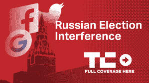

# 普京提议与美国成立联合网络安全小组，调查俄罗斯干预选举 

> 原文：<https://web.archive.org/web/https://techcrunch.com/2018/07/16/trump-putin-joint-cybersecurity-group/>

在周一有争议的赫尔辛基峰会上，俄罗斯总统弗拉基米尔·普京推动了一项议程，表面上看，美国和俄罗斯作为盟友并肩工作。这两个国家比以往任何时候都更加陌生，就在几天前，特朗普自己的司法部因臭名昭著的 2016 年民主党全国委员会黑客攻击起诉了 12 名俄罗斯情报官员。

尽管如此，俄罗斯总统恢复了美国和俄罗斯之间致力于网络安全事务的联合小组的会谈。对于任何关心美国安全利益的人来说，特朗普一年前在一条推文中支持的这一提议，将真正是这两个世界领导人之间令人困惑的亲密关系的最坏情况。

普京在赫尔辛基表示:“特朗普总统再次提到了所谓的俄罗斯(在)美国大选期间进行干涉的问题，我不得不重申我说过几次的话……”。

“任何具体的材料，如果出现这样的事情，我们都准备一起分析。例如，我们可以通过网络安全联合工作组来分析它们，我们在以前的接触中讨论过该工作组的建立。”

普京补充说，俄罗斯赞成“在反恐和维护网络安全方面继续合作。”

“最近的例子是他们在最近结束的世界杯足球赛中的行动合作，”普京说。“总的来说，各特勤部门之间的联系应该放在全系统的基础上，应该纳入一个系统的框架。我提醒了特朗普总统关于重新建立反恐工作组的建议。”

在特朗普去年提出与俄罗斯建立“不可渗透的(网络安全)单位”后，两党进行了大声的指责，这位美国总统将他的评论后退了几步，暗示这些评论是假设的。无论它是否实现，整个想法都有点令人震惊地偏离了国家安全规范，这将被广泛谴责为让狐狸进入鸡窝，因为有足够的证据证明俄罗斯是美国的网络对手，无论是现在还是过去。

2017 年，美国情报界[毫不含糊地发布了这样一个论断](https://web.archive.org/web/20221025222115/https://www.dni.gov/files/documents/ICA_2017_01.pdf):

> 俄罗斯影响 2016 年美国总统大选的努力是莫斯科长期以来破坏美国领导的自由民主秩序的最新表现，但这些活动表明，与以前的行动相比，直接性、活动水平和努力范围都有了显著升级。

该报告指出，这些信息来源广泛，称“对俄罗斯努力的洞察——包括具体的网络行动——以及俄罗斯对美国主要参与者的看法来自多个确证的来源。”

参与调查 2016 年民主党全国委员会(DNC)黑客攻击的安全公司 CrowdStrike 毫无争议地将俄罗斯列入了美国与中国、朝鲜和伊朗一起的“[著名民族国家对手](https://web.archive.org/web/20221025222115/https://www.crowdstrike.com/blog/crowdstrike-2018-global-threat-report-reveals-the-trends-insights-and-threat-actors-you-need-to-know/)”名单。

就在几天前，美国国家情报总监丹·科茨(Dan Coats)警告说，当涉及到对联邦、州和地方美国实体的攻击时，“[警示灯再次闪烁红色](https://web.archive.org/web/20221025222115/https://boingboing.net/2018/07/13/u-s-intel-chief-warns-of-gr.html)。科茨称俄罗斯、中国、伊朗和朝鲜是针对美国的网络侵略者，并补充说，“毫无疑问，俄罗斯是最具侵略性的外国角色。”

不清楚美国会从这样的安排中获得什么，如果有的话，尽管它会失去很多，因为俄罗斯影响美国选举的兴趣可能正在持续。普京在赫尔辛基的评论表明，这种努力的精神将继续存在，尽管它可能被误导了。