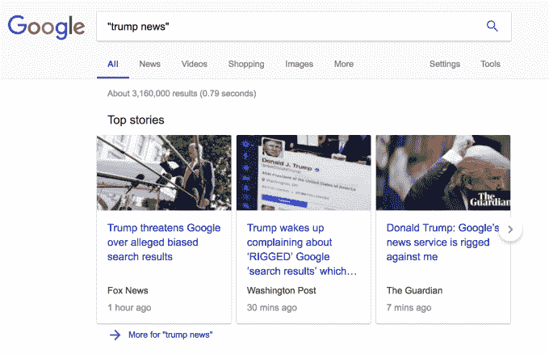

# 特朗普愤怒地发推称谷歌声称搜索“偏见”

> 原文：<https://web.archive.org/web/https://techcrunch.com/2018/08/28/trump-rage-tweets-google-alleging-search-bias/>

尽管自特朗普上任以来，几家科技巨头发现自己处于特朗普总统的十字路口，但他刚刚对谷歌发起了似乎是迄今为止最持续的攻击——在华盛顿 DC 时间凌晨 5 点 30 分左右发了几条推文，指责他所说的如果有人键入“特朗普新闻”，搜索引擎会提供的结果中存在算法偏见。

不，总统没有用四个音节的词“算法”。但据推测，他甚至还没有喝完当天的第一杯可乐。

在他的愤怒推文中，特朗普具体指控“‘特朗普新闻’96%的结果来自国家左翼媒体”，但没有引用他声称的数据点的来源。然后，他进一步提出未经证实的说法:“谷歌和其他公司压制保守派的声音，隐藏好的信息和新闻。”

《卫报》暗示，96%的说法是指网站 [PJ 媒体](https://web.archive.org/web/20230306043024/https://pjmedia.com/trending/google-search-results-show-pervasive-anti-trump-anti-conservative-bias/)周末发布的一篇文章，该网站自称对搜索“川普”的前 100 名谷歌新闻结果进行了“非科学”的研究，显然暗示了“对右倾内容的偏见模式”。

特朗普在两条推文的结尾警告说，“这种情况将得到解决”——但没有具体说明他计划做什么。这几乎是特朗普推特政策的标志。尽管围绕他的政府的更广泛的政治背景，随着[弹劾的传言](https://web.archive.org/web/20230306043024/https://www.theguardian.com/us-news/2018/aug/25/trumps-terrible-week-stunning-news-and-whispers-of-impeachment)在空气中传播，意味着特朗普对与他本人有关的负面头条新闻的任何大声的公开抱怨都是试图转移人们对他周围正在沸腾的法律热点的注意力。但是不管怎样。

以下是充满愤怒和荣耀的推文:

我们已经联系了谷歌寻求评论。**更新:**该公司现已通过电子邮件向我们发送了一份声明，驳斥任何关于其搜索结果有偏见和/或被操纵以反映任何政治情绪的说法。

谷歌发言人告诉我们:

> 当用户在谷歌搜索栏中输入查询时，我们的目标是确保他们在几秒钟内收到最相关的答案。搜索不是用来设置政治议程的，我们不会让我们的结果偏向任何政治意识形态。每年，我们都会对我们的算法进行数百次改进，以确保它们能够呈现高质量的内容来响应用户的查询。我们不断努力改进谷歌搜索，我们从不为操纵政治情绪而对搜索结果进行排名。

具有讽刺意味的是，在特朗普的谷歌燃烧的推文之后，我测试了“特朗普新闻”的搜索，我得到了以下结果，知名右翼新闻机构福克斯新闻频道在头条位置获得了第一个结果，所以呃……

目前还不清楚特朗普是否意识到谷歌搜索结果会因进行搜索的个人而异。好吧，如果特朗普看到了很多关于他自己的坏消息(当他搜索关于他自己的新闻时)，那么我们可以说，我们肯定弗洛伊德会有一天的时间来解开特朗普对他不断声称讨厌并声称是“假”的新闻来源如此专注的纠结暗示。但是，不管怎样。

当然，特朗普在这里声称的大部分都是公然的胡说八道——特别是当他的癌症标语“假新闻”被随意地打在他不同意的任何事情上，不管它是真是假。

但有一点他说的或多或少是对的:谷歌可以说是“控制了我们能看到和不能看到的东西”，因为该公司在西方的搜索市场占据主导地位(在欧洲也是如此)，而且大多数互联网用户永远不会点击它所提供的搜索结果的第一页。甚至浏览前几个结果之外的内容。

因此，从本质上来说，谷歌算法创建的信息层次可以并确实是表面或沉积物信息。或者，换句话说，如果它不在谷歌的第一页，它几乎不在那里。

另一个关于谷歌影响力的例子是:在欧洲，近年来，该公司现在根据请求(在审查请求并做出决定后)选择性地取消与个人相关的某些搜索结果的索引，以遵守欧盟最高法院的一项法律裁决(所谓的“[被遗忘权](https://web.archive.org/web/20230306043024/https://techcrunch.com/tag/rtbf/)”)，从而减少了非公开个人的特定数据点在该地区广泛可见的可能性。

事实上，一家公司对信息的可获取性(以及影响舆论的潜力)拥有如此大的影响力，这应该引起我们的关注。

尤其是谷歌的算法引擎是专有的黑匣子，没有或几乎没有对其信息形成是否公平甚至适当的独立监督。(在欧洲，该公司再次被[指控在购物相关搜索中高于竞争对手推广自己的产品](https://web.archive.org/web/20230306043024/https://techcrunch.com/2017/06/27/google-fined-e2-42bn-for-eu-antitrust-violations-over-shopping-searches/)——并不得不改变其显示的产品搜索结果，以遵守反垄断裁决，尽管它对监管机构的决定提出异议并提起法律上诉。)

因此，特朗普至少正确地认识到，谷歌可以并且确实通过其信息检索平台的普及来行使巨大的权力。

即使声称他也有选择地、自私地放大——即“96%有偏见”——也是完全没有事实根据的，其依据是美国保守派新闻博客进行的一项非科学调查。所以适当判断。

此外，坦率地说，任何西方商业公司，更不用说像谷歌这样突出和主流的公司，都会有意和系统地将政治偏见嵌入其算法，使其对大量潜在用户变得不那么有用，这种想法是荒谬的。

如果有什么不同的话，科技平台往往会有相反的问题；它们提供过于个性化的内容，通过向人们提供政治单一饮食，冒着缩小用户意识形态视野的风险。(这或许有助于解释特朗普现象本身，但我跑题了。)

尽管如此，总统继续让科技公司成为他的推特出气筒。例如，就在上个月，他指责推特“影子禁止”共和党用户。一个说法[公司迅速否认](https://web.archive.org/web/20230306043024/https://techcrunch.com/2018/07/26/twitter-says-it-does-not-shadow-ban-despite-complaints-by-republicans/)，写道:“我们没有影子禁令。你总是可以看到你关注的账户的推文(尽管你可能需要做更多的工作才能找到它们，比如直接进入他们的个人资料)。我们当然不会因为政治观点或意识形态而怀疑潘基文。”

可以肯定地说，随着关于特朗普的头条新闻变得更糟，特朗普的愤怒将会增长，推文肯定会源源不断。

**更新:**国会山报道称，白宫经济顾问拉里·库德洛(Larry Kudlow)在特朗普发推文后被记者问及政府的意图时表示，政府正在“考虑”可能对谷歌进行监管。