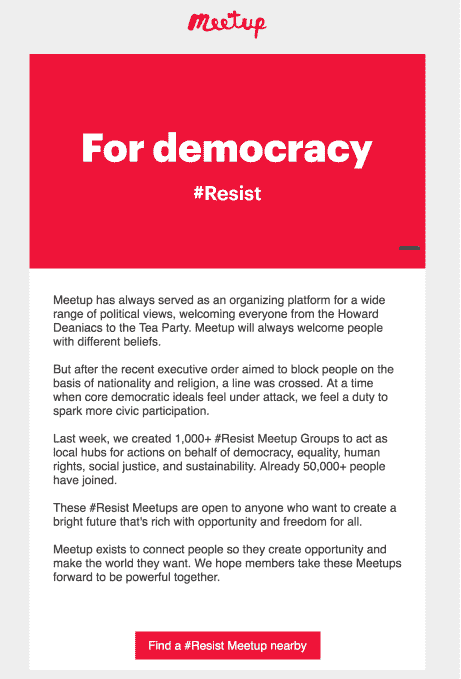
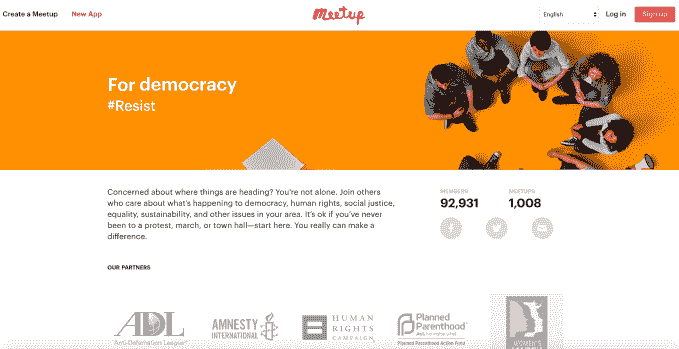

# 特朗普的支持者抵制 Meetup，原因是该公司创建了# respont 团体，让人们知道了它的政治活动 

> 原文：<https://web.archive.org/web/https://techcrunch.com/2017/02/16/trump-supporters-boycott-meetup-after-company-creates-resist-groups-makes-its-politics-known/>

Meetup 是一个帮助人们组织徒步旅行和烹饪课等聚会的网站。面对美国新政府的政策，该网站的政治立场变得非常坚定。特朗普的支持者们为此感到愤怒，T2 方面正在删除他们的账户，T4 方面则呼吁抵制。

虽然 Meetup 的平台对任何政治派别的人开放，但这家此前不关心政治的公司已经在网站上种下了 1，000 个# respont Meetup 团体，并通过电子邮件向 3，000 万会员发送提醒。

公司在电子邮件中表示，网站将始终欢迎不同信仰的人，但在特朗普发布旨在“基于国籍和宗教”阻止人们的行政命令后，Meetup 表示，它觉得有责任激发更多的公民参与。

他在信中指出，该网站目前已有 1000 个“抵制”组织，这些组织的宗旨是成为当地的“民主、平等、人权、社会公正和可持续发展”维权人士的活动中心。

此外，电子邮件中还有一个链接，用户可以单击该链接在本地找到一个# reject 聚会。

像今天的许多其他公司一样，该公司一直在努力解决它希望如何应对特朗普政府及其有争议的政策在美国的情况。特朗普的行为导致了抗议和“抵抗”运动的组织，该运动现在更积极地参与联邦、州甚至地方层面的政治。

这种抵抗活动大多是通过团体和事件在脸书进行的。例如，[华盛顿妇女游行起源于《脸书邮报》](https://web.archive.org/web/20221206151805/https://www.washingtonpost.com/news/local/wp/2017/01/31/the-woman-who-started-the-womens-march-with-a-facebook-post-reflects-it-was-mind-boggling/),后来变成了草根组织的活动。

本月早些时候，Meetup 决定是时候在这个问题上表明立场了。

该公司表示，它停止正常运营两天，以举办全公司范围的黑客马拉松，其目标是“在 Meetup 平台上释放尽可能多的阻力”。

因此，Meetup 推出了这些#抵制小组，并推出了旨在让任何人更容易安排聚会的产品变化。

这些团体也是与妇女游行、计划生育、反诽谤联盟、大赦国际和人权运动合作发起的。这些组织正在帮助为 Meetup 活动提供模板，并就人们聚集在一起时可以做些什么提出建议。

在该公司发出电子邮件之前，第一个周末就有 11，500 名成员注册了这些团体。邮件发出时，已经有 50，000 名成员加入了。如今，这些组织已经发展到拥有超过 90，800 名成员。

除了最初的 1，000 个群组之外，现在还有 500 多个群组正在建立中，15，240 个 Meetup 成员已经回复了 2，453 个预定事件。

不出所料，Meetup 的举动激怒了政治光谱的对立面。

许多人呼吁抵制，删除账户或表示他们对 Meetup 煽动政治动荡感到愤怒。

https://Twitter . com/andeiamwhoiam/status/831309229277532160

*上图:一条愤怒的推特。尚不清楚用户是有意使用电影中一个家庭逃离纳粹的画面，还是对他们没有讽刺。*

Meetup 并不是唯一一家受到美国政治影响或因其立场而面临抵制的科技公司。

另一方面，抗议特朗普移民和难民禁令的人发起了抵制优步的运动，他们认为特朗普利用出租车罢工反对禁令来推广自己的打车服务。(考虑到优步首席执行官特拉维斯·卡兰尼克是特朗普总统的经济顾问[，用户也很关心他的政治立场。)](https://web.archive.org/web/20221206151805/http://www.businessinsider.com/tesla-ceo-elon-musk-uber-travis-kalanick-join-donald-trump-strategic-policy-forum-economic-team-2016-12?r=UK&IR=T)

愤世嫉俗者可能会认为，Meetup 看到了将越来越多的抵抗组织成员引入自己网站的机会，从而增加了用户数量，进而增加了收入。但对于像 Meetup 这样依赖付费订阅的公司来说，做出这样的决定是有风险的。它知道这会失去特朗普的支持者，并激怒其他人。

首席执行官 Scott Heiferman 解释了 Meetup 走这条路的原因。“我们感到对我们的国家和人类有义务捍卫民主的核心价值观。我们听到人们在妇女游行之后。我们听到人们想要做些什么，”海夫曼告诉 TechCrunch。“我们知道我们的平台可以帮助人们。”

他还指出，Meetup 受到了网站上已经存在的有机活动的启发，像这样的 Meetup 正在迅速动员起来。

海夫曼也预料到会有反对意见，但还是继续前进。

“我们感到更有必要为那些可能遭受痛苦的人的权利挺身而出。我们知道我们的平台可以让人们在当地采取行动——因为它已经在发生了，”他说。"出于恐惧，我们没有选择保持沉默."