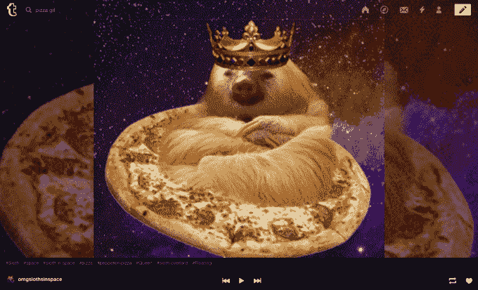
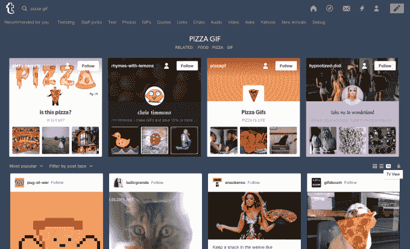
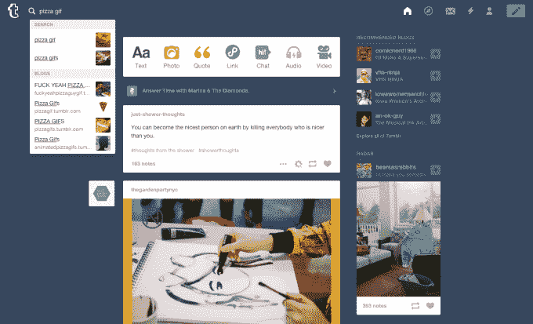

# Tumblr 推出“Tumblr TV”，这是一个带有全屏观看模式的 GIF 搜索引擎 

> 原文：<https://web.archive.org/web/https://techcrunch.com/2015/06/25/tumblr-launches-tumblr-tv-a-gif-search-engine-with-a-full-screen-viewing-mode/>

继本月早些时候推出 Tumblr 的 GIF 搜索引擎之后，这个博客平台今天推出了另一项新功能，旨在帮助用户发现和分享 GIF:[Tumblr TV](https://web.archive.org/web/20221209140408/http://tumblr.com/tv)。新增功能结合了 gif 的搜索和查看功能，可以帮助您找到 Tumblr 上的动画图像，然后以全屏模式查看它们。该功能标题的“电视”部分是指该界面提供了播放器控件，如播放、暂停、前进和后退。

虽然 Tumblr GIF 搜索引擎[几周前宣布](https://web.archive.org/web/20221209140408/https://beta.techcrunch.com/2015/06/04/tumblr-debuts-its-own-gif-search-engine/#.s2agxy:eDOO)允许登录用户在自己的博客上找到 GIF 进行分享，但任何人都可以使用 Tumblr TV，即使他们没有 Tumblr 账户。

有几种方法可以使用这项新服务。你可以选择通过 URL[tumblr.com/tv](https://web.archive.org/web/20221209140408/http://tumblr.com/tv)直接访问 Tumblr TV，这默认显示整个服务当前的趋势 GIF——这一指标由多种因素决定，包括 GIF 的新鲜度和最近的参与情况。

您也可以通过开始搜索特定的 GIF 来访问 Tumblr TV(例如，从仪表板中搜索“OMG gif”或“OMGgifs”)。在推出 Tumblr TV 之前，这种搜索查询可以很好地显示 Tumblr 博客中的 gif，但现在用户会注意到搜索结果上方有一个小的“TV”按钮。这可以在浏览视图中的网格和列表视图按钮旁边找到。点击此电视按钮后，您将进入 Tumblr 电视界面。

在 Tumblr TV 中，gif 以全屏模式启动——坦率地说，鉴于 gif 通常分辨率较低，这并不总是 gif 的最佳外观。GIF 在定时循环中播放，自动从一个 GIF 前进到下一个。当您将光标悬停在 Tumblr 电视界面上时，您将看到 GIF 的来源(最先发布它的 Tumblr 博客)、其标签和播放器控件，这些控件允许您后退、前进或暂停 Tumblr 电视体验，以保持在当前 GIF 上。

你也可以点击这里出现的标签来浏览共享相同标签的其他 GIF，或者你可以访问最初发布 GIF 的博客。

与 Tumblr GIF 搜索一样，Tumblr TV 是使用 Tumblr 上已经托管的 GIF 集合构建的，而不是与 Giphy 等第三方 GIF 搜索引擎集成。该网站目前拥有超过 2.39 亿个博客，每天有超过 8000 万篇新帖子。Tumblr 上目前有超过 1120 亿条帖子，其中许多都包含 GIF，这为 Tumblr 的 GIF 搜索服务提供了一个相当大的数据库。

当然，Tumblr TV 和之前的 Tumblr GIF 搜索一样，也是为了鼓励 Tumblr 用户参与这项服务。这就是为什么它包括按钮来收藏 GIF 或重新记录它。不幸的是，在 Tumblr 之外没有简单的方法来分享 GIF——没有社交分享按钮，你甚至不能右键单击 GIF 以将其保存在本地。换句话说，虽然非 Tumblr 用户也可以使用这项服务，但如果你还没有 Tumblr 账户，那么你在 Tumblr 电视上能做的事情就只有这么多了。

对于 Tumblr 来说，这似乎是一个错失的机会，因为允许用户更广泛地发布推文或分享 Tumblr 的 gif 可能会增加该服务的浏览量，并鼓励更多人注册。Tumblr 甚至可以向这些新用户推广其博客服务，作为存储和保存你最喜欢的 gif 的地方。

该公司表示，Tumblr 电视代表着继续努力扩大对 Tumblr 最受欢迎的功能之一 gif 的访问。

Tumblr 产品工程师 Bill Eager 说:“gif 是 Tumblr 的一个核心功能，我们一直在想不同的方法来展示和展示这种流行的媒体。“Tumblr 上有大量令人难以置信的 GIF 内容，值得更多的关注，我们希望创造一种方式，在没有任何干扰的情况下，美丽而轻松地将 GIF 直接传递给我们的用户。Tumblr 电视还允许创作者接触新观众，并以全新的方式吸引现有观众。这是另一个伟大的发现工具，可以唤起好奇心，让在 Tumblr 上迷路变得有趣。”

Tumblr TV 和 GIF 搜索一样，目前只能在桌面网络上使用，但该公司表示，正在探索将移动设备纳入未来体验的方法。