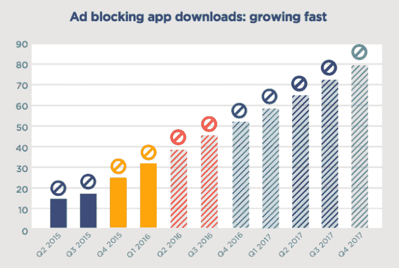

# 调查显示，25%的智能手机用户下载了广告拦截器 

> 原文：<https://web.archive.org/web/https://techcrunch.com/2016/03/07/tune-ad-blocking-survey/>

# 调查显示，25%的智能手机用户下载了广告拦截器

移动营销公司 [Tune](https://web.archive.org/web/20221205111537/https://www.tune.com/) 正在[发布一份新报告](https://web.archive.org/web/20221205111537/http://in.tune.com/tmc-site-ad-blocking-report)，其中 24.6%的调查受访者表示他们下载过广告拦截应用或浏览器。

该公司表示，它调查了美国和欧洲的近 4000 名智能手机用户，发现其采用率正在快速增长——只有 2.4%的受访者表示他们在之前的四到六个月下载了广告拦截器，而 7.8%的人表示他们自 2015 年 11 月以来一直在这样做。

Tune 预计，到 2017 年第三季度，广告屏蔽可能会覆盖 80%的智能手机用户。

这里有一些警告:这是一项调查，询问人们他们在手机上有什么，而不是直接从手机上获取数据。(事实上，21%的受访者表示他们不确定是否安装了广告拦截器。)另外，现在还为时过早，[苹果公司去年秋天才允许在 iOS](https://web.archive.org/web/20221205111537/https://beta.techcrunch.com/2015/09/17/a-day-after-ios-9s-launch-ad-blockers-top-the-app-store/) 上屏蔽广告，所以我不确定这种令人印象深刻的增长率会持续下去。而且，正如报告指出的那样，仅仅因为有人下载了一个广告拦截应用程序，并不意味着他们实际上正在使用它。

该报告还调查了广告屏蔽的人口统计数据，但没有指出任何压倒性的趋势。是的，广告拦截器“稍微偏向于年轻人和中年人”，但也有 65 岁以上的人说他们已经安装了一个。同样，男性、安卓用户和欧洲人似乎更有可能尝试广告拦截器，但这只是几个百分点的差异。

Tune 首席执行官彼得·汉密尔顿在一份电子邮件声明中表示:“人们希望屏蔽广告，因为如今大多数移动广告都很烦人，具有破坏性。”。“大部分责任在于出版商，他们可以选择与广告合作伙伴一起赚钱的最佳方式。如果体验确实有趣或有帮助，消费者会允许广告的。”

互动广告局(Interactive Advertising Bureau)是一个面向在线广告客户的贸易团体，它今天发布了自己的“[广告拦截初级读本](https://web.archive.org/web/20221205111537/http://www.iab.com/iab-tech-lab-publisher-ad-blocking-primer/)”，建议出版商采取“交易(检测、解释、询问、解除或限制)”的方式来对付广告拦截器。

你可以[在这里](https://web.archive.org/web/20221205111537/http://in.tune.com/tmc-site-ad-blocking-report)阅读全文报道。