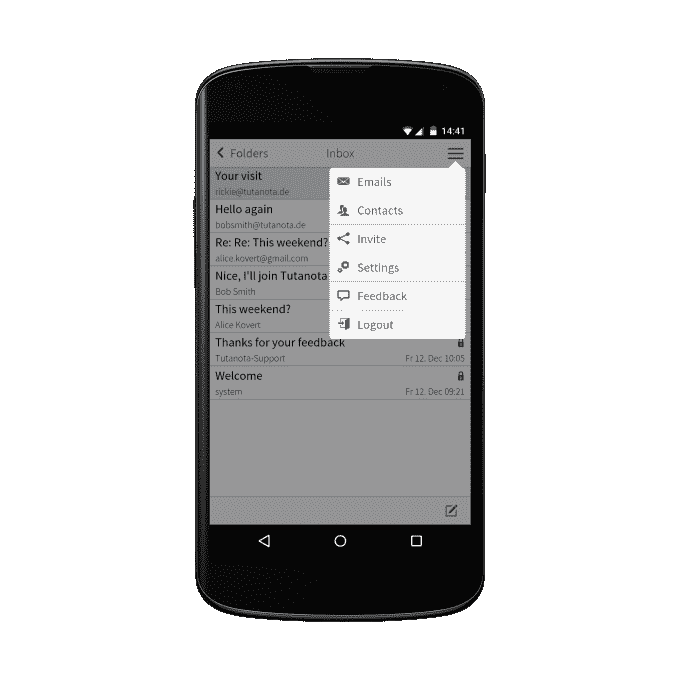

# Tutanota，一个开源的加密 Gmail 替代品，即将退出 Beta 

> 原文：<https://web.archive.org/web/https://techcrunch.com/2015/03/18/tutanota-exits-beta/>

总部位于德国的加密电子邮件初创公司 [Tutanota](https://web.archive.org/web/20230224204806/https://tutanota.com/) 将于下周推出测试版服务——经过一年的测试，近 10 万用户注册发送和接收安全电子邮件。

在周二发布的新版本中还将提供更多的域，包括。com 和。io 选项(除了当前的。de 选项)。

Tutanota 成立于 2011 年底，其理念是让安全电子邮件比 PGP 等现有选项更简单。它的易用性意味着它可以在网络浏览器中加密电子邮件，还可以提供 iOS 和 Android 应用。

它类似于加密电子邮件产品 [ProtonMail](https://web.archive.org/web/20230224204806/https://techcrunch.com/2014/06/23/protonmail-is-a-swiss-secure-mail-provider-that-wont-give-you-up-to-the-nsa/) 、 [StartMail](https://web.archive.org/web/20230224204806/https://www.startmail.com/) 和 [Hushmail](https://web.archive.org/web/20230224204806/https://www.hushmail.com/) 之类的产品，但它表示，它更加强调可用性，具有简洁的界面、附件加密等功能以及对不同设备的支持。

“我们决定发明一些易于使用的新东西。这是从一开始的计划，”联合创始人阿恩·马勒告诉 TechCrunch。“很明显，我们需要使用现代技术——网络浏览器、应用程序——这就是为什么我们决定创建一个网络应用程序，而不是你必须在本地安装的东西。”

在长达一年的测试过程和社区审查后，该公司声称对 Tutanota 的安全性充满信心，现在删除了测试标签——尽管它确实承认去年夏天容易受到跨站点脚本漏洞的攻击[(该漏洞随后得到修复)。](https://web.archive.org/web/20230224204806/http://www.theregister.co.uk/2014/07/11/tutanota/)

自 2011 年以来，hle 表示，它跟踪了人们对隐私日益增长的兴趣，并表示该产品在世界各地都有用户，包括美国的相当大一部分用户，他称美国是 Tutanota 的主要市场。

“我们确实看到(对隐私的兴趣)有所增加。这可能不是一个非常大的增长，但绝对是一个增长，特别是在(美国国家安全局告密者)爱德华·斯诺登之后。更多的人——私人用户——了解这些威胁。他们必须做些事情来捍卫自己的隐私，”他补充道。

Tutanota 加密是在客户端设备上本地完成的，使用用户自己的密码保护(因此也需要很强，并且他们自己的设备需要防御恶意软件以确保电子邮件安全)，然后通过 Tutanota 的服务器上传并发送给收件人，然后在收件人的设备上解密。

Tutanota 并不知道用户的密码(没有密码重置选项)，因此它表示，作为电子邮件服务提供商，它没有办法解密它发送的数据。这意味着它不能被政府强迫交出数据。对你的电子邮件进行数据挖掘以向广告商出售英特尔也不是什么好事。

“我们使用端到端加密。这意味着如果你加密一些数据，它总是在客户端加密，所以在浏览器中，在应用程序中，它不能被解密，除非被加密的人，”hle 说。这种解密再次发生在客户端。因此，如果您发送一封电子邮件，这封电子邮件会在您的客户端加密，通过 Tutanota 服务发送，然后在接收客户端再次解密。

为了增强用户的信任，它去年开放了其软件的源代码，以供社区审查。并指出其系统还接受了德国渗透测试公司 SySS 的加密同行审查。

“我们使用被证明是安全的标准加密算法，至少根据目前的知识是这样，所以我们使用 RSA 和 AES。这两者也用于 PGP 或 S/MIME 或军事系统等。

Tutanota 用户在注册服务时会被自动分配一个非对称密钥对(一个公钥，一个私钥)——密钥是在他们的客户端设备上创建的，而不是在 Tutanota 的服务器上，并再次用他们自己的密码加密。

加密密钥在用户设备之间同步，因此用户不必手动传输它们。Tutanota 当然也会对附件和电子邮件主题行进行加密。马勒承认，虽然元数据对加密电子邮件来说仍有问题，但这项服务至少不会存储 IP 地址。它还打算在未来的更新中实现一个隐藏特定发件人的功能。

“即使你发送的电子邮件没有加密，也有可能发送…‘正常’的电子邮件(通过 Tutanota)，但即使这些未加密的电子邮件也是加密存储在服务器上的，”Mö hle 补充道。“因此，如果你发送一封未加密的电子邮件，你发送的电子邮件会在服务器上为你加密，这样我们以后就无法访问它。”

在 2013 年爱德华·斯诺登(Edward Snowden)披露美国情报机构监控项目后，加密电子邮件继续带来挑战。那年夏天，总部位于美国的 [Silent Circle 关闭了其加密电子邮件产品](https://web.archive.org/web/20230224204806/https://techcrunch.com/2013/08/08/silent-circle-preemptively-shuts-down-encrypted-email-service-to-prevent-nsa-spying/)，以避免将用户数据移交给政府机构，并从那时起转向加密移动通信产品与 [Blackphone](https://web.archive.org/web/20230224204806/https://techcrunch.com/2015/02/26/silent-circle-buys-geeksphone-out-of-blackphone-joint-venture/) (同时还致力于[黑暗邮件项目](https://web.archive.org/web/20230224204806/https://techcrunch.com/2013/11/05/dark-mail/)，以建立一个新的电子邮件安全消息协议，旨在锁定元数据)。它还将总部迁到了瑞士。

在政治前景更有利于保护隐私的欧洲部分地区，初创公司显然在这里看到了商机。例如，瑞士在其宪法中规定了包括电子邮件在内的私人通信权。而马勒说，德国法律意味着电子邮件提供商不能被迫操纵他们的软件来实施后门。

他补充称:“我们无法(向政府)发送电子邮件，因为我们无法阅读它们。”。“如果(用户)熟悉源代码，他们可以查看开放源代码，自己看看代码是否正常。你已经可以自己构建 Tutanota Android 应用程序或 web 应用程序，所以你可以使用你已经检查过的代码，构建应用程序并在本地运行它，所以我们为每个人提供了确保他们使用的软件确实是你已经看过的那个软件的可能性。”

Tutanota 有一个免费增值的商业模式，该产品的免费版本提供高达 1GB 的存储空间，而付费版本计划在未来将消费者版本货币化。它还为企业提供了一个高级版本，允许他们使用自己的域名并插入 Outlook 电子邮件。它已经从中获利了。

Tutanota 有两个投资者，都是德国当地的风险投资公司，迄今为止已经投入了六位数的投资。投资方为: [MBG](https://web.archive.org/web/20230224204806/http://www.mbg-hannover.de/index.php?detectjs=1) 和[享受风险](https://web.archive.org/web/20230224204806/http://www.enjoyventure.de/)。