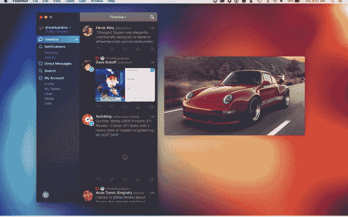
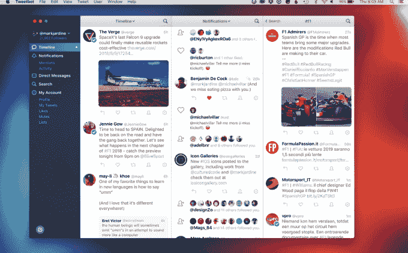
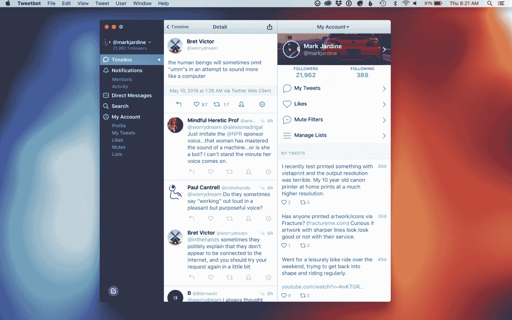

# Tweetbot 3 以全新的面貌出现...Twitter API 变化的暂缓期

> 原文：<https://web.archive.org/web/https://techcrunch.com/2018/05/15/tweetbot-3-arrives-with-a-new-look-and-a-reprieve-from-twitters-api-changes/>

Twitter 最受欢迎的桌面客户端之一， [Tweetbot](https://web.archive.org/web/20230325084726/https://tapbots.com/tweetbot/mac/) ，今天发布了其软件的完全重写版本， [Tweetbot 3 for Mac](https://web.archive.org/web/20230325084726/https://itunes.apple.com/us/app/tweetbot-3-for-twitter/id1384080005?ls=1&mt=12) 。更新后的应用程序引入了新功能，如时间轴过滤器、新的通知视图、升级后的导航侧栏等。与此同时，该公司还详细说明了 Twitter 宣布的 API 变化可能对其应用程序产生的影响。

Twitter 围绕数据流的 API 变化一直在影响第三方开发者。他们最近[导致 Favstar、](https://web.archive.org/web/20230325084726/https://techcrunch.com/2018/05/14/favstar-twitter/)即将关闭，而包括 Tweetbot 在内的其他 Twitter 应用程序制造商[联名写信给 Twitter](https://web.archive.org/web/20230325084726/http://apps-of-a-feather.com/) ，请求帮助解决这些变化将会给他们的应用程序带来的问题。

显然，这种抵制已经奏效。Tweetbot 创始人保罗·阿达德告诉 TechCrunch，原定于 2018 年 6 月 19 日进行的 API 弃用被无限期推迟。他补充说，如果出现这种情况，Tweetbot 将继续工作，但一些功能可能会变慢或被删除。

“Twitter 有一个替代 API，如果我们被允许使用，我们将能够使用它来替代几乎所有他们反对的功能，”他解释道。“在 Mac 上，最糟糕的情况是我们无法显示赞和转发的通知。Haddad 补充说:“推文、提及、引用、DMs 和关注的通知将延迟一到两分钟。

他还表示，推文不会在发布时流入，而是会在一到两分钟后流入，因为应用程序会自动为它们投票。(这与 iOS 应用程序现在连接到 LTE 时的工作方式相同——它使用轮询 API。)

这应该会给那些更喜欢这款应用而不是官方客户端的 Tweetbot 重度用户一些安慰，特别是考虑到 Twitter 今年早些时候宣布停止对其 Mac 桌面客户端的支持，旨在将桌面用户推向网络。

然而，很多事情仍然悬而未决。Twitter 尚未向 Tweetbot 提供企业账户活动 API 的详细信息或定价——如果旧 API 被弃用，Tweetbot 将希望切换到替代 API。

此外，作为升级的一部分，Tweetbot 3 对其体验进行了一系列改变。

用户现在可以将媒体设置为自动播放或禁用自动播放，过滤他们的时间线，并利用新的通知视图，该视图现在合并了提及和报价以及其他帐户活动，如关注和转发。

专栏现在也更容易管理，有一个黑色的主题，侧边栏已经升级，所以你可以点击进入任何列表或 DM 对话。

Tweetbot 3 是对 Tweetbot 1 和 2 的付费升级，价格为 9.99 美元，tweet bot 1 和 2 最初于 2012 年首次亮相，然后在 2015 年向用户提供免费的[升级到 Tweetbot 2。(新用户支付 12.99 美元)。](https://web.archive.org/web/20230325084726/https://techcrunch.com/2015/06/04/tweetbot-2-0-secures-its-reputation-as-the-best-twitter-client-for-mac/)

新的推特机器人在苹果应用商店这里[。](https://web.archive.org/web/20230325084726/https://itunes.apple.com/us/app/tweetbot-3-for-twitter/id1384080005?ls=1&mt=12)

