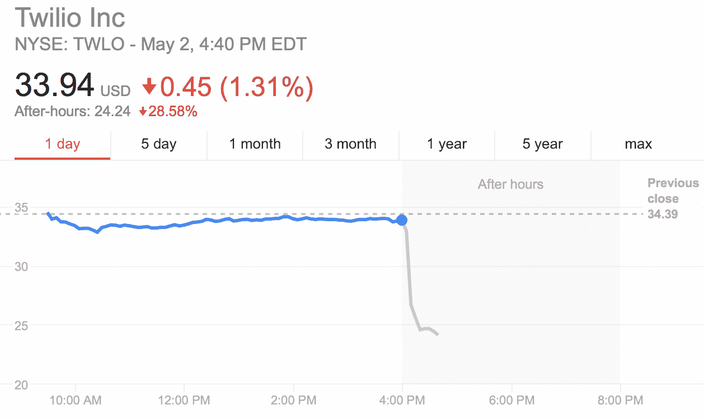
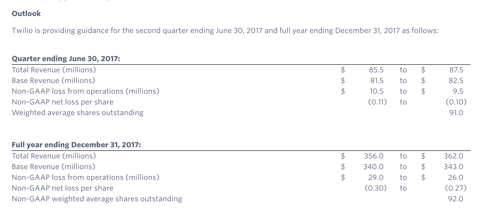

# 由于大客户优步疏远自己，Twilio 股票暴跌

> 原文：<https://web.archive.org/web/https://techcrunch.com/2017/05/02/twilio-stock-takes-a-nosedive-in-after-hours-trading-on-weak-guidance/>

# 由于大客户优步疏远自己，Twilio 股票暴跌

良好的收入报告不足以阻止 Twilio 股票在盘后交易中暴跌。乍一看似乎是一个积极的故事，但很快就变成了一场金融噩梦。由于低于预期的指导，这家云通信公司的股票在盘后交易中下跌了 30%。

在财报电话会议上，首席执行官杰夫·劳森(Jeff Lawson)解释说，Twilio 最大的客户之一优步将在未来一年减少使用 Twilio。这对该公司来说是一个重大打击，因为优步占其本季度收入的 12%。Twilio 预计，随着优步逐渐放弃 Twilio 作为其主要通信基础设施提供商的地位，这一数字在未来一年将会下降。

该公司发布的指引表明，今年的收入将降至 3.56 亿美元至 3.62 亿美元之间。这比预期的 3 . 7 亿美元要少。对于 Q2 2017 年的收益，Twilio 也发布了指引，指出其预计收入在 8550 万美元至 8750 万美元之间。分析师此前预计，8700 万美元将是一个基线预期，而不是一个高端目标。

在指导之外，Twilio 在 2017 年 Q1 财报中报告营收为 8740 万美元，非 GAAP 每股收益亏损 4 美分。这比分析师预期的 8360 万美元的收入高出 380 万美元，也大大超过了每股 6 美分的非 GAAP 预期损失。

Twilio 长期以来一直在努力提高客户集中度，现在它又回来咬他们了。像 WhatsApp 和优步这样的大客户历来占据该公司收入的很大一部分，这引起了一些华尔街人士的担忧。但是，尽管 Twilio 一直在努力实现收入来源的多元化，但一个客户，在这个案例中是优步，仍然能够从这家上市公司获得近 10 亿美元的市值。

“优步真的是一个异数，”劳森在 Twilio 的收益电话会议上说。“你需要花很多钱来证明优步正在进行的重大事业是正确的。”

劳森继续解释说，优步和 WhatsApp 是 Twilio 最大的两个客户。Twilio 在上个季度增加了 4000 名新客户。该公司传统上平均每个季度增加 2，800 名客户。

关于特维利奥的书大部分还没有写完。首席执行官杰夫·劳森在建立开发者社区方面做了令人印象深刻的工作。随着一批新的科技公司 IPO 吸引了行业的注意力，硅谷要求 Twilio 表现出色以吸引更多人退出的压力已基本消退。

但即使如此，Twilio 显然还有很多工作要做，以分散其客户群。今年早些时候，Twilio 与亚马逊网络服务公司谈判了一份合同。这笔交易将 Twilio 的 API 与其联络中心服务产品 Amazon Connect 整合在一起。继续建立新的渠道应该有助于公司获得新的受众。