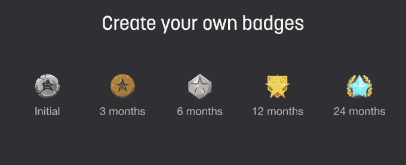

# Twitch 宣布推出 Twitch Prime、忠诚度徽章和视频上传

> 原文：<https://web.archive.org/web/https://techcrunch.com/2016/09/30/twitch-announces-twitchprime-loyalty-badges-and-video-uploads/>

# Twitch 宣布推出 Twitch Prime、忠诚度徽章和视频上传

视频游戏直播服务 Twitch 于 2014 年被亚马逊[以近 10 亿美元收购，今天下午以主题演讲拉开了年度 TwitchCon 大会的序幕。主题演讲通常会带来一些新闻……毫无疑问，这里有一些新内容:](https://web.archive.org/web/20230405183204/https://techcrunch.com/2014/08/25/amazon-will-officially-acquire-twitch/)

*   **Twitch Prime:** 正如我们[在主题演讲](https://web.archive.org/web/20230405183204/https://techcrunch.com/2016/09/30/twitch-appears-to-be-getting-its-own-version-of-amazon-prime-called-twitch-prime/)之前抢先报道的，Twitch 官方确认了 Twitch Prime。亚马逊 Prime 订阅者可以免费获得，它将包括“免费战利品”(如游戏内皮肤、角色等)，无广告观看，每月一次免费频道订阅(流媒体仍将为这些订阅付费)，新发布游戏的折扣和游戏的免费发布日交付。
*   **手机上的剪辑:**观众将能够立即在 iOS/Android 上剪辑/创建/共享 Twitch 流中的剪辑。与此同时，剪辑将通过 10 月中旬推出的新剪辑修剪功能变得更加精确。
*   **上传:**到目前为止，你可以在频道上托管的唯一内容是直播内容或之前你通过 Twitch 流传输的直播内容。从今天开始，你可以将自己的游戏视频上传到 Twitch。

*   **忠诚度徽章:**streamer 将能够向收看 3、6、12 或 24 个月的长期观众授予特殊的“任期”徽章。飘带可以设计自己的徽章；该功能将在三周后推出。
*   **转码:** Twitch 正在向更多流媒体开放转码——即观众的视频质量选项。它目前主要提供给收入共享合作伙伴，但他们希望在未来几个月内向 3 倍多的非合作伙伴开放。
*   **HTML5 支持:**经过几个月的测试，Twitch 宣布今天向所有人推出 HTML5 支持。

第一个 Twitch Prime“战利品”奖励:Twitch Prime 会员将获得暴雪《风暴英雄》中的泰兰德，作为暴雪炉石中的新英雄。

Twitch 还公布了一系列数据:Twitch 在 2016 年平均有 622，347 名并发观众，在 4 月份达到了 2，061，718 名观众的峰值。2016 年有 200 万人观看了流媒体游戏，其中 17，208 人与 Twitch 合作(即通过滚动中置广告和订阅达成收入分成协议)。总体而言，这 200 万条流媒体播放了超过 100 亿分钟的游戏内容。