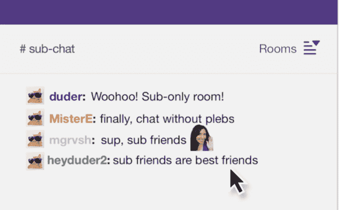

# Twitch 为频道 TechCrunch 推出永远在线聊天室

> 原文：<https://web.archive.org/web/https://techcrunch.com/2018/02/15/twitch-launches-always-on-chat-rooms-for-channels/>

游戏流媒体网站 Twitch 今天推出了一个永远在线的聊天室功能，简称为“房间”早在 10 月份的开发者大会 TwitchCon 上,[首次宣布了这一新功能，预计](https://web.archive.org/web/20221127002658/https://beta.techcrunch.com/2017/10/20/twitch-unveils-a-suite-of-new-tools-to-help-creators-grow-their-channels-and-make-money/)[将在年底前推出](https://web.archive.org/web/20221127002658/https://blog.twitch.tv/twitchcon-2017-keynote-what-you-need-to-know-601a82995e7e)。虽然时间有所改变，但这项功能今天将在全球 Twitch 用户的网络和手机上上线。

聊天室是自定义的聊天空间，可从频道页面访问，任何人都可以通过自己的帐户设置聊天室。它们可以在创建者频道的流聊天标题中找到，在那里可以创建或加入房间。

从现在开始，频道所有者可以选择为特定的用户群创建一个“房间”,比如他们频道的订户、版主、关注者或其他有共同兴趣的人，比如剧透。后一个用例代表了一个主题，这个主题对于隐藏在公开的主群聊中是有意义的。

但聊天室也可以被一些团体使用，这些团体可能会在主流聊天中使用不相关的消息、迷因或私人笑话，或者创作者选择的任何其他主题，无论是否与游戏相关。更重要的是，他们允许频道的社区保持联系和聊天，即使创作者不在流。

Twitch 说，在推出时，创作者只能拥有 3 个房间。

要开始一个房间，创建者在流聊天中点按新的“房间”菜单，然后点按“创建房间”然后，他们给房间命名并分配聊天权限。主持人和订阅者是设定的类别，因此他们会自动添加到任何订阅者或主持人房间。但是如果房间被设置为对所有人开放，观众可以选择加入，如果他们想参加的话。

主持人聊天总是私密的，但是创建者可以选择允许所有查看者预览他们的订户聊天室，即使他们不能参与。此设置在创建房间时通过拨动开关可用。

此次发布紧随近日 Twitch 的其他变化，包括新功能[突出一个频道的顶级粉丝](https://web.archive.org/web/20221127002658/https://beta.techcrunch.com/2018/02/13/twitchs-latest-features-highlight-channels-top-fans/)，以及值得注意的[更新 Twitch 的社区政策](https://web.archive.org/web/20221127002658/https://beta.techcrunch.com/2018/02/08/twitch-updates-its-community-policies-to-crack-down-on-hate-speech-harassment-and-sexual-content/)，以打击仇恨言论、骚扰和性内容。房间可能在某种程度上有助于实现这些目标，因为它可以让人们将他们的来回消息从主聊天转移到子聊天，在子聊天中，他们的帖子对普通观众来说不太可见，甚至不可见。这并不意味着 Twitch 会容忍子聊天中的仇恨内容，但它可以隐藏那些可能会被不理解上下文的临时观众误解的帖子。

Twitch 表示，该功能是根据社区的要求设计的，并将在今年继续迭代。

房间将于今天推出。