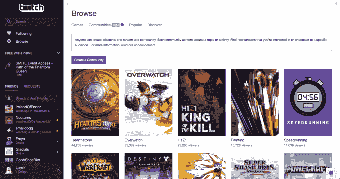
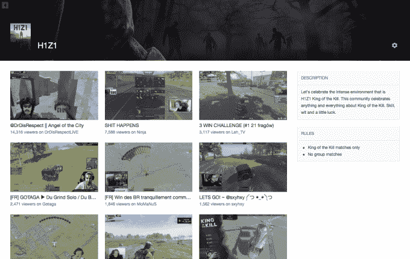

# Twitch 推出社区，帮助游戏玩家围绕他们的共同兴趣组织起来

> 原文：<https://web.archive.org/web/https://techcrunch.com/2017/02/09/twitch-launches-communities-to-help-gamers-organize-around-their-shared-interests/>

Twitch 努力扩大其视频游戏流媒体网站的范围，以包括更多类型的内容，今天[twitch 在其网站上推出了一个名为“社区”的新部分](https://web.archive.org/web/20230319055002/https://blog.twitch.tv/communities-93de2c1a2e4d#.9c57dbt25)为了迎合用户独特的兴趣，这个部分最初包含数百个类别，其中一些建立在玩家兴趣之上，而另一些则没有。在这里，你会发现专门的部分致力于主题，如角色扮演，素描，绘画，喜剧，食物，音乐等。此外，Twitch 表示，如果用户愿意，他们可以建立自己的社区。

当然，许多社区也会关注特定的游戏名称、游戏类型，比如复古，或者活动，比如极速跑。

在此之前，亚马逊旗下的流媒体网站在过去一年左右的时间里进行了一系列改变，强调以新的方式迎合游戏观众，同时吸引新用户。2015 年秋季，该公司推出了一个名为 [Twitch Creative](https://web.archive.org/web/20230319055002/https://techcrunch.com/2015/10/29/twitch-expands-further-into-creative-content-with-the-debut-of-a-new-section-for-artists/) 的新频道，允许游戏玩家展示他们的艺术作品——即他们受游戏启发的绘画、素描、歌曲、服装等等。

它还涉足电视流媒体，提供经典节目，如来自[鲍勃·罗斯](https://web.archive.org/web/20230319055002/https://techcrunch.com/2015/11/09/after-pulling-in-5-6m-viewers-twitch-is-keeping-bob-ross-on-the-air/)和[茱莉亚·切尔德](https://web.archive.org/web/20230319055002/https://techcrunch.com/2016/03/15/twitch-to-stream-julia-childs-cooking-show-to-kick-off-launch-of-new-food-channel/)的节目，以及[亚马逊的新电视节目 pilots。甚至](https://web.archive.org/web/20230319055002/https://techcrunch.com/2016/08/08/amazon-video-pilots-will-stream-on-twitch/)[推出了](https://web.archive.org/web/20230319055002/http://www.businesswire.com/news/home/20160701005823/en/Twitch-Experiments-Social-Eating-Category)一个“社交饮食”类别来迎合韩国用户，然后通过[一个名为“IRL”的新类别更广泛地向视频博客用户开放](https://web.archive.org/web/20230319055002/https://techcrunch.com/2016/12/15/twitch-opens-to-vloggers-with-launch-of-irl-mobile-broadcasting-to-come-next-year/)

鉴于如今网站内容的扩大范围，Twitch 现在试图组织这些不同的社区以使它们更容易找到也就不足为奇了。

但这一变化不仅仅是为了更好地发现，用户也可以创建自己的社区，然后添加到目录列表中。

Twitch 的产品营销经理希拉·拉朱(Sheila Raju)在一份声明中说:“我们从我们的粉丝和观众那里听到，他们希望有组建特定团体的自由，围绕速度跑步、电子竞技、角色扮演和绘画等主题组织起来。”“通过社区，我们为用户提供了创建他们选择的群组的能力，同时为创作者提供了另一种扩大受众的工具。如果你和其他人有共同的兴趣，社区就是这个集体可以生活的地方。”

这些社区可以由其创建者个性化，每个社区都有自己的特定规则、可定制的横幅和头像，并且他们可以有自己指定的社区领导者。领导者还可以访问其社区频道的审核工具，这使他们有权禁止或暂停违反其社区规则的频道。

在社区内部，还有一个“流墙”,显示来自选择向社区广播的创作者的直播内容。对于广播公司来说，将自己与一个社区联系起来可以让他们的内容得到更多的曝光，让他们获得更多的粉丝。

这些社区也都是公开的，这意味着观众和创作者可以随时看到当前正在播放的频道列表。这有助于他们判断这个社区是否适合他们。

新的社区目录今天对所有 Twitch 观众和广播公司开放测试版。