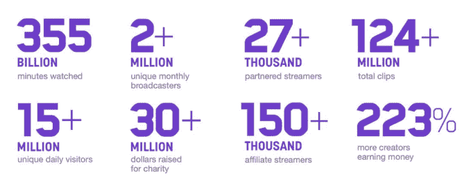

# Twitch 现在有 27 万多个合作伙伴和 15 万多个分支机构从他们的视频中赚钱

> 原文：<https://web.archive.org/web/https://techcrunch.com/2018/02/06/twitch-now-has-27k-partners-and-150k-affiliates-making-money-from-their-videos/>

Twitch today [宣布了](https://web.archive.org/web/20230317204010/https://www.twitch.tv/year/2017/)与其游戏流媒体服务增长相关的新指标，其中最值得一提的是，从 Twitch 内容中获利的视频创作者合作伙伴的数量在 2017 年期间攀升至 27，000 个，附属流媒体的数量达到 150，000 个。

直到 2017 年年中，Twitch 在获得“合作伙伴”地位后，只允许其创作者社区的一小部分人从他们的视频中赚钱。截至去年 4 月，[Twitch 上有 17000 个合作伙伴](https://web.archive.org/web/20230317204010/https://techcrunch.com/2017/04/21/twitch-opens-up-its-money-making-tools-to-tens-of-thousands-of-non-partnered-channels/)，总共有 220 万个独立月度广播公司。

现在，有 27，000 个合作伙伴，每月的流水号数量大致相同。

Twitch 今天将月流光数字定为“200 多万”——可能是因为它正在等待达到下一个里程碑，然后再宣布一个更具体的数字。

然而，这也可能表明创作者社区本身在过去一年中没有增长多少，尽管从 Twitch 赚钱的人数有所增加。

如果是这样的话，YouTube 游戏的出现可能与此有关。上个月发布的一份[独立报告](https://web.archive.org/web/20230317204010/https://www.twitch.tv/year/2017/)发现，2017 年，YouTube 游戏的流媒体基础增长了 343%，而 Twitch 增长了 197%。

不过，值得注意的是，在不到一年的时间里，合作横幅的数量又增加了 10，000 条。

Twitch 要求创作者在一段时间内拥有[高数量的并发观众](https://web.archive.org/web/20230317204010/https://help.twitch.tv/customer/portal/articles/735127-tips-for-applying-to-the-partner-program#ViewershipRequirements)，才能进入这些专属行列；这不是一个容易达到的目标。这表明该网站上的观众高度参与，收看这些游戏视频。

去年春天，随着 Twitch 联盟项目的[推出，Twitch 也让拥有较小渠道的常规流媒体公司更容易赚钱。Twitch 附属公司能够通过欢呼、订阅和游戏销售等方式从他们的视频中获得收入，此前达到了一个低得多的资格标准](https://web.archive.org/web/20230317204010/https://techcrunch.com/2017/04/21/twitch-opens-up-its-money-making-tools-to-tens-of-thousands-of-non-partnered-channels/)[标准](https://web.archive.org/web/20230317204010/https://help.twitch.tv/customer/en/portal/articles/2785927-joining-the-affiliate-program#access)。

在发布会上， [Twitch 邀请了数以万计的非合作频道参与新计划。到 10 月份——上线仅 6 个月后 Twitch 附属项目](https://web.archive.org/web/20230317204010/https://techcrunch.com/2017/04/21/twitch-opens-up-its-money-making-tools-to-tens-of-thousands-of-non-partnered-channels/)[已经发展到包括超过 110，000 名视频创作者](https://web.archive.org/web/20230317204010/https://techcrunch.com/2017/10/20/twitch-unveils-a-suite-of-new-tools-to-help-creators-grow-their-channels-and-make-money/)。今天这个数字是 15 万。

Twitch 不会透露合作伙伴和分支机构的收入，也不会透露自己的收入。但该公司确实指出，与去年相比，现在有 223%的创作者从 Twitch 上的视频内容中赚钱。

与此同时，报告称，Twitch 的日访问量已超过 1500 万，网站目前拥有超过 1.24 亿个视频剪辑。

此外，超过 1700 名开发者已经注册创建扩展——允许游戏玩家定制他们的频道的附加软件，[于去年 8 月](https://web.archive.org/web/20230317204010/https://techcrunch.com/2017/08/31/twitchs-new-extensions-let-streamers-customize-their-channel-make-money-from-amazon-sales/)推出。

该公司通常会以某种有趣的互动形式发布年终数据。去年是[一款视频游戏](https://web.archive.org/web/20230317204010/https://www.twitch.tv/year/2016/)。这一次，它是一部数字漫画——该公司表示，鉴于其在过去几年中对[视频博客](https://web.archive.org/web/20230317204010/https://techcrunch.com/2016/12/15/twitch-opens-to-vloggers-with-launch-of-irl-mobile-broadcasting-to-come-next-year/)和[创意内容](https://web.archive.org/web/20230317204010/https://techcrunch.com/2015/10/29/twitch-expands-further-into-creative-content-with-the-debut-of-a-new-section-for-artists/)的扩张，这一变化旨在展示其社区的创意面。

年终“报告”深入研究了围绕内容、游戏、表情等的其他几个里程碑，可在 Twitch 的网站[这里](https://web.archive.org/web/20230317204010/https://www.twitch.tv/year/2017/)获得。