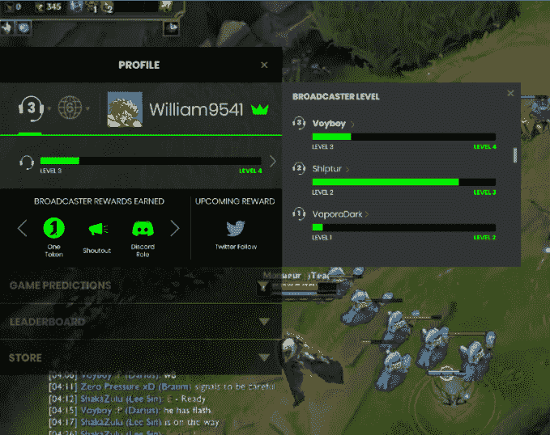

# Twitch 现在允许 streamers 同时使用多个扩展

> 原文：<https://web.archive.org/web/https://techcrunch.com/2018/06/19/twitch-now-lets-streamers-use-multiple-extensions-at-once/>

去年，Twitch [宣布了一套名为 Extensions 的工具，允许流媒体工具通过互动功能定制他们的频道页面，包括投票、排行榜、时间表等。如今，Twitch 正在让扩展变得更加有用，它允许 streamers 在视频上同时运行多达三个这样的覆盖，再加上视频播放器下方的三个覆盖，总共六个覆盖可以随时在他们的频道上活动。](https://web.archive.org/web/20221210001048/https://techcrunch.com/2017/08/31/twitchs-new-extensions-let-streamers-customize-their-channel-make-money-from-amazon-sales/)

Twitch 表示，这一更新将允许 streamers 以独特的方式更好地定制他们的频道，同时吸引并留住他们的粉丝。

为了支持多种扩展，流媒体工具将访问其 channel dashboard 的重新设计的扩展管理器，现在可以按类别对扩展进行分类，如游戏、音乐、流媒体工具等的扩展。这里还有一个“合作伙伴选择”部分，顶级创作者在这里分享他们的最爱。

在发布的同时，许多开发人员已经发布了新的和更新的扩展，这些扩展旨在相互协作。然而，Twitch 指出，根据显示扩展本身所需的区域，会有一些例外。也就是说，您不能将覆盖图叠加在另一个之上。

除了更好的定制选项，streamers 可能对添加多个扩展感兴趣还有另一个原因:货币化。

4 月，Twitch [推出了 Bits in Extensions，为创作者和开发者带来了新的收入来源。这使得开发者可以定制他们的扩展和其他交互体验，他们可以通过使用 Bits 来收费。这使得观众可以使用 Twitch 的虚拟货币支付解锁功能，流媒体工具可以从其频道托管扩展的收入中获得一部分。](https://web.archive.org/web/20221210001048/https://techcrunch.com/2018/04/23/twitchs-creators-and-developers-gain-a-new-revenue-stream-with-launch-of-bits-in-extensions/)

通过组合在其频道页面上使用 Bits 的多个扩展，流和开发者将能够由于这种扩展而产生额外的收入。

Twitch 表示，目前有超过 250 个扩展，其中 30 多个可以与其他扩展结合，35 个通过 Bits 提供付费体验。还有数以千计的扩展正在开发中。

从今天开始，所有渠道都可以使用新的定制选项。