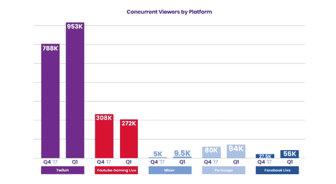
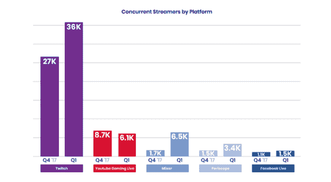
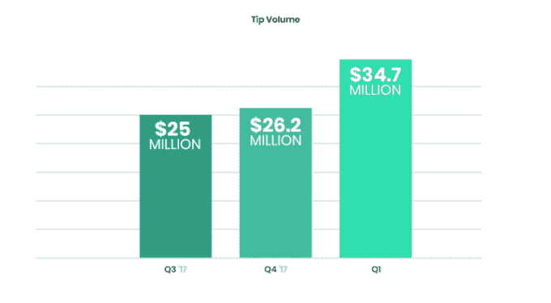

# Twitch 巩固了其领先地位，Q1 收视率上升了 21%，而 YouTube 游戏收视率下降

> 原文：<https://web.archive.org/web/https://techcrunch.com/2018/04/26/twitch-solidifies-its-lead-with-viewership-up-21-in-q1-while-youtube-gaming-drops/>

今年第一季度，Twitch 进一步巩固了其在游戏流媒体市场的领先地位，平均并发观众人数和峰值并发观众人数都有所增加，而排名第二的流媒体网站 YouTube Gaming 在这两个方面都出现了亏损。根据 Streamlabs 的一份新报告，由于成千上万的流媒体工具使用其软件平台，Twitch 的市场可见性在本季度增长了 21%，从 2017 年第四季度的 78.8 万平均并发观众增长到 Q1 的 95.3 万。

与此同时，YouTube 游戏同期平均并发观看人数从 30.8 万下降到 27.2 万，下降了 12%。

其他流媒体服务也有所增长，但它们的观众人数要少得多。

例如，脸书的观众人数增长了 103%，平均并发观众人数达到 56K，Periscope 增长了 18%，达到 94K，微软的 Mixer 增长了 90%，达到 95k。(然而，微软的真实数字可能要高得多，因为 Streamlabs 无法跟踪 Xbox 上 Mixer 的观众人数——这是其中的大部分。Streamlabs 也失去了一些脸书直播的观众，因为它无法跟踪只与朋友分享的私人直播流。)

然而，Twitch 有一个杀手级的季度并不令人惊讶。

该公司在 2 月份宣布，它看到了破纪录的 388，000 名并发观众收看了不尊重博士的节目。这个里程碑在接下来的一个月浮出水面，当时[忍者与德雷克和特拉维斯·斯科特一起玩堡垒之夜，](https://web.archive.org/web/20230405025211/https://techcrunch.com/2018/03/14/drake-and-ninja-are-playing-fortnight-live-on-twitch/)达到了 628，000 名并发观众。

但即使没有这些特殊事件，Twitch 也一直在成长。

它还见证了 Q1 平均并发数据流增长了 33 %,从 27K 增长到 36K。混音器和潜望镜也有所增长，分别增长了 282%和 126%。但 YouTube 游戏在这一指标上下降了 13%，从 2017 年第四季度的 8.7K 平均并发流降至 Q1 的 6.1K。

Streamlabs 发现，随着 Twitch 的成长，streamers 也赚了更多的钱。

它声称看到了 Streamlabs 小费量有史以来最大的一个季度，增长了 33%，达到 3470 万美元，高于上一季度的 2620 万美元。(请记住，这是通过 Streamlabs 软件发生的小费——跨平台的小费总量甚至会更高。)

该公司将这些收益归功于各种因素，包括 streamers 更专业质量的视频，来自堡垒之夜等拥有大量观众的游戏的流媒体，非游戏流媒体的增长等等。

Streamlabs 的完整报告[在这里](https://web.archive.org/web/20230405025211/https://blog.streamlabs.com/tipping-up-33-twitch-viewers-up-21-fortnite-dominates-q118-streamlabs-report-52f60450af5a)，也深入研究了自己在牵引力方面的收益，以及本季度最受欢迎游戏的细分。