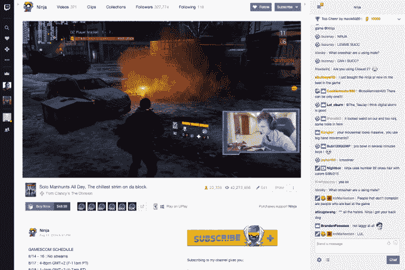
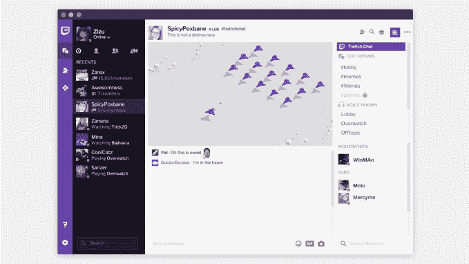

# Twitch 将于本周尽快开始销售视频游戏[更新]·

> 原文：<https://web.archive.org/web/https://techcrunch.com/2017/03/28/twitch-starts-selling-video-games-on-its-site-today/>

该公司表示，视频游戏流媒体网站 Twitch 将很快开始在其网站上销售个人电脑游戏和其他游戏内容。我们知道奥运会最早可能在明天或本周晚些时候到来，尽管确切的时间仍在变化中。Twitch 已经是流媒体直播和粉丝参与的热门目的地之一，所以它也会迈出成为视频游戏零售商的最后一步也就不足为奇了，尤其是考虑到该公司是亚马逊所有。

*[更新:游戏略有延迟，于 2017 年 4 月 4 日星期二推出。]

抽动成为游戏零售商的计划于今年早些时候宣布，并计划在春季上市。

然而，与传统的在线零售商不同，抽动提供了一些激励措施来鼓励抽动用户从其网站上购买。游戏购买者将收到一个免费的 Twitch 板条箱，其中包括各种各样的物品，可以在观看视频流和与其他用户互动时使用。例如，可能会有独家的[表情符号](https://web.archive.org/web/20221207203448/https://twitchemotes.com/) (Twitch 自己的表情符号)、聊天徽章和[欢呼位](https://web.archive.org/web/20221207203448/https://beta.techcrunch.com/2016/06/29/twitch-makes-cheering-exchange-rate-clear-one-penny-per-bit-for-streamers/)——这些项目通常需要 Twitch 用户付费才能获得。

这些抽动板条箱将分配给任何购买，游戏或其他，费用为 4.99 美元或以上。

Twitch 说，在发布时，将有大约 50 个游戏和相关的游戏内容可供购买，比早些时候宣布的几十个有所增加。

出道阵容包括育碧的《为了荣誉》和汤姆·克兰西的《幽灵侦察:荒野之地》；泄密游戏《行尸走肉和《我的世界》:故事模式》;Hi-Rez 工作室的《斯密特和帕拉丁》；悖论互动的暴政；Trion Worlds 公司的 Atlas 反应堆；双精制作的《破碎的时代》与心理学家:Campo Santo 的 FirewatchJackbox Games 的 jack box Party Pack 3；和数字极端的战争框架，等等。游戏将从今天开始，持续到下周。

Twitch 说，选择加入这一新的商业计划的合作伙伴将从他们的渠道销售中获得 5%的收入。与此同时，游戏发行商从游戏销售中获得 70%的收入。

游戏和游戏中的物品将在 Twitch 频道和游戏详情页面上出售，从某种意义上说，Twitch 的横幅将成为该网站的销售力量和营销团队。

合作的流媒体将能够从他们的频道页面上的购买中赚钱，这给了他们鼓励粉丝购买的动力。这可能会导致问题，如果 streamers 开始为现金而不是因为他们真正喜欢和推荐它们来推广标题。但敢于越过这条线的彩带可能会被粉丝们喊出来，并可能冒着名誉受损的风险。

我们已经看到了广告的注入如何对 YouTube 产生了影响，在 YouTube 上，创作者没有披露他们与品牌的关系，或者在视频中使用产品，但不承认他们为此获得了补偿。类似地，Twitch streamers 在兜售待售图书时也需要坦诚，以便对观众透明。

但现在有游戏出售这一事实可能会影响 streamers 接下来玩什么的计划——巧妙地将 Twitch 上的内容类型转移到那些有利于参与 Twitch 市场的游戏公司的内容上。

这些游戏可以通过 [Twitch 桌面应用](https://web.archive.org/web/20221207203448/https://app.twitch.tv/)下载。该公司本月早些时候宣布将重新推出诅咒应用程序——来自它去年收购的公司——作为改进的 Twitch 桌面。新应用包括社区服务器、语音和视频消息，旨在成为 Twitch 游戏内容分发系统的家园。该应用程序计划在游戏下载发布之前发布。

进军游戏销售让 Twitch 与 Steam 和 Valve 等其他游戏市场展开竞争，但它拥有强大的社交网络来吸引更多销售。该公司的网站每天有 970 万活跃用户，包括每月超过 200 万条独特的流媒体和超过 17，000 名合作伙伴计划成员。

该公司将通过一场 [Twitch Crates Gear 赠品](https://web.archive.org/web/20221207203448/https://blog.twitch.tv/twitch-crates-gear-giveaway-4ae1b41fda8)促销活动启动游戏销售，提供赢得游戏和流媒体设备的机会，以及超过 500 美元的专业流媒体设备大奖，现在一直持续到 4 月。