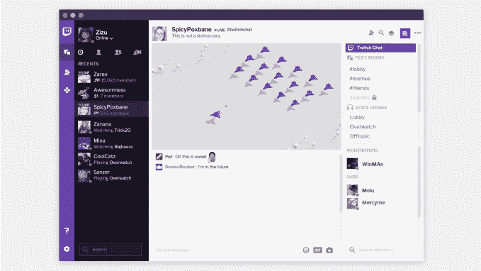
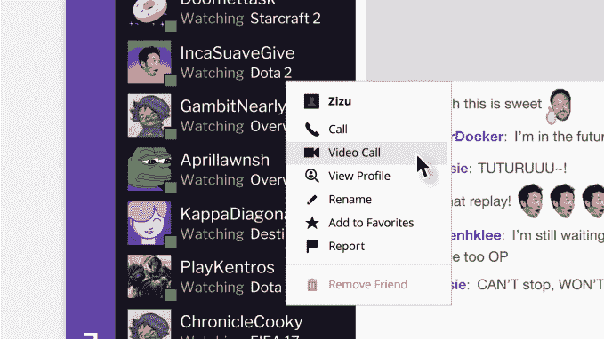

# 去年收购的 Twitch 将重新发布 Curse，成为更社会化的 Twitch 桌面应用 

> 原文：<https://web.archive.org/web/https://techcrunch.com/2017/03/10/twitch-to-relaunch-curse-acquired-last-year-as-the-more-social-twitch-desktop-app/>

视频游戏流媒体网站 [Twitch](https://web.archive.org/web/20230221164524/http://www.twitch.tv/) 继[推出其名为 Pulse](https://web.archive.org/web/20230221164524/https://techcrunch.com/2017/03/06/twitch-introduces-pulse/) 的 Twitter 版本后，今天宣布了其新的桌面应用 Twitch Desktop App。这实际上是对 Curse App 的更名——这是一款 [Twitch 去年从视频游戏社区和软件制造商 Curse 手中收购的](https://web.archive.org/web/20230221164524/https://techcrunch.com/2016/08/16/twitch-is-acquiring-popular-video-game-community-and-software-maker-curse/)应用。Twitch 表示，现在“增强”的应用程序将包括社区服务器、语音和视频消息以及游戏内容分发。

Twitch 桌面应用的一个更大的目标是给 streamer 的粉丝一个联系的地方，即使 streamer 离线。这也进一步表明了 Twitch 是如何将自己重新想象成不仅仅是一个观看直播视频的地方——它正在努力成为一个真正的社交网络。

此次发布定于 2017 年 3 月 16 日，此前，Twitch 最近采取了几项举措，旨在给 Twitch 更多社交网络的感觉。最引人注目的是[本周推出的 Pulse](https://web.archive.org/web/20230221164524/https://techcrunch.com/2017/03/06/twitch-introduces-pulse/) ，这是一个类似 Twitter 的社交流，就在主页上，让用户分享更新，包括来自 Vimeo、YouTube、Imgur 和 Gfycat 以及 Twitch 等服务的文本和多媒体。

该公司还推出了其他社交功能，如[社区](https://web.archive.org/web/20230221164524/https://techcrunch.com/2017/02/09/twitch-launches-communities-to-help-gamers-organize-around-their-shared-interests/)，专注于游戏玩家的共同兴趣——包括那些超越视频游戏的兴趣； [IRL](https://web.archive.org/web/20230221164524/https://techcrunch.com/2016/12/15/twitch-opens-to-vloggers-with-launch-of-irl-mobile-broadcasting-to-come-next-year/) ，让 vloggers 主持广播与粉丝直接对话；还有 [Twitch Creative](https://web.archive.org/web/20230221164524/https://techcrunch.com/2015/10/29/twitch-expands-further-into-creative-content-with-the-debut-of-a-new-section-for-artists/) ，广播公司可以展示艺术作品，无论它们是否与游戏直接相关。

它还涉足了流媒体非游戏视频内容，包括鲍勃·罗斯、茱莉亚·切尔德和亚马逊 Prime Video 的节目，截至 3 月 14 日，它还将 Power Rangers 加入了 831 集的马拉松比赛。这将从该网站电视马拉松的新家 twitch.tv/TwitchPresents,进行直播。

综合起来，这些努力旨在给游戏玩家一个留在网站上并继续参与其内容的理由，即使他们来看的视频游戏流已经结束。

Twitch 表示，作为该应用更名的一部分，它保留了其受欢迎的功能，如屏幕共享、语音和视频通话以及社区服务器创建。

然后，它在上面添加了 Twitch 自己的功能集，包括其社交产品。这包括朋友、悄悄话(私聊)和活动分享(查看朋友何时在流、他们在看什么或在玩游戏)。

该应用程序稍后还将提供从 Twitch 下载游戏购买的能力，当[游戏销售在今年春天晚些时候](https://web.archive.org/web/20230221164524/https://techcrunch.com/2017/02/27/twitch-will-sell-video-games-on-its-site-starting-this-spring/)上线时——Twitch 在 2 月份宣布的新电子商务推广。桌面应用程序将作为这些购买的游戏库，以及自动更新的插件和模块的地方。

这是自亚马逊旗下的 [Twitch 去年收购](https://web.archive.org/web/20230221164524/https://techcrunch.com/2016/08/16/twitch-is-acquiring-popular-video-game-community-and-software-maker-curse/)Curse 以来，第一个与 Curse 相关的重大公告。Twitch 对 Curse 感兴趣有几个原因:它的 TeamSpeak 竞争对手是上面提到的 Curse 应用，以及它相当大的视频游戏社区，这些社区与 Twitch 自己的有很多重叠。

当新的 Twitch 桌面应用程序在本月晚些时候推出测试版时，可以从 download.twitch.tv 下载。

[gallery ids="1463372，1463368，1463371，1463374"]