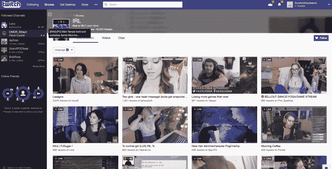
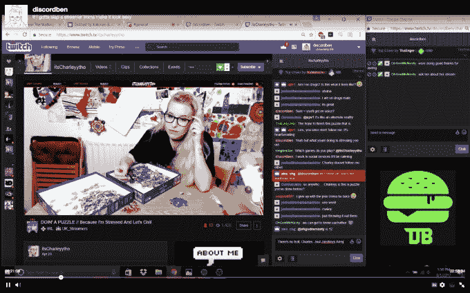

# Twitch 更新其社区政策，以打击仇恨言论、骚扰和性内容

> 原文：<https://web.archive.org/web/https://techcrunch.com/2018/02/08/twitch-updates-its-community-policies-to-crack-down-on-hate-speech-harassment-and-sexual-content/>

Twitch 今天[宣布](https://web.archive.org/web/20230316071649/https://blog.twitch.tv/twitch-community-guidelines-updates-f2e82d87ae58)更新其[社区指南](https://web.archive.org/web/20230316071649/https://www.twitch.tv/p/legal/community-guidelines)，旨在阐明该公司将如何执行其[现有的](https://web.archive.org/web/20230316071649/https://www.twitch.tv/p/legal/community-guidelines/harassment)反骚扰和仇恨内容政策，同时也加大对那些违反其[性内容指南的频道的关注。](https://web.archive.org/web/20230316071649/https://www.twitch.tv/p/legal/community-guidelines/sexualcontent)

在仇恨内容和反骚扰指南的情况下，Twitch 表示，任何仇恨行为都将导致立即无限期停职。

“仇恨在 Twitch 社区中没有一席之地，”该公司在一份声明中表示。

它还扩大了对仇恨行为和骚扰的执法力度，将那些发生在异地的行为包括在内。也就是说，如果一个 Twitch 用户转向其他服务来骚扰另一个 Twitch 用户，Twitch 现在也会认为他们的行为违反了 Twitch 的政策。

然而，该公司本身不会扫描所有的网络和社交媒体来寻找此类活动——相反，骚扰的受害者可以直接向 Twitch 发送文档，并要求审查。

该公司告诉我们，这些记录在案的例子可以来自“任何来源”，但 Twitch 需要能够在采取行动前亲自验证它们。

这似乎意味着 Twitch 会认为仇恨或骚扰性的推文违反了政策，但可能不会考虑通过短信骚扰他人的人，因为这无法独立核实。(因为这些截图可能是伪造的)。

此外，Twitch 正在更新其审核框架，以帮助更好地执行其政策。它表示，现在将密切关注所用单词的“上下文和意图”，而不仅仅是单词本身或发生的行为。

该公司甚至可能会打击朋友之间的不当玩笑，如果被其他人看到，可能会被视为骚扰；它提醒 streamers，他们仍在“通过服务向广大观众广播”，应该采取适当的行动。

Twitch 今天已经发展到超过 200 万条视频流，其中 27，000 条是合作伙伴，从他们的视频中获得收入。另外 150，000 个是被称为附属公司的中层流媒体，他们也可以利用 Twitch 的赚钱工具。

随着内容创作者基础的不断增长，Twitch 可能会试图避免其服务遇到最近困扰 YouTube 的同样问题。在谷歌的视频网站上，几个顶尖的创作者发现自己因为他们的内容和评论而陷入了困境。

例如，YouTube 不得不从其谷歌首选广告项目中删除顶级创作者罗根·保罗[，因为他](https://web.archive.org/web/20230316071649/https://techcrunch.com/2018/01/10/youtube-drops-logan-paul-from-google-preferred-and-puts-his-originals-on-hold/)[录制了一名自杀受害者的视频片段](https://web.archive.org/web/20230316071649/https://techcrunch.com/2018/01/02/youtube-star-logan-paul-apologies-for-video-of-apparent-suicide-victim/)。其最受欢迎的广播公司 PewDiePie 一再发表种族主义言论。儿童视频[创作者](https://web.archive.org/web/20230316071649/https://techcrunch.com/2017/11/17/youtube-terminates-exploitive-kids-channel-toyfreaks-among-broader-tightening-of-its-endangerment-policies/)因危害儿童和[剥削](https://web.archive.org/web/20230316071649/https://www.buzzfeed.com/charliewarzel/youtube-is-addressing-its-massive-child-exploitation-problem?utm_term=.arW4N9MwJE#.gnYaKVXMd2)被禁。

Twitch 可能希望避免类似的头条新闻，特别是因为它的许多创作者现在不仅仅做直播游戏——他们在创意频道上发布非游戏内容并记录视频日志。

*上图:今日 Twitch 的 IRL 网站*

该公司对色情内容频道的监管也越来越严格。总的指导方针是，所有个人资料和频道图像、信息流和服装都应适合公共街道、商场或餐厅。

“Twitch 是一个开放的全球社区，拥有不同年龄和文化的用户。因此，重要的是
你的内容本质上不是性的，”Twitch 的声明说。

虽然该公司长期以来一直有关于性内容的政策，但现在它将完全审查流媒体的行为，以确定它是否有意进行性暗示。这意味着版主会查看诸如流的标题、使用的摄像机角度、表情、面板、玩家的服装、覆盖和聊天审核等内容。

Twitch 表示，政策的改变是应社区本身的要求，因为人们不确定 Twitch 的底线在哪里，或者在某些情况下，觉得政策不够有力。

*图片来源:[The Verge](https://web.archive.org/web/20230316071649/https://www.theverge.com/2017/8/12/16120496/twitch-harassment-livestream-irl)*

“Twitch 一直有一套强有力的反骚扰政策，”Twitch 发言人告诉 TechCrunch。他们说:“我们对政策做出的新改变更加明确了什么是允许的，什么是不允许的，并使我们的版主能够使用额外的因素来确定是否违反了指导方针。”

事实上，Twitch 在其网站上遇到了许多骚扰问题。例如，一名加拿大男子[被指控在网站上发布](https://web.archive.org/web/20230316071649/http://www.cbc.ca/news/canada/british-columbia/twitch-brandan-apple-spambot-mischief-1.4483998)一个充满辱骂信息的垃圾邮件，[包括](https://web.archive.org/web/20230316071649/http://newnormative.com/2018/01/25/twitch-spammer-arrest-highlights-another-side-to-harassment-issue/)种族主义、恐同和性骚扰评论。许多 Twitch streamer[还会转发他人的直播](https://web.archive.org/web/20230316071649/https://kotaku.com/harassment-livestreams-on-twitch-are-multiplying-and-ea-1797767263)并以骚扰的方式对其进行评论。一名 IRL Twitch streamer 在脸书被骚扰和勒索了几天，

在去年一个引人注目的例子中，一名[妇女写道](https://web.archive.org/web/20230316071649/http://www.kotaku.co.uk/2017/08/11/someone-live-streamed-themselves-sexually-harassing-me)一名 Twitch streamer 直播了他们对她的性骚扰。我们不要忘记，通过 [Gamergate](https://web.archive.org/web/20230316071649/https://en.wikipedia.org/wiki/Gamergate_controversy) ，游戏玩家社区的成员对社交媒体上最糟糕的在线骚扰事件之一负有责任。

Twitch 没有说是否会增加其审核团队的规模以配合这些更新，但它为社区成员提供了各种内容审核工具，包括分配版主来监管他们的聊天，以及一个提醒 Twitch 24/7 人类审核团队的频道“报告”按钮。

在这些变化于太平洋时间 2 月 19 日星期一上午 9 点生效之前，有一个短暂的过渡期。这将允许流媒体通过删除违反准则的剪辑及其点播视频来遵守规定。Twitch 还直接接触那些当前和过去的内容有问题的流媒体。

这些变化可能是 Twitch 政策更大改革的一部分。

该公司表示，它还将在未来几个月内改进其自动聊天审核系统 AutoMod，并重新审视其对合作伙伴和非合作伙伴的执行政策、上诉程序、IRL 指南以及防止用户对用户的骚扰。