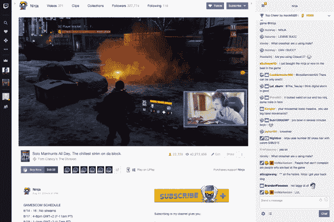

# 从今年春天开始，Twitch 将在其网站上销售视频游戏

> 原文：<https://web.archive.org/web/https://techcrunch.com/2017/02/27/twitch-will-sell-video-games-on-its-site-starting-this-spring/>

亚马逊旗下的视频游戏流媒体网站 Twitch 今天早上宣布，它将直接在其平台上销售游戏——这并不完全令人惊讶，因为开发者已经在利用该网站的社交社区来宣传他们的游戏，并吸引粉丝。Twitch 表示，游戏将于今年春天上市，但没有给出确切的上市日期。

该公司说，已经有几家出版商排队等待首次亮相，从较大的名字到较小的独立出版商。宣布的发行名单包括育碧、Telltale Games、Digital Extremes、Hi-Rez Studios、tinyBuild、Paradox Interactive、Trion Worlds、Vlambeer 等。

这些游戏将通过 Twitch launcher 下载和播放，该软件目前帮助 Twitch Prime 客户赎回他们的游戏和战利品代码。Twitch Prime， [Twitch 自己的亚马逊 Prime 版本，](https://web.archive.org/web/20230405154553/https://techcrunch.com/2016/09/30/twitch-announces-twitchprime-loyalty-badges-and-video-uploads/)可能预示着这一销售游戏的必然举措，因为它提供了各种好处，包括新发布游戏的折扣和游戏的免费发布日交付。让购买游戏成为 Twitch 体验中更常规的一部分是有意义的。

除了 Twitch launcher，游戏玩家还可以选择通过现有的开发者和发行商运营的服务下载和玩游戏，包括 Uplay。此举将使 Twitch 与 Steam 和 Valve 等其他游戏市场展开竞争。

游戏可以在直播流下面的网站上推广，在那里一个明亮的紫色按钮“立即购买”会和游戏的价格一起出现。游戏也可以出现在频道页面上。开发者将获得 70%的收入，而 Twitch partner streamers 将从其频道页面的销售中获得 5%的佣金。

为了增加交易的甜头，Twitch 表示，它还将通过向买家提供一个免费的 Twitch 板条箱来奖励他们，其中包括随机选择的物品，如独家[表情](https://web.archive.org/web/20230405154553/https://twitchemotes.com/)、聊天徽章和用于欢呼的[位](https://web.archive.org/web/20230405154553/https://techcrunch.com/2016/06/29/twitch-makes-cheering-exchange-rate-clear-one-penny-per-bit-for-streamers/)——这些通常都是让玩家花钱的东西。

育碧数字出版副总裁克里斯·厄尔利(Chris Early)在一份声明中表示:“多年来，我们一直非常感谢 Twitch 粉丝和观众对我们游戏的支持。“这使得与 Twitch 合作以更好地服务于我们充满激情的社区并为每个人带来好处的决定变得很容易。”

虽然销售游戏使 Twitch 成为游戏市场的电子商务玩家，但销售融入网站的方式似乎更多地是为了增强整体社区。游戏销售为流媒体提供了另一种创收方式，并鼓励更多开发者参与，而不是在线游戏市场。

Twitch 的游戏销售最初将于今年春天在全球范围内以英语推出，以美元定价。它将在今年晚些时候推出本地化的体验。

[vimeo 205836652 w=640 h=360]