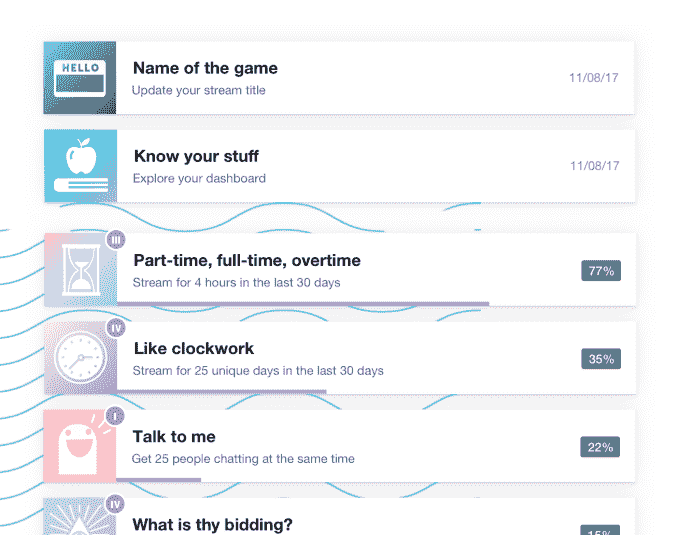
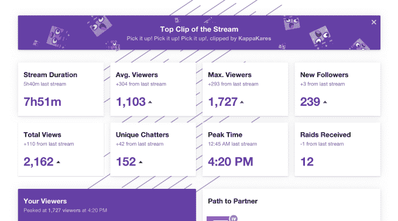

# Twitch 推出成就和流摘要，帮助创作者拓展渠道 

> 原文：<https://web.archive.org/web/https://techcrunch.com/2017/11/14/twitchs-launches-achievements-and-stream-summaries-to-help-creators-grow-their-channels/>

在上个月的游戏流媒体网站 Twitch 的年度会议 Twitchcon 上，该公司在其平台上为视频创作者推出了一套新工具[，旨在帮助他们扩大在线渠道，赚更多的钱。该公司今天下午宣布，其中两个工具——成就和流摘要——将于今天上线。](https://web.archive.org/web/20230129060258/https://techcrunch.com/2017/10/20/twitch-unveils-a-suite-of-new-tools-to-help-creators-grow-their-channels-and-make-money/)

这两个工具特别专注于帮助创作者更好地了解哪种内容与他们的观众产生共鸣，它的表现如何，并跟踪他们成为 Twitch 子公司或合作伙伴的途径。

Twitch 合作伙伴计划已经存在了一段时间，允许受欢迎的视频创作者通过每月订阅和广告收入分成从[他们的频道中赚钱。今年春天，该公司引入了第二层，名为](https://web.archive.org/web/20230129060258/https://www.twitch.tv/p/partners/)[分支机构](https://web.archive.org/web/20230129060258/https://techcrunch.com/2017/04/21/twitch-opens-up-its-money-making-tools-to-tens-of-thousands-of-non-partnered-channels/)。

目前，Twitch 附属公司可以通过 Bits 欢呼(一种虚拟小费机制)、订阅和游戏销售等方式赚钱，类似于合作伙伴。但是，他们没有相同的访问级别，例如，分支机构不能提供自定义 Cheermotes，只能获得一个子表情(自定义订户表情)，而合作伙伴可以获得 50 个子表情。

对于那些想要进入这些更高层次的 Twitch 创造者来说，知道你现在所处的位置以及需要做什么是关键。

这就是新的成就特性的用武之地。

从今天开始，streamers 将在他们的仪表板上看到一个名为“成就”的新页面，该页面在申请加盟或合作伙伴计划之前必须达到的每个里程碑下显示进度条。

例如，他们将看到自己在特定任务上的进度，如“过去 30 天内连续 4 小时”或“过去 30 天内连续 25 天”除了进度条之外，他们的进度还显示为完成百分比。

与此同时，流摘要允许创作者查看关于他们的流的详细分析，这可能有助于他们实现各种目标——例如，吸引粉丝并让他们聊天。

摘要页面包括一个列表，列出了过去视频流的各种收视率统计数据，比如观众人数、新关注者和聊天者。创作者也将能够看到他们的流，来源的意见和其他统计数据的顶级剪辑，将计入成为子公司或合作伙伴。

像这样的工具不仅对创作者本身很重要，对公司的底线也很重要。Twitch 将通过合作伙伴和分支机构渠道产生的收入进行分割，因此它可以将越多的人推入这些赚钱的层级，效果就越好。

该公司 10 月份还表示，这些项目一直在稳步增长。

Twitch 附属计划已经发展到包括超过 110，000 名视频创作者，2017 年支付给个人合作伙伴的金额增加了一倍多，平均增加了 71%的收入。

总的来说，该网站每天有 1500 万活跃用户，每月有 220 多万创作者使用该网站。这为这些项目进一步扩大规模留下了很大的空间。

*更正:功能名称是流摘要，而不是摘要，即使是复数。这个故事已经更新，以反映这一点。*