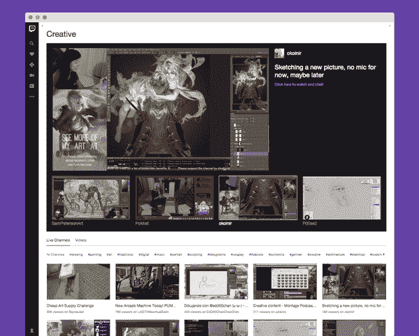

# Twitch 的用户平均一个月观看的视频比典型的 YouTube 用户还要多

> 原文：<https://web.archive.org/web/https://techcrunch.com/2016/02/11/twitchs-users-watch-more-video-in-a-month-than-youtube-users-do/>

亚马逊旗下的视频游戏流媒体网站 Twitch 越来越受欢迎，因为如今越来越多的年轻用户转向在线视频而不是传统电视来娱乐。今天，该公司发布了描绘其用户基础以及他们对 Twitch 内容参与程度的数据。虽然该公司没有透露其用户总数，但它指出，平均有超过 50 万人同时观看其 170 万月度广播公司的视频。这些用户与该网站密切相关，每月观看视频的时间比普通 YouTube 用户多。

我们应该指出，该公司此前曾宣布拥有超过 1 亿用户，但这次没有更新这个数字。然而，它会说它有 850 万每日活跃用户——自 2015 年以来增长了 20%。

Twitch 还表示，其用户每月观看 421.6 分钟的节目，远高于 YouTube 的 291 分钟。(Twitch 引用了 comScore 数据中的这个数字)。最近，这也包括非游戏内容，因为网络[一直在尝试扩展到游戏空间附近的“创意”视频](https://web.archive.org/web/20230316225130/https://techcrunch.com/2015/10/29/twitch-expands-further-into-creative-content-with-the-debut-of-a-new-section-for-artists/)，包括绘画、插图、歌曲、服装甚至玻璃吹制等内容。

许多 Twitch 的广播公司都在他们的频道中投放这种内容，但直到去年秋天 [Twitch 的“创造性”垂直](https://web.archive.org/web/20230316225130/http://www.twitch.tv/directory/game/Creative)的推出，这种内容才被发现。

此外，在一场吸引了 560 万观众的特别活动后，该公司决定继续播放《绘画的快乐》鲍勃·罗斯的视频。

尽管如此，Twitch 的主要业务还是游戏视频，该公司表示，游戏视频在美国、加拿大、巴西、英国、法国、德国、瑞典、波兰和台湾最受欢迎。

有时，来自世界各地的观众正在收看网络上的赛事，这导致了 2015 年 8 月 23 日的使用高峰，一个周末就有 200 多万观众观看了 ESL One:科隆 2015 和传奇 NA LCS 总决赛。

11 月，部分由于 Twitch Creative 和 ExtraLife 慈善活动的推出，Twitch 的并发广播公司数量达到峰值，共有 35，610 个流媒体节目。(Twitch 定期举办慈善活动——2015 年，其社区为超过 55 个慈善机构筹集了 1740 万美元。)

然而，观众不仅仅是在看节目，他们也在互动。该公司表示，其用户在 2015 年发送了 92 亿条信息，并在“绘画的快乐”马拉松期间分享了多达 380 万个 KappaRoss“表情”。

KappaRoss 是网站上第十大最受欢迎的表情，紧随其后的是 Kappa、:D、< 3，:)、PogChamp、DansGame、BibleThump、Kreygasm 和 4Head。

表情符号就像 Twitch 的秘密语言——[这些定制的表情符号一样的图案符号让用户的对话变得有趣，](https://web.archive.org/web/20230316225130/http://www.cnet.com/news/learn-the-secret-language-of-twitchs-rogue-emojis/)同时也允许广播公司通过向粉丝出售自己的包来创收。(如果你不知道所有这些表情是什么意思，一个叫做[抽搐表情](https://web.archive.org/web/20230316225130/https://twitchemotes.com/)的网站可以帮你理解)。

同样值得注意的是，Twitch 在手机上取得了进展，现在占其每月观众的 35%。但大多数人(56%)仍然通过网络观看，而 7%的人在游戏机上观看。

这些细节和更多细节，包括那些关于 2015 年哪些游戏受欢迎的细节，今天公布在 [Twitch.tv 的网站上。](https://web.archive.org/web/20230316225130/http://www.twitch.tv/year/2015)

这一消息是在亚马逊本周早些时候宣布其新游戏引擎 Lumberyard 之后发布的，该引擎也包含 Twitch 集成。在 Lumberyard，新的“Twitch Chatplay”功能允许游戏玩家与观众实时互动(例如通过对游戏结果投票或发送礼物)，这可能会导致更多的“Twitch Plays…”内容。多人游戏也有一个 Twitch“join in”功能，广播公司邀请观众一起玩。如果开发出更多的游戏来利用这些特性，Twitch 也会因此受益，而且上述数字可能会进一步增长。