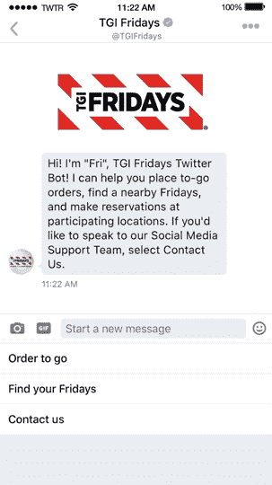
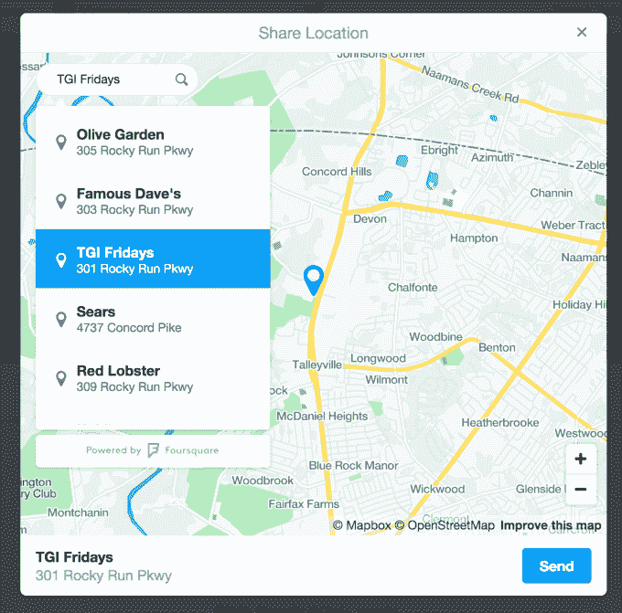

# Twitter 为通过直接消息提供客户支持的企业增加了位置共享功能 

> 原文：<https://web.archive.org/web/https://techcrunch.com/2017/04/03/twitter-adds-location-sharing-for-business-offering-customer-support-over-direct-messages/>

# Twitter 为通过直接信息提供客户支持的企业增加了位置共享功能

Twitterverse 仍在为 Twitter 对@ replies 的[改造](https://web.archive.org/web/20221207150913/https://beta.techcrunch.com/2017/03/30/twitter-stops-counting-replies-towards-its-140-characters/)[而纠结，并为](https://web.archive.org/web/20221207150913/https://beta.techcrunch.com/2017/03/31/dear-jack-i-dont-love-twitter-anymore/)[改变默认头像](https://web.archive.org/web/20221207150913/https://beta.techcrunch.com/2017/03/31/twitter-is-getting-rid-of-the-egg-avatar-because-that-will-totally-fix-the-abuse-problem/)与解决滥用问题有什么关系而挠头，但该网络仍在缓慢前进，今天[发布了针对其商业用户的新功能](https://web.archive.org/web/20221207150913/https://blog.twitter.com/2017/businesses-can-now-share-and-request-locations-in-direct-messages)。这是一系列更新中的最新一项，旨在帮助企业通过 Twitter 提供客户服务，这一新功能为企业提供了一种更简单的方式来请求和分享客户的位置——例如，启用商店定位器功能，或根据客户的居住地点定制响应。

位置请求选项是企业可以通过直接信息使用的，首先要求客户点击按钮分享他们的位置。客户可以选择他们是否想要这样做，然后可以选择分享他们的精确位置或从提供的列表中选择一个地名。

使用第二种方法，即使客户不在那里，他们也可以参考一个位置，例如，在餐馆预订或下外卖订单时，这将很有帮助。

TGI 星期五餐厅是第一批采用这一功能的餐厅之一，它正在使用这一功能进行外卖订单、预订和附近餐馆搜索。它还与 Conversable 合作，为一些功能提供支持。 [Wingstop](https://web.archive.org/web/20221207150913/http://twitter.com/messages/compose?recipient_id=89858807) 是另一家现在使用位置共享的企业，原因类似。

然而，在其他用例中，这也是可行的。通常，企业需要知道报告问题的客户在哪里，例如服务中断，或者根据需要为某个城市、地区或其他地区的客户定制支持。

这项功能也可以通过 Twitter 的 Direct Messages API 使用，[目前正在私人测试中](https://web.archive.org/web/20221207150913/https://gnipinc.formstack.com/forms/account_activity_api_configuration_request_form)，由 Foursquare 的位置数据提供支持。

这一变化是旨在通过 Twitter 更好地支持客户服务的几项举措之一——在这个领域，Twitter 与脸书页面正面竞争，在大多数情况下，支持是通过 Messenger 提供的。然而，Twitter 是一个众所周知的地方，人们经常在那里表达他们的担忧或抱怨，通常期望品牌或企业会做出回应。

这方面最近的其他更新包括[客户反馈卡](https://web.archive.org/web/20221207150913/https://blog.twitter.com/2016/making-customer-service-even-better-on-twitter)、[自动欢迎消息和快速回复](https://web.archive.org/web/20221207150913/https://beta.techcrunch.com/2016/11/01/twitter-unveils-new-options-for-customer-service/)、[将“支持时间”](https://web.archive.org/web/20221207150913/https://beta.techcrunch.com/2016/09/15/twitter-rolls-out-new-features-for-businesses-running-customer-service-accounts/)添加到企业简介的能力、[更大的 DM(直接消息)按钮](https://web.archive.org/web/20221207150913/https://beta.techcrunch.com/2016/08/05/twitters-latest-test-encourages-users-to-direct-message-brands-not-tweet-at-them/)和[按钮，便于](https://web.archive.org/web/20221207150913/https://beta.techcrunch.com/2016/02/18/twitter-customer-service/)将公共对话转为私人对话。