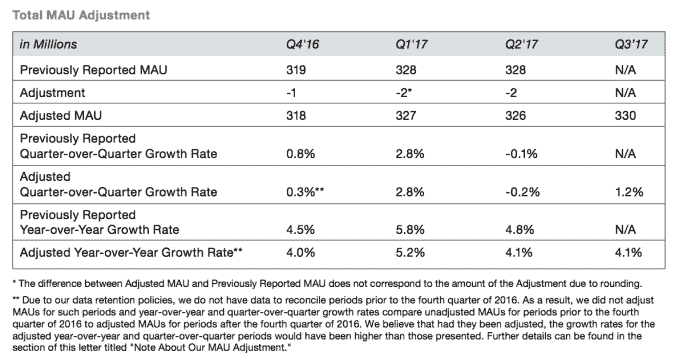

# Twitter 承认高估了用户数量 

> 原文：<https://web.archive.org/web/https://techcrunch.com/2017/10/26/twitter-admits-it-overestimated-its-user-numbers/>

# Twitter 承认高估了自己的用户数量

Twitter 今天宣布了第三季度的财务状况，其中包括令人惊讶的表现，这可能会使其在 2017 年前实现四分之一的实际盈利(T3)，但也有一些不太积极的消息。

该公司承认，它错误地将 Digits, [的用户数统计为去年总用户数的一部分，这款应用是它在 1 月份通过出售其面料产品](https://web.archive.org/web/20221007052649/https://beta.techcrunch.com/2017/01/18/google-twitter-fabric/)转让给谷歌的。在高峰时期，这个错误使 Twitter 的人数膨胀了 200 万。

考虑到 Twitter 的用户基数超过 3 亿，100 万到 200 万之间的调整似乎并不算大，但是[的增长如此之小](https://web.archive.org/web/20221007052649/https://beta.techcrunch.com/2017/07/27/twitters-user-growth-went-nowhere-and-the-stock-is-diving/)以至于他们可以调整指针。

以下是错误测量对 Twitter 近期数据的影响:

虽然 Digits 是一款可以连接到 Twitter 的应用，但该公司解释说，并非所有用户都是 Twitter 用户。

“这些第三方应用程序使用 Digits，这是我们现已剥离的 Fabric 平台的一个软件开发工具包，允许第三方应用程序通过我们的系统通过短信发送认证消息，这与 Twitter 平台上的活动无关，”[它在给股东的一份报告中表示](https://web.archive.org/web/20221007052649/http://files.shareholder.com/downloads/AMDA-2F526X/5458918398x0x961121/3D6E4631-9478-453F-A813-8DAB496307A1/Q3_17_Shareholder_Letter.pdf)。

这一承认让人想起脸书，T2 去年承认由于计算错误，三年来视频浏览量大幅增加。