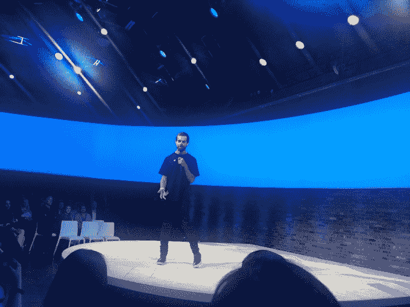

# Twitter 宣布了来自 WNBA、BuzzFeed、Viacom 等网站的新直播节目

> 原文：<https://web.archive.org/web/https://techcrunch.com/2017/05/01/twitter-announces-new-live-shows-from-the-wnba-buzzfeed-live-nation-and-more/>

# Twitter 宣布了来自 WNBA、BuzzFeed、维亚康姆等网站的新直播节目

看起来，Twitter 与彭博的流媒体视频新闻协议只是今天宣布的十几个内容合作的第一个。

该公司在 NewFronts 推出了完整的名单，在线出版商在这里向广告商推销他们的内容。(这是[Twitter 第一次举办自己的 NewFronts 展示。)](https://web.archive.org/web/20230329061655/http://adage.com/article/special-report-newfronts/advertisers-expect-twitter-s-newfronts/308864/)

在过去的一年中，Twitter 一直在加强其直播视频的努力，最引人注目的是在职业体育世界[的](https://web.archive.org/web/20230329061655/https://www.google.com/search?client=safari&rls=en&q=twitter+mlb+techcrunch&ie=UTF-8&oe=UTF-8)。最终，根据首席财务官和首席运营官·安东尼·诺托的说法，该公司计划[一周七天一天 24 小时播放直播视频](https://web.archive.org/web/20230329061655/https://techcrunch.com/2017/04/26/twitter-plans-to-eventually-air-live-video-247/)——事实上，听起来其中两笔交易已经让 Twitter 实现了这个目标。

Twitter 全球收入和运营副总裁马特·德雷拉(Matt Derella)说:“你们都可以坐在前排，听听我们如何拍摄优质、专业、电视质量的视频，并将其与 Twitter 的速度、交互性和访问能力相结合。”

以下是公告的简要内容:

*   *   WNBA 将在今年连续 20 周直播每周一次的常规赛，并在 2018 年和 2019 年再次直播。
    *   除了[已经在 Twitter 上直播的每周一次的美国职业棒球大联盟比赛之外，](https://web.archive.org/web/20230329061655/https://techcrunch.com/2016/07/25/twitter-mlb-nhl/)MLB 将播出一个每周三小时的节目，展示过去一周的精彩片段。
    *   NFL 将扩展其与 Twitter 的直播关系，现在将包括独家每日节目。
    *   一个新的体育场网络将全天候覆盖大学体育。
    *   球员论坛报将推出#Verified，这是一个运动员回答粉丝问题的直播节目。
    *   PGA 巡回赛已经在 Twitter 上直播，现在它说这将包括球员锦标赛期间第 17 洞的 360 度视频。
    *   [还有彭博合作伙伴](https://web.archive.org/web/20230329061655/https://techcrunch.com/2017/05/01/twitter-will-offer-247-streaming-video-news-in-partnership-with-bloomberg/)，涉及 24/7 新闻报道。
    *   The Verge 将推出《断路器:The Verge's Gadget Show》，这是一个由 Nilay Patel 主持的现场节目。
    *   BuzzFeed 将推出一档名为 MorningFeed 的早间新闻节目。
    *   商业新闻初创公司 Cheddar 将开始在 Twitter 上播放其早间节目开场铃声(它已经在下午播放其闭幕铃声节目)。
    *   维亚康姆将播出一些活动和颁奖节目，包括音乐录影带大奖。

*   迪克·克拉克制作公司也将把它的交易扩展到红地毯上的现场直播，包括美国音乐奖。
*   从 5 月 13 日的查克·布朗·班德开始，Live Nation 将播放音乐会和其他直播内容。
*   IMG 时尚将会直播时装周和其他地方的视频。
*   Propagate 计划推出一个名为#WhatsHappening 的每日娱乐节目。

是的，这些都是关于视频直播的。公告发布后，首席执行官杰克·多西上台提醒观众，Twitter 的使命是告诉用户“发生了什么？”他说，我们的目标是成为“人们第一个听到重要信息的地方。”他还感谢大家没有参加大都会歌剧院的庆祝活动——但毕竟，他们可以通过 Twitter 关注大都会歌剧院的庆祝活动。