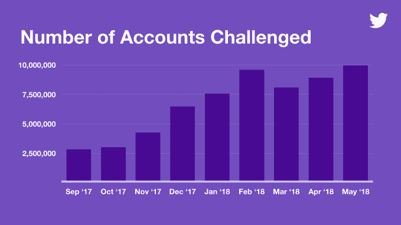

# 自去年以来，Twitter 暂停虚假账户的努力增加了一倍

> 原文：<https://web.archive.org/web/https://techcrunch.com/2018/07/06/twitter-bots-numbers-disinformation-washington-post/>

# 自去年以来，Twitter 暂停虚假账户的努力翻了一番

机器人，你在推特上发布政治分裂废话的日子可能屈指可数了。《华盛顿邮报》周五报道称，在过去的几个月里，Twitter 已经积极暂停账户，以阻止虚假信息在其平台上蔓延。

华盛顿邮报[报道](https://web.archive.org/web/20230407072900/https://www.washingtonpost.com/technology/2018/07/06/twitter-is-sweeping-out-fake-accounts-like-never-before-putting-user-growth-risk/?noredirect=on&utm_term=.6df1ce5e102a)称，今年五月至六月间，推特暂停了多达 7000 万个账户，而七月并没有减缓的迹象。根据《华盛顿邮报》获得的数据，在 5 月中旬为期一周的 bot 禁止活动高峰期间，该平台暂停了 1300 万个账户。

消息人士告诉《华盛顿邮报》，停牌率上升与该公司努力遵守国会对俄罗斯社交平台虚假信息的调查有关。报告补充说，Twitter 通过一个名为“扩音器行动”的内部项目调查机器人和其他虚假账户，通过该项目购买可疑账户，然后调查它们的联系。

Twitter 拒绝提供有关《华盛顿邮报》报道的更多信息，但给我们指出了上周[的一篇博文](https://web.archive.org/web/20230407072900/https://blog.twitter.com/official/en_us/topics/company/2018/how-twitter-is-fighting-spam-and-malicious-automation.html)，其中披露了与其僵尸工具搜索相关的其他数据。2018 年 5 月，Twitter 确定了超过 990 万个可疑账户，是 2017 年底的三倍。

通过 Twitter 制作图表

当 Twitter 发现一个它认为可疑的账户时，它就会“挑战”这个账户，给合法的 Twitter 用户一个机会，通过确认一个电话号码来证明他们的敏感性。当一个帐户没有通过这个测试时，它将被引导，而通过测试的帐户将被恢复。

正如 Twitter 在其最近的博客文章中指出的那样，机器人可以通过人为增加追随者数量来让用户看起来更好。

“由于这些改进，一些人可能会注意到他们自己的账户指标更有规律地变化，”Twitter 警告说。该公司指出，打击虚假账户意味着“恶意演员”将无法通过夸大自己的数字来轻松推广自己的内容和账户。对于一家定期报告月度活跃用户(尽管只是暂时的)的公司来说，把用户踢出一个平台是有风险的，不管是不是假的。

正如报告所指出的，至少有一位内部人士预计，Twitter 的 Q2 活跃用户数量将会下降，这反映了其在执行方面的转变。尽管如此，对于一个应该专注于用户健康增长的平台来说，任何暂时的用户数量下降都是微不足道的。由于俄罗斯 bot 丑闻，脸书正面临类似的清算，因为该公司预计用户参与度统计数据将下降，因为它开始强调高质量的用户体验，而不是夸大的季度数据。在这两种情况下，这都是值得的权衡。