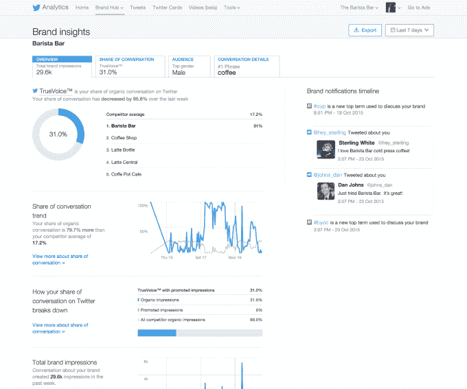

# Twitter 推出一套新的以品牌为中心的分析技术 

> 原文：<https://web.archive.org/web/https://techcrunch.com/2015/10/26/twitter-brand-hub/>

# Twitter 推出了一套新的以品牌为中心的分析方法

Twitter 正在扩展其分析产品，推出了其所谓的[Twitter 品牌中心](https://web.archive.org/web/20230131001044/https://business.twitter.com/help/brand-hub)的[产品](https://web.archive.org/web/20230131001044/https://blog.twitter.com/2015/introducing-twitter-brand-hub)。

尽管这是 Twitter 广告商的一个工具，但品牌中心似乎不太关注特定的广告或活动，而是更关注围绕不同品牌和产品的更广泛的对话——尽管这些数据当然可以帮助企业看到他们需要在哪里用广告来提高他们的可见性。

例如，Twitter 引入了一个“真实声音”指标，它代表了与竞争对手相比，社交媒体对话中有多少是关于某个品牌的。该公司是这样衡量的:“我们首先通过分析关于你的品牌和你的竞争对手的推文来确定你的品牌的真实声音。然后，我们确定你的品牌在这些印象中所占的比例。”

品牌中心还包括关于人们在推特上谈论某个品牌的人口统计数据，如性别、地点和收入水平，并列出了对话中最具“影响力”的人。(Twitter 表示，人口统计数据是聚合的，并保留了个人用户的隐私信息。)它还包含了关于人们在说什么的额外信息，比如热门短语或这些推文中隐含的品牌忠诚度。

Twitter 和脸书的许多举措都专注于追踪广告是否能推动销售和对话。另一方面，品牌中心呈现更传统的品牌广告指标。它还非常重视印象，而不仅仅是推文或互动，这可以帮助 Twitter 提醒广告商，如果有足够多的人看到，一条推文可以产生很大的影响。

该公司表示，目前它正在向英语国家的大中型广告商开放这个品牌中心。