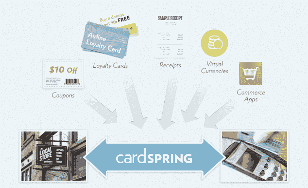
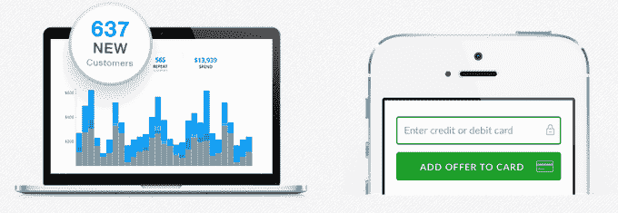

# Twitter 收购 CardSpring 以支持推内商务，并提供 

> 原文：<https://web.archive.org/web/https://techcrunch.com/2014/07/17/twitter-cardspring/>

[Twitter 刚刚宣布](https://web.archive.org/web/20230210021917/https://blog.twitter.com/2014/welcoming-cardspring-to-the-twitter-team)它已经收购了 [CardSpring](https://web.archive.org/web/20230210021917/https://cardspring.com/) 来实现“即时商务体验”CardSpring 是一个应用程序平台，让开发人员构建与卡相关的优惠电子优惠券、积分卡和虚拟货币，可用于信用卡和其他类型的支付。Twitter 将继续开放这项服务。

[CardSpring](https://web.archive.org/web/20230210021917/http://www.crunchbase.com/organization/cardspring) 写道:“在 Twitter，我们将继续扩大我们平台的采用，并与我们的出版商、金融和零售合作伙伴合作，为消费者创造新的、创新的商业体验。”

Twitter 解释说，“我们已经让用户能够获得[交易和折扣](https://web.archive.org/web/20230210021917/https://sync.americanexpress.com/twitter/Index)，用[咖啡](https://web.archive.org/web/20230210021917/https://www.starbucks.com/tweet-a-coffee)给某人惊喜，甚至向他们的[在线购物车](https://web.archive.org/web/20230210021917/http://www.amazon.com/gp/socialmedia/amazoncart/ref=amazoncart_surl_amazoncartlp)添加商品——所有这些都直接来自一条推文。当我们在 Twitter 上致力于商业的未来时，我们相信 CardSpring 团队和他们所建立的技术是非常合适的“关于 CardSpring 的更多细节，[查看我们过去的报道](https://web.archive.org/web/20230210021917/https://techcrunch.com/tag/cardspring/)。

Twitter 可以使用 CardSpring 来实现[与卡相关的优惠](https://web.archive.org/web/20230210021917/https://techcrunch.com/2013/09/25/cardspring-connect-lets-merchants-switch-on-card-linked-offers-on-foursquare-elsewhere-with-just-a-click/)。例如，你可以从一个要求你输入信用卡号码的商家那里得到一个折扣(或者有一天从你在 Twitter 上的信用卡中提取)。当你以后在线或离线在该商家购物时，CardSpring 会识别你的卡号并应用折扣。然后，它会向商家报告报价的性能分析。这些线上到线下的促销活动可以让 Twitter 与希望推动实体销售的当地企业更加相关，而不仅仅是转发和关注。

去年，CardSpring 推出了 [CardSpring Connect，](https://web.archive.org/web/20230210021917/https://techcrunch.com/2013/09/25/cardspring-connect-lets-merchants-switch-on-card-linked-offers-on-foursquare-elsewhere-with-just-a-click/)这是一个成熟的商业分析系统，可以接入商家现有的店内销售点系统。它让企业通过 Foursquare、Trialpay、Thanx、MOGL、Roximity、Moblico 和 OnStripe 等服务跟踪他们的销售与在线促销的联系。

CardSpring 是几年前由一群前网景工程师和高管创立的。它已经从 [Greylock Partners](https://web.archive.org/web/20230210021917/http://www.crunchbase.com/organization/greylock) 、 [Accel Partners](https://web.archive.org/web/20230210021917/http://www.crunchbase.com/organization/accel-partners) 、 [Morado Venture Partners](https://web.archive.org/web/20230210021917/http://www.crunchbase.com/organization/morado-ventures-partners) 、 [SV Angel](https://web.archive.org/web/20230210021917/http://www.crunchbase.com/organization/sv-angel) 、[Data collection](https://web.archive.org/web/20230210021917/http://www.crunchbase.com/organization/data-collective)、 [John Hering](https://web.archive.org/web/20230210021917/http://www.crunchbase.com/person/john-hering) 、 [Felicis Ventures](https://web.archive.org/web/20230210021917/http://www.crunchbase.com/organization/felicis-ventures) 和 [Webb Investment Network](https://web.archive.org/web/20230210021917/http://www.crunchbase.com/organization/webb-investment-network) 筹集了超过 1000 万美元的资金。

虽然 CardSpring 已经有了一大批令人印象深刻的商家和开发者与之合作，但 Twitter 将为其提供一种强大的方式来分发基于其平台的产品。

此次收购可能会让 Twitter 在成为网络社交商务门户的战斗中获得一件武器。今天早些时候，脸书开始测试一个购买按钮，让电子商务购物者直接从新闻提要中购买。但是推特在这方面可能有优势，因为一个重要的原因:转发。当人们喜欢脸书的某些东西时，他们就是喜欢。但在 Twitter 上，他们转发，立即将信息放大给自己的追随者。

虽然脸书在订阅帖子上有一个分享按钮，但它的文化侧重于原创内容。Twitter 欣然接受了它的再分享文化，这种文化对企业来说非常有吸引力，因为它给了他们免费获得的接触。这意味着，无论商家只是简单地在推特上发布 CardSpring 优惠，还是购买广告向更多用户展示，如果它让人们高兴，他们就会转发它，从而为企业赢得新的潜在客户。