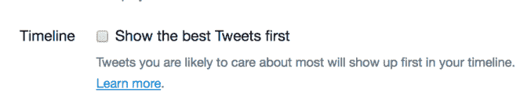

# Twitter 正在恢复按时间顺序排列的时间轴

> 原文：<https://web.archive.org/web/https://techcrunch.com/2018/09/17/twitter-chronological-timeline/>

# Twitter 带回了按时间顺序排列的时间轴

你的推特祈祷被回应了！好吧，也许不是关于骚扰的祈祷或关于编辑推特按钮的祈祷，而是你的其他*祈祷。*

今天，该公司在一系列推文中宣布，它已经听到了各种不满用户的呼声，并将恢复一种用户可以选择的纯时间表形式。大约三年前，Twitter 首次对更具算法性的时间线感兴趣，2016 年[致力于此。](https://web.archive.org/web/20230407150432/https://blog.twitter.com/official/en_us/a/2016/never-miss-important-tweets-from-people-you-follow.html)

一些用户认为，通过关闭账户设置菜单中的“首先显示最佳推文”选项，他们已经过上了没有算法的生活。不幸的是，对我们所有人来说，取消这个框并没有让 Twitter 回到过去的纯粹的时间表，而是删除了一些更突出的算法部分，否则这些部分将首先提供给用户。即使关闭了这个选项，用户也会定期观察非时间顺序的时间轴行为。

正如 Twitter 产品负责人 Kayvon Beykpour [对](https://web.archive.org/web/20230407150432/https://twitter.com/kayvz/status/1041840577279492096)的阐述，“我们正在努力让人们更容易控制他们的 Twitter 时间表，包括提供一个简单的切换来查看最近的推文。”

希望定期恢复旧 Twitter 的怀旧用户可以期待在“未来几周”的测试中看到该功能

我们准备好拉开关了，告诉我们什么时候。