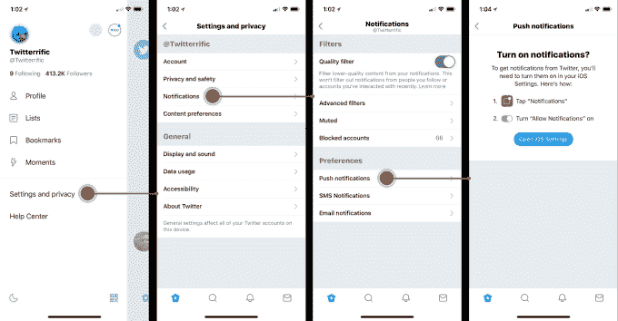

# Twitter 公司电子邮件地址为什么是# breaking mytwitter 

> 原文：<https://web.archive.org/web/https://techcrunch.com/2018/08/16/twitter-company-email-addresses-why-its-breakingmytwitter/>

现在很难成为 Twitter 的粉丝。该公司[为阴谋论者亚历克斯·琼斯](https://web.archive.org/web/20230112044910/https://techcrunch.com/2018/08/14/twitter-alex-jones-7-day-ban/)辩护，当几乎所有其他平台都被[解雇](https://web.archive.org/web/20230112044910/https://techcrunch.com/2018/08/08/all-the-platforms-that-have-banned-infowars/)时，它充斥着机器人，现在它通过关闭这些应用所依赖的 API 来破坏用户最喜欢的第三方 Twitter 客户端，如[tweet bot 和 Twitter fic](https://web.archive.org/web/20230112044910/https://techcrunch.com/2018/08/15/tweetbot-loses-several-key-features-ahead-of-twitters-api-change/)。更糟糕的是，Twitter 没有为自己的决定承担全部责任。

在今天 it [分享的一封公司电子邮件中，Twitter 引用了“技术和业务限制”,这是 API 关闭背后的原因，它不能再忽视这一点。](https://web.archive.org/web/20230112044910/https://twitter.com/robjohnson/status/1030122316875747328)

它表示，客户依赖的“遗留技术”在 9 年多后仍处于“测试状态”，不得不“出于运营需要”而被淘汰。

这读起来像推卸责任。大时代。

这并不是说有其他神秘的力量在维护 Twitter 的 API 平台，现在可怜的 ol' Twitter 被迫关闭旧技术，因为根本没有其他资源。号码

事实上，Twitter 是负责其用户流和网站流 API 的人——这些 API 服务于这些现在已被弃用的第三方 Twitter 客户端的核心功能。Twitter 是这些 API 近十年来一直处于测试状态的原因。Twitter 决定不投资支持这些遗留 API，或者将它们转移到新的 API 平台上。

Twitter 决定放弃一些最老、最狂热的粉丝——满足他们需求的超级用户和开发者社区——希望将所有人都转移到自己的第一方客户端。

该公司甚至否认了这些年来这些用户和开发者对其社区的重要性，理由是事实上它终止的 APIs 那些支持 [Tweetbot、Twitterrific、Tweetings 和 Talon](https://web.archive.org/web/20230112044910/http://apps-of-a-feather.com/) 的 APIs 只有“不到 1%”的 Twitter 开发者使用。*烧！*

落井下石的方法，推特。

但是，仅仅因为一个社区人数少，并不意味着它的声音不强大，或者它的影响没有被感受到。

因此， [#BreakingMyTwitter 标签](https://web.archive.org/web/20230112044910/https://twitter.com/search?q=%23BreakingMyTwitter&src=tyah)，Twitter 声称“经常”观看。

用户提醒 Twitter 首席执行官杰克·多西关于那次[他为没有听他们的话向 Twitter 开发者道歉](https://web.archive.org/web/20230112044910/https://techcrunch.com/2015/10/21/twitter-ceo-dorsey-apologizes-to-developers-says-he-wants-to-reset-relations/)，并承认是他们成就了 Twitter 的今天。他承诺做得更好的时候。

这是…不是更好:

该公司的电子邮件还表示，它希望最终了解“为什么人们雇佣第三方客户端而不是我们自己的应用程序。”

自己的应用？

哦，你是说像 TweetDeck 一样，Twitter [收购了](https://web.archive.org/web/20230112044910/https://techcrunch.com/2011/05/23/twitter-buys-tweetdeck-for-40-million/)然后在[安卓、iPhone](https://web.archive.org/web/20230112044910/https://techcrunch.com/2013/03/04/twitter-shuts-down-tweetdeck-for-android-iphone-and-air-discontinues-tweetdecks-facebook-integration/) 和 [Windows](https://web.archive.org/web/20230112044910/https://techcrunch.com/2016/03/17/twitter-kills-tweetdeck-for-windows-automates-logins-for-tweetdeck-users/) 上关闭的应用？那个它[通常表现得好像忘记它拥有](https://web.archive.org/web/20230112044910/https://techcrunch.com/2017/03/23/a-brief-history-of-tweetdeck/)一样？或者你可能指的是 Mac 版 Twitter(之前的 Tweetie，被收购前)，今年关闭的应用，告诉 Mac 用户*直接使用网络*？或者也许你指的是 Twitter 决定不再存在的几乎全部电视应用程序？

Twitter 想知道为什么用户不想使用它自己的客户端？

或许，用户想要的是一致的体验——一种不涉及一百万个无关紧要的产品变化的体验，比如把[星星变成心形](https://web.archive.org/web/20230112044910/https://techcrunch.com/2015/11/03/heart-heart-heart/)或者把[字符计数器改成圆形](https://web.archive.org/web/20230112044910/https://techcrunch.com/2017/09/26/twitter-trials-an-expansion-beyond-140-characters/)。也许他们欣赏这样一个事实，即第三方似乎比 Twitter 本身更了解 Twitter:Twitter 一直是一个 T4 式的实时信息流。这并不意味着是另一个脸书式的算法新闻推送。第三方客户尊重这一点。Twitter 没有。

昨天，Twitterific 的[制造商谈到了 API 的变化](https://web.archive.org/web/20230112044910/https://blog.iconfactory.com/2018/08/streaming-into-the-void/)，指出其应用程序将不再能够传输推文，发送原生推送通知，或更新其今日视图，新的推文和 DMs 将被延迟。

它建议用户下载 Twitter 的官方移动应用程序，以获得未来的通知。

换句话说，虽然 Twitterific 仍将处于崩溃状态，但其客户现在将不得不在他们的设备上运行两个 Twitter 应用程序，一个是官方应用程序，用于接收通知，另一个是因为他们更喜欢这种体验。

*icon factory*发布的使用 Twitter 应用程序通知的指南

Iconfactory 的联合创始人 Ged Maheux 解释说:“我们理解为什么 Twitter 觉得有必要更新其 API 端点，”他的公司让 Twitter 变得非常棒。“利用他们的系统的坏人传播机器人、垃圾邮件和巨魔对整个 Twitter 世界都是有害的，我们只是希望他们为像我们这样的小型第三方应用程序的开发者提供了一种负担得起的方式。”

“像 Iconfactory 的 Twitterrific 这样的应用程序帮助建立了 Twitter 的品牌、功能集甚至其术语，形成了今天的。诚然，我们的贡献很小，但却是真实的。他补充道:“在我们一起经历了这么多历史之后，被排除在 Twitter 的未来之外，对我们所有人来说都是难以下咽的苦果。

很多用户现在面临的问题是下一步怎么办？

继续使用现在坏掉的第三方 app？搬到[乳齿象](https://web.archive.org/web/20230112044910/https://mastodon.social/about)这样的开放平台？如其所愿，切换到 Twitter 自己的客户端，在那里它计划[【试验展示不同的观点】](https://web.archive.org/web/20230112044910/https://www.washingtonpost.com/technology/2018/08/15/jack-dorsey-says-hes-rethinking-core-how-twitter-works/?utm_term=.bc5865548d8b)打开人们的回音室……在一个拒绝赶走像亚历克斯·琼斯这样的人的服务上？

或者是时候承认推特和社交媒体承诺的[开放论坛](https://web.archive.org/web/20230112044910/https://www.nytimes.com/2018/08/15/magazine/twitters-misguided-quest-to-become-a-forum-for-everything.html)失败了？也许是时候关闭第三方或其他应用了。也许是时候天黑了。停止传送。休息一下。向前看。

来自 Twitter 的完整邮件如下:

> 嗨，队员们，
> 
> 今天 ，我们将在 Twitter 客户体验中发布一篇关于我们投资重点的博文。我想与您分享更多关于我们如何做出这些决定，以及我们如何特别考虑第三方客户的信息。
> 
> 首先，一些历史:
> 
> 第三方客户对 Twitter 服务和我们开发的产品产生了显著的影响。独立开发者为 Mac 开发了第一个 Twitter 客户端，也为 iPhone 开发了第一个本地应用。这些客户开创了我们都知道并喜欢的关于推特的产品功能，比如静音、拉至刷新手势等等。
> 
> 我们喜欢开发者在我们的 API 上构建体验，以推动我们的服务、技术和公众对话向前发展。我们非常尊重他们使用 Twitter 为创造惊人的东西所投入的时间、精力和热情。
> 
> 但是，我们并不总是能够很好地向开发人员直截了当地说明我们对第三方客户做出的决定。2011 年，我们(在一封电子邮件中)告诉开发者不要开发模仿核心体验的应用。2012 年，我们[宣布了对我们开发者政策的](https://web.archive.org/web/20230112044910/https://blog.twitter.com/developer/en_us/a/2012/changes-coming-to-twitter-api.html)变更，旨在通过限制第三方客户端允许的用户数量来使这些限制更加明确。而且，在这些公告发布后的几年里，我们一再告诉开发人员，我们的API的[路线图](https://web.archive.org/web/20230112044910/https://blog.twitter.com/developer/en_us/topics/tools/2017/building-the-future-of-the-twitter-api-platform.html)没有对客户端用例进行优先排序——即使我们继续维护这些客户端频繁使用的几个特定的API，并悄悄地向需要它们的客户端授予用户上限例外。
> 
> 现在是做出艰难决定的时候了，结束对这些传统 API 的支持——承认这些应用的某些方面会因此而降级。 今天的 ，我们面临着我们无法忽视的技术和业务约束。服务于这些客户端核心功能的用户流和站点流 API 已经处于“测试”状态超过 9 年，并且建立在我们不再支持的技术堆栈上。我们不会改变我们的规则，或着手“杀死”第三方客户；但是出于运营的需要，我们正在取消一些支持这些客户端功能的传统 API。对我们今天的来说，投资建立一个全新的服务来取代这些API并不是一个现实的选择，只有不到 1%的 Twitter 开发者使用这些 API。
> 
> 我们已经听到了客户对这种做法带来的痛苦的反馈。我们经常查看 [#BreakingMyTwitter](https://web.archive.org/web/20230112044910/https://twitter.com/search?q=%23breakingmytwitter) ，并与许多主要第三方客户的开发人员交谈，以了解他们的需求和关注点。我们致力于理解为什么人们会雇佣第三方客户端而不是我们自己的应用。我们将努力做得更好，诚实而清晰地向开发者传达这些变化。我们有许多工作要做。这一改变是实现这一目标的艰难但重要的一步。感谢您与我们合作实现这一目标。
> 
> 谢谢，
> 
> 抢劫