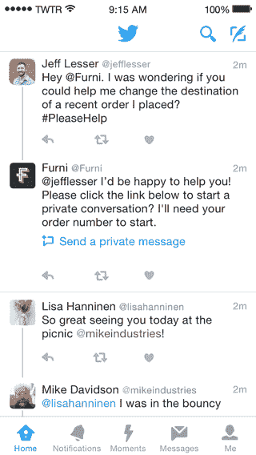
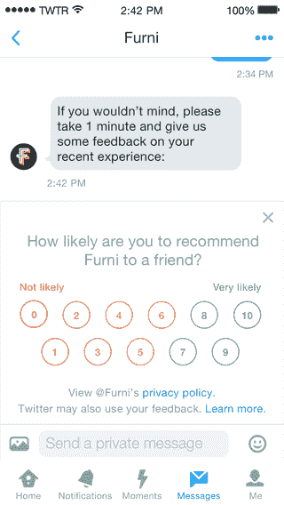

# Twitter 新的客户服务功能使得发送私人信息和反馈更加容易

> 原文：<https://web.archive.org/web/https://techcrunch.com/2016/02/18/twitter-customer-service/>

# Twitter 新的客户服务功能使得发送私人信息和反馈变得更加容易

如果你是那种喜欢在 Twitter 上与企业交流的人，该公司正在推出一些新的选项来改善这些互动。

首先，企业现在可以在推文中添加一个“发送私人信息”按钮。因此，你可能会通过公开推文与一家企业展开对话，但在某个时候，他们可能会要求你只需轻点或点击一下就可以直接发送消息。第二，Twitter 为企业增加了一个选项，在客户服务互动后私下向你征求反馈。

现在，我可以想象这对那些更喜欢私下讨论客户问题和投诉，而不是看着它们被广播给所有人看的公司会有吸引力。然而， [Twitter 指出了这些新功能的其他一些优势。](https://web.archive.org/web/20230306013418/https://blog.twitter.com/2016/making-customer-service-even-better-on-twitter)

【T2

毕竟，如果你想修好某样东西或获得退款或其他什么，你可能需要在某些时候分享你的个人信息，这可能是你想私下做的。此外，企业可能需要一种更可量化的方式来衡量他们客户服务的有效性，因此 Twitter 允许他们通过标准的净推广者得分(NPS)和客户满意度(CSAT)格式来调查客户。

由于与 Conversocial、Hootsuite、Lithium、Salesforce、Spredfast、Sprinklr 和 Sprout Social 的合作，Twitter 正在将这些新功能与现有的客户服务工具相结合。如今，所有企业都应该可以使用直接信息深度链接功能，像 [Delta](https://web.archive.org/web/20230306013418/https://twitter.com/DeltaAssist/status/700129696990670849) 、 [Starbucks](https://web.archive.org/web/20230306013418/https://twitter.com/starbuckshelp/status/699335680594300928) 和 [ClassPass](https://web.archive.org/web/20230306013418/https://twitter.com/classpass/status/700048540006014976) 这样的品牌已经在使用这一功能。与此同时，客户反馈功能将在未来几周内推出。

