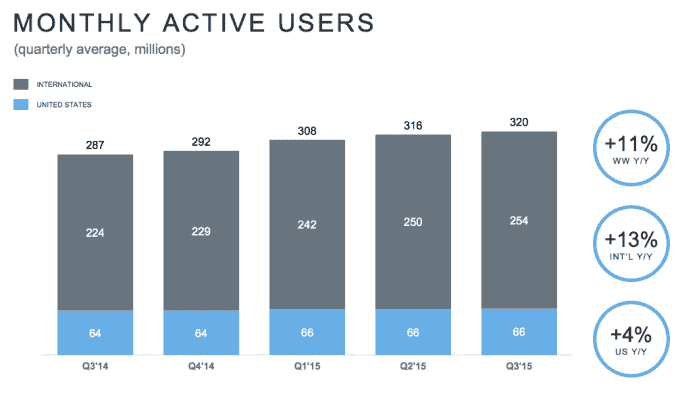

# Twitter 月活跃用户增至 3.2 亿，股价在盘后下跌超过 10% 

> 原文：<https://web.archive.org/web/https://techcrunch.com/2015/10/27/twitter-growth-q315/>

# Twitter 月活跃用户增至 3.2 亿，股价在几小时后下跌超过 10%

对 Twitter 来说，最重要的话题，也是华尔街最关注的话题，是该公司能否吸引一些新用户加入这项服务。

是的，成长。

去年这个季度，[公司报告月活跃用户为 2.84 亿](https://web.archive.org/web/20230213113609/https://techcrunch.com/2014/10/27/twitter-beats-in-q3-with-revenue-of-361m-but-slowing-user-growth-drags-its-shares-down-8/)。不好看。上个季度，[公司报告有 3 . 16 亿活跃用户，对此，当时的临时 CEO 杰克·多西说“我们不满意”](https://web.archive.org/web/20230213113609/https://techcrunch.com/2015/07/28/twitter-monthly-active-users-crawl-to-316m-up-just-15-year-over-year/)

[本季度](https://web.archive.org/web/20230213113609/https://techcrunch.com/2015/10/27/twitter-shares-tank-8-despite-q3-earnings-beat-on-lackluster-user-growth-weak-guidance/)？它的月活跃用户只有 3.2 亿(3.07 亿，不包括[短信快速关注者](https://web.archive.org/web/20230213113609/http://qz.com/393784/twitter-is-goosing-its-numbers-by-counting-sms-only-users/))。

美国经济增长连续第三个季度停滞不前。

Twitter 的股票在收盘前上涨了近 2%，但富有弹性(“股票就像落基山脉顶端火中煎锅上的豆子一样跳来跳去”，亚历克斯·威廉(Alex Wilhelm)说。

[graphiq id = " d 3 bfumxrqxn " title = " Twitter Inc .(TWTR)" width = " 700 " height = " 542 " URL = " https://w . graphiq . com/w/d 3 bfumxrqxn " link = " http://listings . FindTheCompany . com/l/445483/Twitter-Inc-in-San-Francisco-CA " link _ text = " Twitter Inc .(TWTR)| FindTheCompany "]

多尔西在 Twitter 的路线图和对真正增长的追求中这样说道:

> 我们已经围绕 Twitter、Periscope 和 Vine 的几个大项目简化了我们的路线图和组织，我们认为这些项目代表了我们最大的增长机会。

弥补缺乏的注册用户肯定需要时间，但多尔西团队专注的产品旨在吸引他们。该公司表示，它拥有超过 10 亿的眼球，这可能是真的，它只需要将其中的一部分转化为注册用户。如果时刻和民意测验不为他们做，该公司将不得不继续调整。我怀疑他们会的。

包括我在内的许多人认为，直接消息产品作为一个独立的应用程序剥离出来的时机已经成熟，就像脸书的信使一样。基于该产品构建的平台肯定也会有所帮助。

随着新任首席执行官首席运营官、精简的工程团队和路线图的到位，很多事情都在发生变化。但遗憾的是，增长还没有实现，这正是令华尔街愤怒的地方。

想在*观看*财报电话会议吗？加入我们的潜望镜。