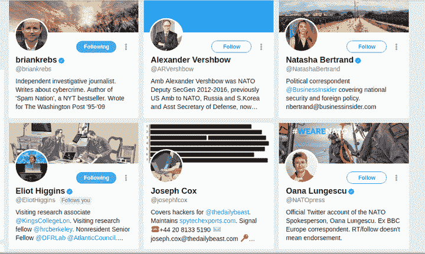
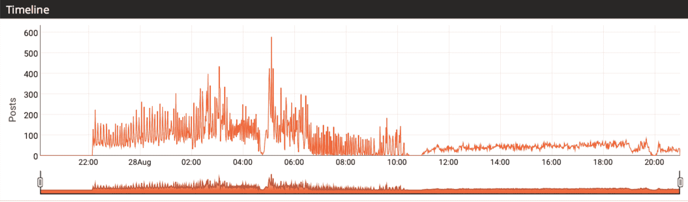

# 推特有一个很大的机器人问题

> 原文：<https://web.archive.org/web/https://techcrunch.com/2017/09/01/twitter-has-a-big-bot-problem/>

推特机器人——与人类互动的机器人——历史悠久。推特的应用编程接口很容易使用(两年前我和一个朋友制作了一个扮演佐克的机器人)，而且没有什么保护措施可以阻止自动创建新账户。这种易用性过去对程序员来说很棒，但现在推特有了一个巨大的机器人问题。

机器人已经超越了传统的战术。一个[老网站建议](https://web.archive.org/web/20221005230446/http://trafficleaks.com/bot-army)创建一个机器人网络来“收集你所有竞争对手的数据库”。

“作为信息，反驳宣传你的品牌胜过宣传他们的品牌。每当你的利基市场有人谈论竞争时，发一条推文甚至一条 DM(直接信息)，传达你是更好的产品/服务的信息，并给你一次尝试。”

相比之下，新系统相形见绌。

在最新的例子中,《每日野兽》的记者约瑟夫·考克斯(Joseph Cox)因为被一群推特机器人跟踪太快而被踢出推特。

考克斯不能谈论他被禁的原因——他与推特的对话是不公开的——但写完他的帖子后，他看到了一个奇怪的模式。一系列的机器人跟随着他，就像他们跟随着其他一直在写俄罗斯机器人现象的主要人物一样。简而言之，机器人“阅读”新闻故事，然后跟随作者，一个接一个，步调一致。

一旦发生这种情况，Twitter 的反机器人工具就会开始行动，并…禁止原始海报。

“让我们暂时记住这一点:大量被封账户——其中绝大多数应该很容易被发现——可能会滥用 Twitter 的反滥用工具，暂时关闭被怀疑是机器人的真实人物的账户！”安全研究员布莱恩·克雷布斯写道。“僵尸网络似乎是针对那些暴露社交媒体平台上的傀儡和机器人账户可以被用来影响公众舆论的人。”

当[大西洋理事会的数字法医研究实验室](https://web.archive.org/web/20221005230446/https://medium.com/dfrlab/botspot-the-intimidators-135244bfe46b)在夏洛茨维尔事件后调查亲克里姆林宫账户时，发现自己很快受到积极传播错误信息和亲特朗普政治的相同机器人军队的攻击。在撰写了关于[机器人和恐吓战术](https://web.archive.org/web/20221005230446/https://medium.com/dfrlab/kremlin-and-alt-right-share-nazi-narrative-2df4af60c749)的文章后，黑客们很快将攻击的目标锁定在了 DFR，导致“成千上万的自动账户[……]发出推文和关注，这显然是为了炫耀武力。”

一部[引人入胜的《金钱星球》剧集](https://web.archive.org/web/20221005230446/http://www.npr.org/sections/money/2017/08/25/546127444/episode-790-rough-translations-in-ukraine)进一步暴露了媒体、机器人和俄罗斯天文学界之间的奇怪联系。

此外，僵尸网络基本上对 DFR 的 twitter 账户进行了拒绝服务攻击，向该账户发送了数百条虚假的转发，如果使用标准的 Twitter 通知设置，基本上使其无用。正如你所看到的，转发爆炸了几个小时，然后慢了下来。“因此，大量的转发并没有传播到真正的 Twitter 用户。相反，主要效果是用一系列无休止的通知轰炸帖子中提到的账户的 Twitter 订阅源，”本·尼姆写道。

考克斯基于 DFR 的研究写了一篇文章，并很快发现自己成了恐吓的目标。

当我问及他的经历时，考克斯说:“有人甚至会费心在我的账户上使用机器人，这太可笑了，但如果机器人是暂时暂停的幕后黑手，那么 Twitter 可能会在监管其平台方面遇到更多问题。”。他的账户恢复了。然而，由于 Twitter 的政策，信息和迷因正在以一种人们可能从未想象过的方式传播，这使得激活一个 Tweetbot 变得很容易。