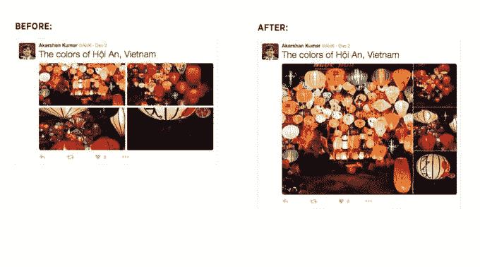

# Twitter 通过更大的图片、更好的布局改进照片共享技术

> 原文：<https://web.archive.org/web/https://techcrunch.com/2015/12/07/twitter-improves-photo-sharing-with-bigger-images-better-layouts/>

# Twitter 通过更大的图片、更好的布局改进了照片分享

Twitter 今天正在调整发布到其服务上的照片的外观，更加注重更加媒体化的体验，现在提供未剪辑的照片和改进的多照片显示。这一更新可以说是大计划中的一个小调整，旨在帮助 Twitter 继续从过去基于文本的服务过渡到更好地支持富媒体的服务。

在此之前，Twitter 最近采取了其他举措，以更好地突出其服务中的媒体，包括推出以视觉媒体为重点的“时刻”和自动播放视频。

以前在 Twitter 上发布照片的一个问题是，为了呈现更统一的用户界面和体验，图像会被裁剪。虽然这可能使事情变得简单，并且可能鼓励更多的用户点击推文来扩展有问题的照片，但这也是一个烦恼，因为你不能以预期的方式查看照片。

对于不太懂技术的用户或那些没有时间编辑他们的图片以便在 Twitter 的截断视图中正确显示的人来说，这意味着他们的照片不会正确显示。

Twitter 现在已经解决了这个问题，在很大程度上，它以你最初拍摄照片时的大小发布照片。(我们知道，照片在达到一定尺寸后会被裁剪成方形照片。)

然而，这一变化意味着在你的时间线上扫描推文将需要比以前更多的滚动，因为更大的图像会占用更多的屏幕空间。对于更关心 Twitter 上的信息而不是媒体的高级用户来说，这可能是此次更新的一个不利因素。

此外，当你一次发布多张照片时，这些帖子的显示格式也会比以前更大。它还允许您强调比布局中的其他图片更大的潜在客户图片。

Twitter 不是唯一一家考虑如何更好地安排多图片帖子的科技公司—[脸书几天前推出了自己的媒体拼贴画](https://web.archive.org/web/20221205171239/https://beta.techcrunch.com/2015/12/03/facebook-collages/#.s2agxy:ckJQ),用户可以像在 Instagram 的独立应用 Layout 中一样调整每个拼贴画的大小。这些变化的想法是通过以更具视觉吸引力的方式突出他们关心的内容，让更多的用户参与到社交平台中。

Twitter 的声明听起来像是每个人都可以立即看到更新，但我们听说，并不是每个人都看到了变化。但是您应该很快就会看到更新的格式，如果您还不知道的话。然而，更新目前只在 Twitter.com 推出。