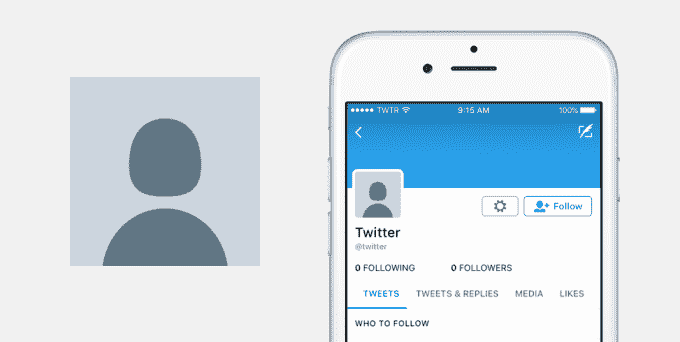

# Twitter 正在摆脱鸡蛋头像(因为这将彻底解决滥用问题)

> 原文：<https://web.archive.org/web/https://techcrunch.com/2017/03/31/twitter-is-getting-rid-of-the-egg-avatar-because-that-will-totally-fix-the-abuse-problem/>

# Twitter 正在摆脱鸡蛋头像(因为这将彻底解决滥用问题)

大家都知道 Twitter 有一个[骚扰问题](https://web.archive.org/web/20221206104610/https://beta.techcrunch.com/2016/07/19/leslie-jones-twitter-harassment/)。虽然该服务已经尝试了禁止滥用用户的事情(在[临时](https://web.archive.org/web/20221206104610/https://beta.techcrunch.com/2017/02/16/twitter-starts-putting-abusers-in-time-out/)和[永久](https://web.archive.org/web/20221206104610/https://beta.techcrunch.com/2016/07/19/twitter-finally-bans-milo-yiannopoulos-one-of-its-most-notorious-trolls/)的基础上)，但它并没有真正解决问题。

今天，他们宣布了另一项未能解决真正问题的彻底变革:他们在敲碎鸡蛋。

在一篇长篇大论的帖子中，该服务宣布他们将把默认的彩蛋替换成一张类似头和肩膀轮廓的中性头像。

从 2010 年开始，所有新账户的默认头像都是一个鸡蛋。从那时起，它已经成为 Twitter 品牌不可或缺的一部分。每个人，甚至非铁杆 Twitter 用户，都知道这个彩蛋。甚至 CNN 在播放政客和其他名人的推文时也经常展示这个彩蛋。

Twitter [给出了一堆更换的理由](https://web.archive.org/web/20221206104610/https://blog.twitter.com/2017/rethinking-our-default-profile-photo)。有些理由是有道理的，比如更普通的个人资料照片应该鼓励新用户上传真实的个人资料照片。

但是改变的一个原因与骚扰有关。

具体来说，Twitter 表示，由于滥用帐户经常将鸡蛋作为个人资料图片，现在“默认鸡蛋个人资料照片和负面行为之间存在关联。”

天啊，你觉得呢？

Twitter 不明白的是，从 egg 帐户发送的辱骂性推文现在将只是从 silhouette 帐户发送的辱骂性推文。调转个人资料图片可能只是解决问题的权宜之计，但从长远来看，这对解决骚扰问题毫无帮助。

辱骂性的推文就是辱骂性的推文，不管旁边是鸡蛋、剪影还是真人头像。

此外，作为副产品，Twitter 正在扼杀 Twitter 独特的内部语言和身份的另一部分——就像他们对[、](https://web.archive.org/web/20221206104610/https://beta.techcrunch.com/2017/03/30/twitter-stops-counting-replies-towards-its-140-characters/)和[收藏夹](https://web.archive.org/web/20221206104610/https://beta.techcrunch.com/2015/11/10/twitter-sees-6-increase-in-like-activity-after-first-week-of-hearts/)所做的那样。

不要怪蛋，把问题搞定就好。

