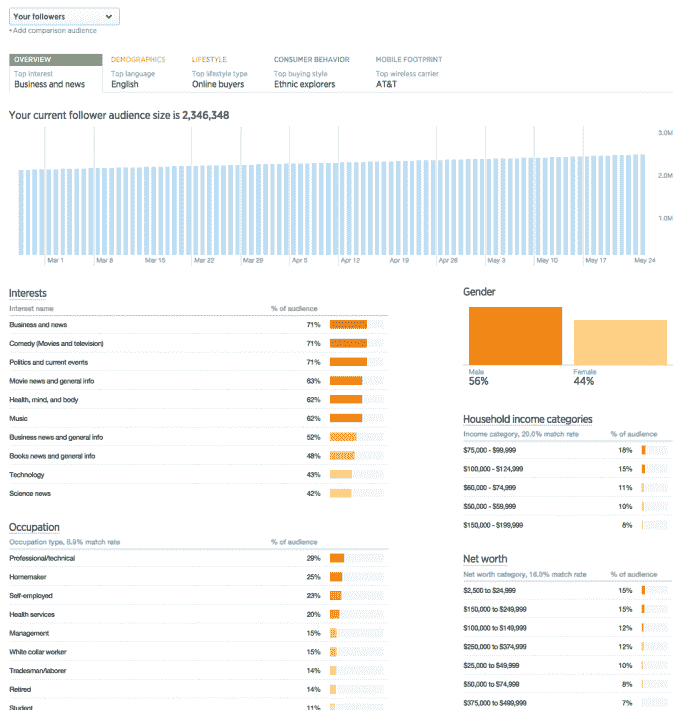

# Twitter 给广告商更多的用户数据，希望他们花更多的钱 

> 原文：<https://web.archive.org/web/https://techcrunch.com/2015/05/27/twitter-is-giving-advertisers-more-user-data-in-the-hope-that-they-spend-more/>

# Twitter 给广告商更多的用户数据，希望他们花更多的钱

Twitter 希望通过增加一种工具来帮助营销人员更好地了解他们的 Twitter 受众，这种工具将为他们提供关于有机推文的更深入的用户行为。

观众洞察仪表板工具添加了一些与脸书广告平台类似的洞察，包括用户人口统计、兴趣和购买行为的汇总信息，以及用户观看的电视节目和他们的移动使用情况。这些新的见解有望帮助广告商为平台上即将到来的活动确定更相关的受众。

“你还可以利用受众洞察来了解更多关于你的关注者和参与你的推文的人的信息，然后相应地调整你的目标和内容。例如，如果你是一名应用程序开发人员，并发现你的大多数粉丝都使用 iPhone，你可以确保你的富媒体是为该设备量身定制的，” [Twitter 上一篇关于新见解的博文](https://web.archive.org/web/20221209171738/https://blog.twitter.com/2015/introducing-audience-insights)称。

这些新见解会有助于推动 Twitter 上的广告吗？公司现在就需要它。上个季度，该公司的广告销售增速低于预期，甚至铁杆粉丝和早期投资者也认为该公司需要一些帮助。早期投资者克里斯·萨卡最近给[写了一篇博文](https://web.archive.org/web/20221209171738/http://lowercasecapital.com/2015/05/21/i-bleed-aqua/)，警告 Twitter 他将很快分享一些关于公司现在需要做什么的想法。

“我写这些是因为我很快会发布一些我个人希望 Twitter 团队能够完成的事情，”[萨卡写道](https://web.archive.org/web/20221209171738/http://lowercasecapital.com/2015/05/21/i-bleed-aqua/)。

提供关于有机用户行为的更深刻的见解可能是这种沮丧的一个答案，并可能有助于吸引品牌在平台上花费更多的广告美元。

受众洞察工具现已面向所有 Twitter 广告商和分析用户开放。Twitter 的具体信息可以在美国境内访问，计划在未来几个月内更广泛地推出这一功能。