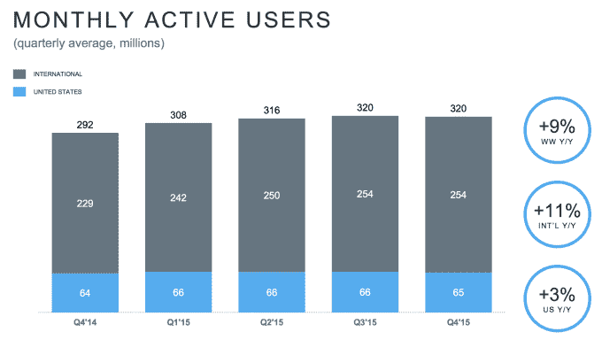
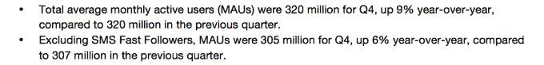
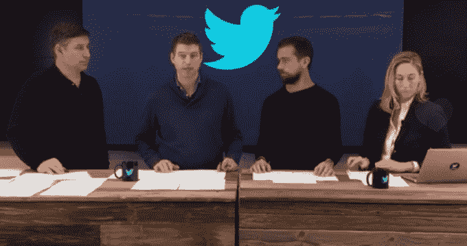

# 如果排除短信 TechCrunch，Twitter 的月用户数实际上减少了

> 原文：<https://web.archive.org/web/https://techcrunch.com/2016/02/10/twitter-is-shrinking/>

Twitter 的总用户数停留在 3.2 亿，本季度零增长，这已经够糟糕的了。但如果不算“短信快速关注者”，即只通过短信使用 Twitter 而不看广告的人，其月活跃用户数在第四季度从 3.07 亿下降到 3.05 亿。在美国，Twitter 的月用户总数从 6600 万降至 6500 万

考虑到这份收益报告完全是为了安抚华尔街对 Twitter 的增长和收入前景的担忧，这是一个可怕的迹象。Twitter 的股价在 2015 年[第四季度收益发布后的几分钟内下跌了超过 7%](https://web.archive.org/web/20230213113606/http://files.shareholder.com/downloads/AMDA-2F526X/1299750991x0x874448/7F88ED74-4727-4B42-8568-60B0C0DA92C7/Q4_15_Shareholder_Letter.pdf),之后略有回升，下跌了 3%。

短信快速追随者通常来自发展中国家市场，如巴西和 T2。虽然通过短信吸引用户可以使这项服务更普遍，并增强网络效应，但 Twitter 最终需要将用户转移到显示广告的服务版本。

相比之下，脸书获得了惊人的收益，部分原因是它的[成功地将发展中国家](https://web.archive.org/web/20230213113606/https://techcrunch.com/2016/02/02/invasion-of-the-ads/#.c09dfs:L5bG)货币化，第四季度其世界其他地区的每用户收入增加了 29.8%，达到 1.22 美元，自 2012 年以来翻了两番。

在财报电话会议上，首席财务官安东尼·诺托(Anthony Noto)表示，尽管核心月度活跃用户数量有所下降，但日活跃用户数量持平，没有下降。他坚持认为，这表明“我们从 MAUs 流失的用户质量不高”。他大概的意思是，由于他们每个月只是偶尔访问，他们可能没有看到太多的广告或推动服务的收入或内容创作。

诺托将每月核心用户数量的下降部分归咎于“我们有意识地决定减少休眠用户的电子邮件数量。”他还表示，第四季度是 Twitter 历史上最糟糕的一个季度，“这个季度也不例外”。

不过，他表示，以转发、讨论和其他信号形式出现在平台上的参与是积极的。此外， [Twitter 称](https://web.archive.org/web/20230213113606/https://twitter.com/TwitterIR/status/697533580117839872)截至 1 月底，我们已经看到 MAUs 回到第三季度的水平，这意味着核心 Twitter 已经回升到 3.07 亿。

核心 Twitter 用户的下降意味着时刻，它使 Twitter 对新用户和主流更具吸引力的巨大推动力，并没有改变。Twitter 甚至播放了昂贵的电视广告来宣传这些时刻。但似乎许多人仍然认为 Twitter 是新闻迷和名人观察家的利基产品。

我们终于看到，多年来糟糕的新用户加入率和随之而来的用户流失反过来影响 Twitter。即使它做出了重大改变，许多注册了 Twitter 但不了解它的人也不会给它第二次机会。按照这些思路，今天对时间线的[顺序的微妙改变可能也不会有所帮助。](https://web.archive.org/web/20230213113606/https://techcrunch.com/2016/02/10/twitters-algorithm-appreciates-you/)

Twitter 可能需要对其基本机制进行大规模、立竿见影的改变，以刺激增长。否则，它将不得不依靠制作更大、更大胆、更具干扰性的广告，从现有的每个用户身上榨取更多收入。

也许 Twitter 收益中唯一真正的亮点是它在这方面取得了成功。今年，它设法将每用户平均收入从 1.48 美元提高到 2 美元，增幅为 35%。Twitter 或许可以利用长期用户的忠诚度，让他们接受更具攻击性的广告，并希望他们留下来，而不是试图推动增长。

*了解为什么 Twitter 的旧入职缺陷会导致其当前的增长问题*