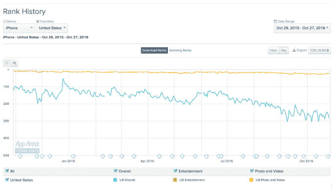

# Twitter 正在关闭 Vine 

> 原文：<https://web.archive.org/web/https://techcrunch.com/2016/10/27/twitter-is-shutting-down-vine/>

在寻找收购者的努力失败以及最近宣布裁员 9%之后，Twitter 的未来仍然存在疑问，该公司今天宣布关闭其独立的短片视频应用 Vine。据[的一篇帖子](https://web.archive.org/web/20230225043028/https://medium.com/@vine/important-news-about-vine-909c5f4ae7a7#.85q0sa3m3)称，没有什么会立即改变——网站和应用程序将暂时保持在线，用户将有机会在正式关闭前下载他们的 Vine 视频。

该声明没有解释是什么导致了这一决定，只是表示 Twitter 将在未来通过其博客和官方 Twitter 账户分享更多关于接下来会发生什么的消息。

虽然计划是逐步结束 Vine 的运营，但 Twitter 也表示该网站将保持在线，因为该公司认为“仍然能够观看所有已经制作的令人难以置信的 Vine 非常重要。”

然而，鉴于 Twitter 的计划，目前还不清楚该网站将存在多久。

最近几天，Twitter 一直更关注其 Periscope 产品和直播，而不是短循环视频服务 Vine，后者现在是许多创作者的家园。它甚至[将直播整合到服务](https://web.archive.org/web/20230225043028/https://techcrunch.com/2016/09/12/twitter-can-now-alert-you-when-someone-you-follow-starts-live-streaming/)中，当你关注的人开始直播时提醒用户。它还通过与 NFL、彭博等组织的合作伙伴关系，大力关注电视直播内容。

该团队已经有一大批人离职，三位联合创始人之前都离开了。对于 Twitter 处理产品的方式，似乎仍有一些不满。

Vine 联合创始人 Rus Yusupov 刚刚在推特上写道:

Vine 于 2012 年被 Twitter 收购，开始表现强劲，在加入该公司仅六个月后就成为 iTunes 应用商店的第一大应用。Vine 一度拥有超过 2 亿活跃用户，但它很难保持吸引力，最近几个月的受欢迎程度有所下降。

来自 Instagram、Snapchat 和 YouTube 的竞争让它很难脱颖而出。根据 App Annie 的数据，Vine 已经从年初的 100 多名跌至 iOS 免费应用排行榜的第 284 名。它在照片和视频类别中的排名仍然相当不错(第 24 位)，但自 2015 年以来就没有登上娱乐应用排行榜。

根据 Sensor Tower 的数据，第三季度苹果应用商店和 Google Play 的 Vine 应用全球下载量同比下降了 55%。

这只是最新一个认输的社交媒体应用。自拍应用 Shots，[最近更名为 Shots Studios](https://web.archive.org/web/20230225043028/https://techcrunch.com/2016/10/05/shots-studios/) ，并希望与前 Vine 明星[一起创建 YouTube 内容。](https://web.archive.org/web/20230225043028/https://techcrunch.com/gallery/nothingloopsforever/)