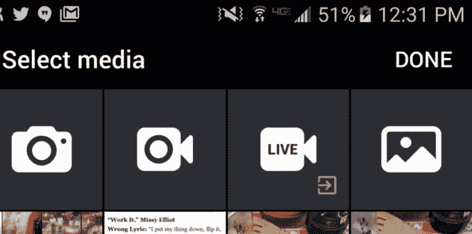

# Twitter 在其移动应用 TechCrunch 中引入了一个 Periscope 直播按钮

> 原文：<https://web.archive.org/web/http://techcrunch.com/2016/05/16/twitter-is-testing-a-periscope-live-streaming-button-inside-its-mobile-apps/>

# Twitter 在其移动应用程序中引入了一个 Periscope 直播按钮

脸书正通过[一个完全专用的流媒体标签](https://web.archive.org/web/20230128093446/https://techcrunch.com/2016/04/06/facebook-video-tab/)来集中关注直播视频，而[则优先关注即时广播](https://web.archive.org/web/20230128093446/https://techcrunch.com/2016/03/01/get-it-while-its-hot/)，因此毫不奇怪，Twitter 正在通过整合其直播平台 Periscope 和 Twitter 移动应用程序来反击流媒体战争。

[该公司告诉 The Verge](https://web.archive.org/web/20230128093446/http://www.theverge.com/2016/5/16/11686128/twitter-periscope-android-integraiton) 这是一个逐步推出的项目，一小部分 Android 用户在创建推文时，除了现有的媒体选项外，还有一个“直播”按钮，如录制视频或附上图片。那些已经在手机上安装了应用程序的人在点击按钮时会被定向到 Periscope，所有其他人都会被发送到 app store，他们可以在那里下载直播应用程序。

“随着时间的推移，所有用户都将能够从 Twitter 上启动潜望镜广播，”该公司在一份声明中告诉我们。

此举很有意义，坦率地说，它花了这么长时间才实现，这有点令人惊讶。一年前，Twitter 收购了 Periscope,就像它运行的另一个独立应用 Vine 一样，它给了团队一定程度的独立于母舰之外的独立性。但是，随着脸书在直播方面加倍努力，而[的用户基数超过 16.5 亿](https://web.archive.org/web/20230128093446/https://techcrunch.com/2016/04/27/facebook-q1-2016-earnings/)，Twitter 需要探索协同效应。

脸书可能拥有更大的用户群，但该社交网络是否能适应直播视频仍有待观察，这与仔细阅读几天来积累的完整更新时间表是一个非常不同的命题。然而，Twitter 更擅长于实时，但是[的 3 . 1 亿用户基数](https://web.archive.org/web/20230128093446/https://techcrunch.com/2016/04/26/twitter-reports-mixed-q1-on-sales-of-595m-ep-of-0-15-and-a-sluggish-310m-maus/)要小得多。

除了通过这种集成将用户重定向到另一个应用程序之外，看看 Twitter 未来是否会在 Twitter 应用程序中探索一种更无缝的直接广播选项也很有趣——因为脸书已经在这样做了。

[*帽尖 Engadget*](https://web.archive.org/web/20230128093446/http://www.engadget.com/2016/05/16/twitter-periscope-go-live-android-button)

*这个故事的原始版本已经更新，解释说这是一个渐进的展示，而不是一个测试。*