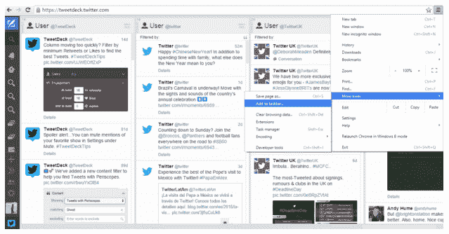

# Twitter 扼杀了 Windows 的 TweetDeck，让 TweetDeck 用户的登录自动化

> 原文：<https://web.archive.org/web/https://techcrunch.com/2016/03/17/twitter-kills-tweetdeck-for-windows-automates-logins-for-tweetdeck-users/>

# Twitter 扼杀了 Windows 的 TweetDeck，让 TweetDeck 用户的登录自动化

Twitter 今天[推出了一项变革](https://web.archive.org/web/20230403104220/https://blog.twitter.com/2016/a-more-seamless-log-in-experience)，不再要求用户单独登录 TweetDeck，这将使用户更容易在其桌面应用 TweetDeck 和网站之间切换。也就是说，如果用户打开 Twitter 网站并已经登录，他们将能够跳过 TweetDeck 上的登录过程。与此消息相关的是，Twitter 表示，它也正在关闭 Windows 应用程序的 TweetDeck。

TweetDeck 暂时仍然支持 Mac，因为该应用程序继续托管在 [Mac 应用商店](https://web.archive.org/web/20230403104220/https://itunes.apple.com/us/app/tweetdeck-by-twitter/id485812721?mt=12)中。然而，Windows 用户现在被指向网络版的 TweetDeck。Twitter 还提醒 Windows 用户如何将 TweetDeck web 应用程序固定在任务栏上，使其更容易从 Windows PC 上访问。(Twitter 表示，为此，你可以在 Chrome 中打开应用，然后点击*自定义和控制>更多工具>添加到任务栏】。)*

该公司表示，它决定放弃在 Windows 上开发，以便“更好地专注于增强你的 TweetDeck 体验”，但很可能 Windows 应用程序根本不具备值得花费时间和精力的吸引力。

TweetDeck for Windows 将于 4 月 15 日关闭，给当前用户一点时间过渡到网络或另一个 Twitter 客户端。

与此同时，该公司还指出了近几个月来它对 TweetDeck 所做的一些开发——也许是为了强调 Windows 应用程序的关闭并不意味着该公司忽视了整个 TweetDeck 平台。其中一些新功能包括类似于 [TweetDeck 团队](https://web.archive.org/web/20230403104220/https://blog.twitter.com/2015/introducing-tweetdeck-teams)、[群组直接消息](https://web.archive.org/web/20230403104220/https://blog.twitter.com/2015/tweetdeck-group-direct-messages)，用于查找 Vines、gif 和潜望镜的新搜索过滤器，以及[更多](https://web.archive.org/web/20230403104220/https://twitter.com/TweetDeck/status/597826666153398272)。

只要你登录任何一个 Twitter 网站，比如 Twitter.com 甚至 analytics.twitter.com，就可以绕过 TweetDeck 的登录过程。Twitter 指出，从 TweetDeck 到网站和从网站到 TweetDeck 都是有效的。

该公司表示，这一变化将在“未来几周内”惠及所有用户。

TweetDeck 应用程序关闭和登录体验的消息是在一群[新闻](https://web.archive.org/web/20230403104220/http://thenextweb.com/twitter/2016/03/17/twitter-quietly-turned-new-algorithmic-timeline-everyone/) [报道](https://web.archive.org/web/20230403104220/http://venturebeat.com/2016/03/17/twitter-begins-switching-its-algorithmic-timeline-on-by-default/) [今日](https://web.archive.org/web/20230403104220/http://mashable.com/2016/03/17/twitter-algorithmic-timeline-live-for-everyone/#k1BL8t3l3gqy) [声明](https://web.archive.org/web/20230403104220/http://www.wired.co.uk/news/archive/2016-03/17/twitter-non-chronological-timeline-how-to-opt-out)Twitter 新的算法排序时间线现在默认对所有用户开放之后[发布的。然而，这是不准确的。](https://web.archive.org/web/20230403104220/http://gizmodo.com/twitters-new-timeline-is-now-the-default-heres-how-to-1765454069)

更新的时间表[在上个月](https://web.archive.org/web/20230403104220/https://techcrunch.com/2016/02/10/twitter-will-now-put-recommended-not-recent-tweets-at-the-top-of-your-timeline/)公布，Twitter 当时表示将在未来几周推出这种“改进的体验”。(Twitter 用户可以选择退出，如果他们不喜欢这些改进，你可能还记得。)自那以后，一切都没有改变——这个算法时间线仍在分阶段推出的过程中，这意味着并非所有 Twitter 用户都拥有它。