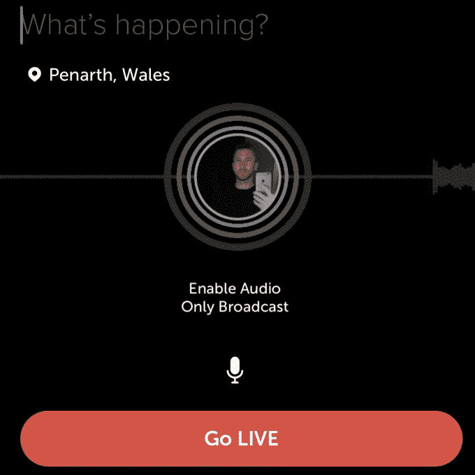

# Twitter 在其 iOS 应用程序和 Periscope 上推出纯音频广播功能 

> 原文：<https://web.archive.org/web/https://techcrunch.com/2018/09/07/twitter-launches-audio-only-broadcasting-feature-on-its-ios-app-and-periscope/>

# Twitter 在其 iOS 应用程序和 Periscope 上推出纯音频广播功能

Twitter 正在推出一项新功能，允许用户直接从 Twitter 本身以及 Twitter 的 Periscope 创建纯音频广播。Twitter 首席执行官杰克·多西今天早上在推特上证实了这一功能，该功能可以在你通常启动直播视频的同一界面上使用。目前可以在 Twitter for iOS 应用程序和 Periscope 上访问它。

现在，你可以点击一个按钮来选择纯音频广播，而不是只在点击“直播”后选择录制视频。

该功能在最近几周的 beta 测试中出现，但@Jack 的推文——以及移动应用的更新日志——表明它现在已经向所有人推出。

Twitter 还向 TechCrunch 证实，该功能目前暂时只在 iOS 的 Twitter 应用程序和 Periscope 上可用。它还没有提供何时将到达其他平台的时间框架。

虽然这些用户目前只能录制音频，但所有跨平台的 Twitter 用户都可以看到录音并回放。

正如更新文本解释的那样，当你想让观众听到你而看不到你的时候，这个功能是很有价值的。这可以让人们在 Twitter 上分享纯音频性质的实时新闻，录制可分享的迷你播客，或向他们的粉丝发布超过 280 个字符的内容。

类似于现场视频，音频广播公司将能够查看他们的统计数据，如现场观众人数，重播观众，观看时间和其他指标。

该公司计划不久后通过官方 Twitter 工程博客分享这一消息。

更新:Twitter 现在也在自己的账户上发布了这条消息。