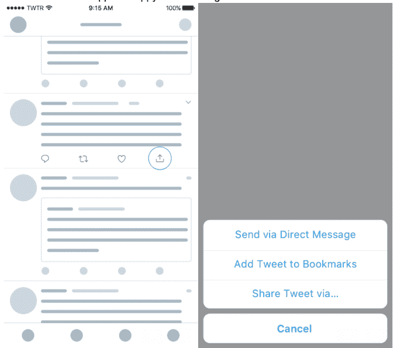

# Twitter 推出书签，一种保存推文的私人方式

> 原文：<https://web.archive.org/web/https://techcrunch.com/2018/02/28/twitter-launches-bookmarks-a-private-way-to-save-tweets/>

Twitter 今天公开推出其“书签”功能，该功能自去年年底以来一直在测试中，此前该公司的 HackWeek 项目被称为#SaveForLater。人们之所以希望保存内容以备日后阅读，是因为 Twitter 上流传着大量新闻，通常包括你目前没有时间阅读的较长文章的链接，以及人们对保存内容隐私的需求增加。

由于推文内容的性质，Twitter 用户有时会发现使用收藏按钮保存推文很不舒服。

形状像一颗心，按钮表明一种积极的情绪——但情况并不总是如此。经常有这样的时候，你需要稍后返回到一条推文，而没有表明你喜欢或支持它所包含的内容。

脸书也在“喜欢”按钮上遇到了类似的问题。虽然用户要求不喜欢的选项，但这家社交网络公司最终推出了其他情绪的表情符号，如愤怒、悲伤、笑声和爱，以补充“喜欢”

当然，Twitter 不需要用情感按钮来使它的产品复杂化，但是它需要一种方法来保存你不“喜欢”的东西。

使用 Twitter 最喜欢的按钮的另一个问题是这个动作是公开的。

发帖人会被提醒你已经喜欢了他们的推文，Twitter 上与该推文互动的任何人都可以看到你的收藏，并且每个人都可以从你的 Twitter 个人资料中访问你的收藏列表。

收藏夹的公开性在过去给一些高调的推特用户带来了问题——比如当梅兰妮·特朗普[收藏了一条似乎暗示她讨厌她丈夫的推特](https://web.archive.org/web/20230228031824/https://www.theguardian.com/us-news/2017/may/03/most-unlike-her-melania-trump-sparks-intrigue-with-fat-fingered-favourite)(也许是[无意中)](https://web.archive.org/web/20230228031824/https://nypost.com/2017/05/03/melania-did-not-intend-to-troll-her-husband-on-twitter/)；或者当其他知名人士——如[哈里·斯泰尔斯](https://web.archive.org/web/20230228031824/https://www.buzzfeed.com/mattbellassai/harry-styles-maybe-faved-a-porn-tweet-and-everybodys-reactio?utm_term=.gmR48LR6Jz#.xfrqxZQjMb)或[特德·克鲁兹](https://web.archive.org/web/20230228031824/https://www.huffingtonpost.com/entry/ted-cruz-porn-like_us_59b76b91e4b031cc65cc1be4)——喜欢色情时。

Twitter 用户已经解决了无法私下保存推文的问题，他们可以做一些事情，比如给自己发推文，保存在记事本中，通过电子邮件发送，在新标签中打开，以及其他一些技巧。

从今天开始，他们将不再需要求助于这种黑客手段，因为加了书签的推文只*被*私人保存。

要使用该功能，您需要点击一个新的“共享”图标，该图标位于收藏夹(心形)按钮的右侧。从这里开始，你可以选择以多种方式分享推文，包括通过书签、DM 或其他方式，就像之前通过右上角的下拉菜单一样。

当你想查看你保存的推文时，你可以点击你的个人资料图标来显示菜单，在那里可以找到书签列表和其他选项，如 Twitter 列表和时刻。

今天，在 iOS 和 Android 的 Twitter 上，Twitter Lite 和[mobile.twitter.com](https://web.archive.org/web/20230228031824/http://mobile.twitter.com/)都推出了书签。