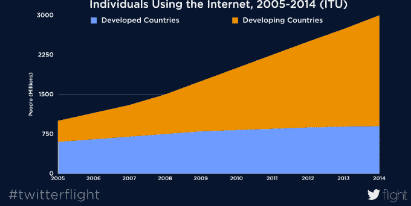
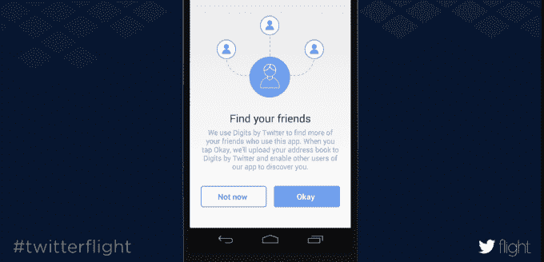
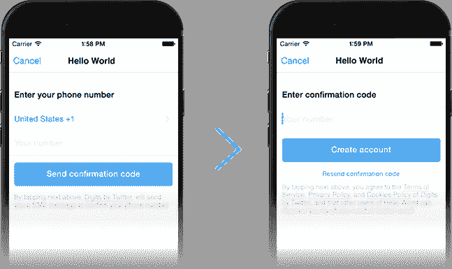
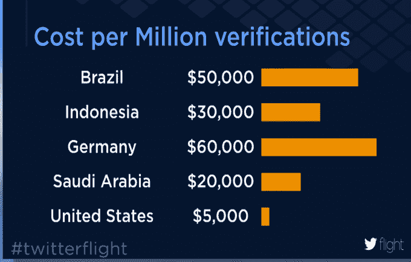

# Twitter 推出 Digits，这是一种无需密码即可登录应用的新方式

> 原文：<https://web.archive.org/web/https://techcrunch.com/2014/10/22/twitter-launches-digits-a-new-way-to-sign-in-to-apps-without-using-passwords/>

今天，Twitter 宣布推出一项名为 [Digits](https://web.archive.org/web/20230320203813/https://www.digits.com/) 的新服务，旨在帮助应用开发者为他们的移动应用寻找一个更简单、无密码的登录选项。这个消息是今天下午在 Twitter 的第一次年度开发者大会 Flight 上透露的，它不仅是针对移动应用开发者的工具套件[的发射台，也是对整个开发者社区的一种道歉，因为 Twitter 试图重新控制其产品和平台，多年来一直拒绝他们和他们的想法。](https://web.archive.org/web/20230320203813/https://techcrunch.com/2014/10/22/twitter-introduces-fabric-a-toolkit-for-developers-to-build-apps-on-its-platform/)

[Digits](https://web.archive.org/web/20230320203813/https://dev.twitter.com/products/digits) 是今天宣布的众多新产品之一，其中还包括一个名为 [Fabric](https://web.archive.org/web/20230320203813/https://techcrunch.com/2014/10/22/twitter-introduces-fabric-a-toolkit-for-developers-to-build-apps-on-its-platform/) 的工具集，以及其他 Twitter 产品的新功能，如其广告平台 MoPub 和崩溃报告服务 Crashlytics。

然而，Digits 是一个及时的产品，因为在脸书收购 Whatsapp 的高调收购交易之后，消息应用的世界已经爆炸，更简单、甚至匿名的消息以及 Snapchat 等“短暂”消息的更大趋势也出现了。

在这些应用中，即使不是大部分，也有许多应用的注册与你在网上看到的不同。如今，用户通常只使用他们的移动电话号码作为注册和认证机制，而不是创建用户名和密码。应用程序然后验证他们拥有通过基于短信的确认码输入的电话号码。

随着 Digits 的推出，Twitter 正在提供一种工具，可以代表开发者的应用程序处理这一过程，甚至是为那些“消息”空间之外的应用程序。它还可以在需要时支持 web 应用程序注册。(Web APIs 将于今年秋季推出。)

Digits 向用户提供初始登录屏幕，用户在该屏幕上键入他们的电话号码，然后它处理 SMS 确认码的发送。最终，对用户来说，这是一个两步走的过程。

这一过程在移动设备上更有意义，不仅因为用户名和密码组合是网络为王时代的遗留物，还因为在世界上的许多地方，尤其是智能手机是人们唯一的“电脑”的发展中地区，许多用户没有电子邮件地址作为他们的“用户名”或登录 ID。但是他们*有*的电话号码。

Twitter 在其开发者网站 Digits 上提到了这一点，并补充道，如今新兴市场占全球移动人口的 70%以上。Twitter 的 Digits 产品经理迈克尔·达克(Michael Ducker)今天下午在飞行舞台上说，今年美国和欧洲有 3 亿人购买智能手机。

“但如果你不关注新兴市场，你就会错过更多的人，”他补充道。“今年将有 9.4 亿部手机——智能手机——在新兴市场销售。这是你的应用市场的三倍。”

此外，对于最终用户来说，电话号码更容易记住，更容易用于注册和登录，而且它们还能很好地阻止垃圾邮件发送者，而不会迫使用户解码验证码(坦白地说，这在过去几年变得非常困难)。)

最后，Digits 为应用程序提供了“寻找朋友”的机制，但它不会创建一个通用的、基于数字的“社交图”，在应用程序之间共享。相反，你可以找到那些在你的地址簿中的人，反之亦然，然后在每个数字驱动的应用程序中添加他们。

Digits 目前在 216 个国家和 28 种语言中推出，代表着在移动领域占有一席之地的重大举措。这也是对 Twitter 功能的一个很大的赌注，它可以为移动应用程序提供支持，而不是仅仅作为一个独立的社交网络，它正在努力让相对被动的受众不仅阅读名人和其他知名人士和组织的推文，还可以自己发布推文。

相反，Twitter 可以拓展业务，将自己嵌入数十种——或者它希望是数百种——新的移动应用程序，同时为那些可能负担不起基于短信的注册系统的相关成本，或者希望加快应用程序概念上市的小型开发者节省资金和时间。

*今天，位数之前:*

要实现数字，开发者只需在他们的应用程序中输入几行代码，然后他们就有了一个可行的替代方案，可以选择基于密码的登录，甚至是脸书或谷歌的认证机制。

Twitter 甚至暗示 Digit 相对于脸书的优势，在其[主页](https://web.archive.org/web/20230320203813/https://www.digits.com/)上害羞地写道，Digit“不会代表你发布，所以你说什么和在哪里说完全由你决定。”这句话显然是针对脸书的开发者平台，该平台允许应用发行商开发应用，发布到用户的墙上和时间线上，并向朋友发送消息，往往没有用户的理解——即使该应用在技术上得到他们的“同意”。

现在的问题是，在公司[主动](https://web.archive.org/web/20230320203813/https://techcrunch.com/2011/03/04/twitter-shuts-geoapi/) [关闭开发者对关键 API 的访问](https://web.archive.org/web/20230320203813/https://techcrunch.com/2012/08/16/twitter-api-client-apps/)，[在](https://web.archive.org/web/20230320203813/https://techcrunch.com/2012/08/27/twitter-api-changes-are-already-posing-challenges-to-tweetbot-developers/)[年前](https://web.archive.org/web/20230320203813/https://techcrunch.com/2009/04/22/twitter-oauth-temporarily-disabled-leaves-developers-hanging/)改变了其运行中的规则，使得许多 Twitter 最早的开发者支持者破产之后，开发者社区是否准备好原谅和信任 Twitter。

发布时，Twitter 的 Digits 主页列出了一些计划实施新系统的应用程序:Fitstar、Resy 和 OneFootball。在不久的将来，该主页还将成为希望管理其安全设置(包括双因素身份验证)的最终用户的资源。