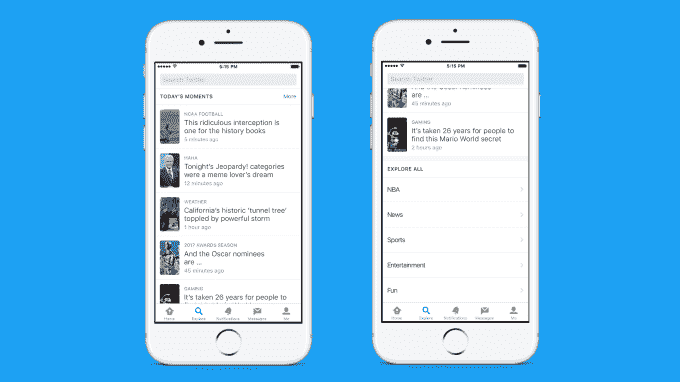
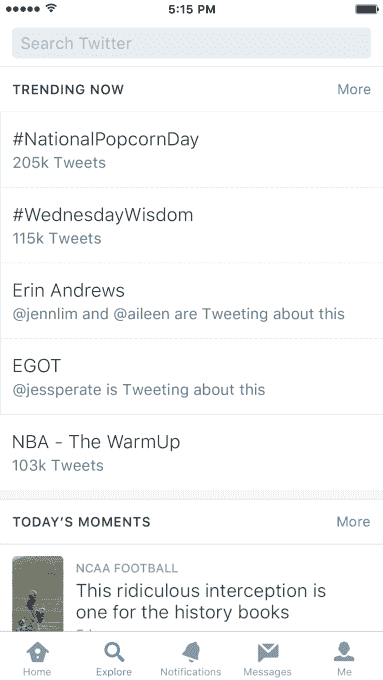

# Twitter 推出“探索”，这是一个关于时刻、趋势、搜索和视频直播的新家

> 原文：<https://web.archive.org/web/https://techcrunch.com/2017/01/26/twitter-launches-explore-a-new-home-for-moments-trends-search-and-live-video/>

Twitter 的 Moments 功能，允许用户通过一系列推文讲述故事，将不再是 Twitter 应用程序的核心。相反， [Twitter 将在今天用一个名为“探索”的新标签取代“时刻”部分](https://web.archive.org/web/20230406120410/https://blog.twitter.com/2017/explore)这个区域将成为了解 Twitter 上发生的事情的地方，包括趋势、时刻、搜索和特色直播视频流。

这一变化将于今天开始向 iOS 上的 Twitter 用户推出，并将在未来几周内推广到 Android。该公司告诉我们，它最终也会出现在网络上，但这不是 Twitter 的当务之急。

Moments [于 2015 年推出](https://web.archive.org/web/20230406120410/https://techcrunch.com/2015/10/06/project-glacier/)，旨在作为 Twitter 自己对短格式内容的接受——这种内容在其他社交应用程序上很流行——例如 Snapchat 和 Instagram 的 Stories。但创建时刻需要更多时间，因为你必须首先通过搜索、添加链接或从特定账户或收藏夹中提取来找到你想要收集的推文。这可能会吓跑一些用户，导致该功能的采用率更低。

在过去的几个月里，Twitter 首先开始用一小部分用户测试时刻标签的替代品，发现人们更喜欢探索，因为它更容易找到新闻、趋势和当前流行的东西。这些早期测试的结果鼓励 Twitter 更广泛地推出这一功能。

Explore 的标签实际上会从底部导航栏的中间位置移出。这个中心点现在将改为通知功能，浏览功能位于左侧。

新的部分将为 Twitter 提供更好的方式来突出显示时刻或直播视频，因为它包括一个更大的标题，可以显示这些项目中的任何一个。

下面是“现在趋势”部分，接着是“今天的时刻”，然后是“探索所有”区域，在那里你可以深入了解特定的类别，如新闻，体育，娱乐或乐趣。

此外，它给了 Twitter 一种推广视频直播的方式——它通过推出 Periscope 在社交网站[上帮助开拓了这一领域。但最近几天，Twitter](https://web.archive.org/web/20230406120410/https://techcrunch.com/2015/03/13/how-periscope-works/) [在其主要应用](https://web.archive.org/web/20230406120410/https://techcrunch.com/2016/12/14/twitter-now-lets-you-broadcast-live-video-from-its-mobile-apps/)中直接添加了直播视频流，这让人有些怀疑 Periscope 是否也会从 Twitter 中被切除——特别是考虑到该公司[将其开发者平台 Fabric 移交给了谷歌](https://web.archive.org/web/20230406120410/https://techcrunch.com/2017/01/18/google-twitter-fabric/)，而[关闭了其视频剪辑社区 Vine](https://web.archive.org/web/20230406120410/https://techcrunch.com/2017/01/20/twitter-just-cant-let-go-of-vine-launches-an-online-archive/) 。

Explore 还将为 Twitter 提供一个突出的位置，展示其直播活动，如 NFL 比赛、红毯预演以及其他许多新闻和体育活动，它将继续通过持续的合作协议为其服务。

以前，这些活动更难找到，这可能会影响他们的观众人数。能够在 Explore 中突出显示它们可能会带来更多的直播观众。

总的来说，这种变化在可用性方面是有意义的，因为它集中了所有帮助你了解现在正在发生什么的功能，对于 Twitter 这样的实时网络来说，这比 Moments 更适合。