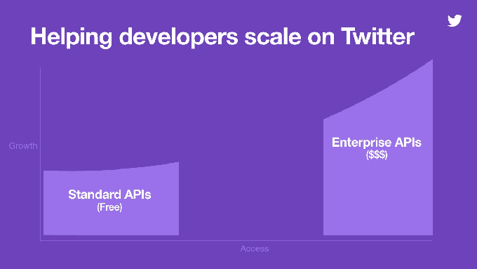
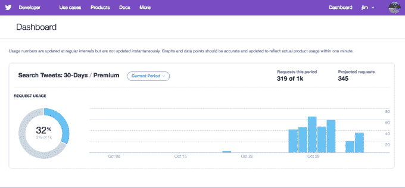

# Twitter 通过新的高级 APIs  推出更低成本的数据订阅服务

> 原文：<https://web.archive.org/web/https://techcrunch.com/2017/11/14/twitter-launches-lower-cost-subscription-access-to-its-data-through-new-premium-apis/>

今年早些时候，Twitter 试图修复与开发者的关系，推出了一个新的 API 平台，该平台专注于简化 API，并承诺增加访问层级。Twitter 表示，除了其企业 API 之外，它还将提供免费的 API 来测试想法、自助访问以及增加功能的付费访问。如今，Twitter 正在实现其为开发者提供付费 API 的计划，这比企业规模的业务需求低了一步。

新产品被称为 Twitter Premium APIs，它们旨在提供对 Twitter 数据的扩展访问，超出目前免费 API 的可用范围。这包括每次请求更多的推文、更高的速率限制和更复杂的查询。

根据所需的访问级别，高级 API 的价格从每月 149 美元到每月 2499 美元不等。

第一款优质产品 Search Tweets API 将于今日推出公测版。

这将使开发者能够访问过去 30 天的 Twitter 数据。它稍后将包括一个额外的端点，可以访问 Twitter 数据的完整历史，可以追溯到第一条 tweet。

Twitter 表示，新的搜索端点将提供许多优于免费访问的优势，包括每次请求更多的推文，更高的速率限制，返回推文时间序列计数的计数端点
更复杂的查询，以及元数据丰富，如扩展的 URL 和改进的个人资料地理信息。

搜索 Tweets API 是即将推出的几个高级 API 中的第一个，其他 API 将在未来几周或几个月内陆续推出。

此外，Twitter 正在推出一个新的自助式开发者门户，旨在为开发者的数据使用提供更透明的访问。这将帮助开发人员更好地确定何时需要升级到更高级别的访问或其他高级功能。他们还可以在这里管理他们的订阅和支付。

稍后，来自 apps.twitter.com 体验的更多功能也将进入门户。

为扩展访问付费是 Twitter 开发者社区多年来一直要求的，这似乎是 Twitter 增加收入的一个明显步骤。

免费 API 和企业 API 之间缺乏付费访问限制了开发者在 Twitter 上发展业务的能力。这可能是开发人员在过去想做的事情，几年前 Twitter [从开发人员的脚下](https://web.archive.org/web/20230405000048/https://techcrunch.com/2012/08/16/twitter-api-client-apps/)拉出地毯，然后欺骗[自己的合作伙伴](https://web.archive.org/web/20230405000048/https://techcrunch.com/2015/04/11/twitter-cuts-off-datasift-to-step-up-its-own-b2b-big-data-analytics-business/)，因为该公司重新考虑它希望如何与第三方开发人员社区合作。

鉴于 Twitter 过去的反复无常，开发人员可能不确定投入时间和精力在 Twitter 的基础上进行建设，因此这些负面影响可能仍然会对这些新产品的潜力留下印记。

但 Twitter 数据仍然很有价值，这也是该公司在 2014 年收购 Gnip 的原因，Gnip 是 Twitter 的长期合作伙伴和社交数据提供商。付费 API 也可以作为该公司产生额外收入的一种手段，因为在其最近的收益公告中，[的广告收入同比下降了 8%](https://web.archive.org/web/20230405000048/https://techcrunch.com/2017/10/26/twitter-gets-a-surprise-beat-in-q3-on-sales-of-590m-and-eps-of-0-10/),而数据许可收入增长了 22%。

开发者可以通过 Twitter 的[公共路线图](https://web.archive.org/web/20230405000048/https://trello.com/b/myf7rKwV/twitter-api-platform-roadmap)、[论坛](https://web.archive.org/web/20230405000048/https://twittercommunity.com/)和包含文档和指南的新[开发者资源中心](https://web.archive.org/web/20230405000048/http://developer.twitter.com/)来关注这个和其他 API 新闻和信息。