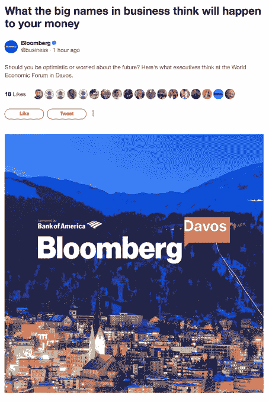

# Twitter 现在允许广告商赞助出版商的时刻 

> 原文：<https://web.archive.org/web/https://techcrunch.com/2018/01/26/twitter-now-lets-advertisers-sponsor-publishers-moments/>

Twitter 的产品线中增加了一个新的广告产品。该公司[今天宣布](https://web.archive.org/web/20221206041200/https://blog.twitter.com/marketing/en_us/topics/product-news/2018/How-sponsored-Moments-connect-publishers-and-brands.html)它将为品牌提供赞助 Moments 的能力——类似“故事”的功能，包括一系列推文，通常包括图像、gif 和视频——来自选定的出版商。Twitter 表示，第一个赞助时刻已经上线，该功能现已广泛提供给全球所有参与流内赞助的出版商。

目前，关于达沃斯的[彭博时刻](https://web.archive.org/web/20221206041200/https://twitter.com/i/moments/956529120141340672)由美洲银行赞助，这是第一个公开发起的。然而，Twitter 表示，它在今天之前已经与选定的合作伙伴测试了这项功能。

“赞助时刻”让广告商能够在相关时刻添加品牌封面图片，并在该时刻的综述中插入自己品牌的推文。

与其他流内赞助一样，Moment 也可以通过 Twitter 的广告工具针对特定受众进行推广。

Twitter 表示，与流内赞助一样，新计划的目标是以定制的方式将品牌与合作伙伴的内容一对一地联系起来，在广告客户和内容之间存在“紧密联系”。

“我们知道决策者和有影响力的人正在转向 Twitter，以了解达沃斯发生的事情。美国银行首席营销官 Meredith Verdone 在一份声明中说:“赞助时刻为我们提供了一种无缝加入这种对话的新方式。“与彭博和 Twitter 合作有助于我们将高质量的相关内容带给积极参与的全球受众。我们很高兴首次亮相的时刻是我们#WEF 节目的重要组成部分。”

赞助商 Moments 的发行商合作伙伴包括那些拥有大量观众的发行商，如电视网、体育联盟和数字发行商。

定价细节和分割还不能立即得到，但我们会更新，当我们有更多的。(推特，平心而论，[今天可能有点忙](https://web.archive.org/web/20221206041200/https://www.barrons.com/articles/merger-rumors-give-twitter-a-friday-boost-1516995417)。)

更新:赞助一个时刻的成本将根据客户、事件、行业或观众而变化，收入份额也将根据手头的交易而定制。